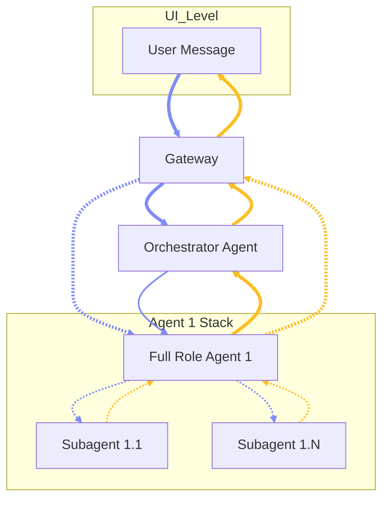

# Chapter 0.1 — Formatting Guide & Template

## 0.1.0 Overview

This file serves as the instruction manual and structural template for formatting all AAS documentation chapters.

### 0.1.1 Typography and Highlighting
*(instruction)* **Bold Text:** Used for labels and emphasis. The UI highlights bold text in a specific color. \
*(instruction)* **Italic Text:** Used for annotations such as *(to-be-updated)*. The UI highlights italic text in a different distinct color.

### 0.1.2 Chapter and Heading Structure
*(instruction)* **Main Title:** Use `# Chapter [Number].[Sub] — [Title]` for the top-level chapter heading. \
*(instruction)* **Overview:** The first section must be `## [Number].[Sub].0 Overview` followed by a single-sentence summary of the chapter. \
*(instruction)* **Subchapters:** Use `###` headings for all remaining subchapters (e.g., `### 1.1.1 Subchapter Name`). \
*(instruction)* **Accordions:** Understand that `###` headings are automatically transformed into collapsible accordions by the UI.

### 0.1.3 Lists and Spacing Rules
*(instruction)* **No Bullet Points:** Do not use markdown bullet points (`-` or `*`). \
*(instruction)* **No Blank Lines:** Do not leave empty blank lines between list items within an accordion. \
*(instruction)* **Hard Breaks:** End each list item with a space followed by a backslash (` \`) to create a hard break. \
*(instruction)* **Item Format:** Structure items starting with an optional italic tag, then a bolded label, for example: `*(tag)* **Label:** Description \`.

### 0.1.4 Flow Charts (Mermaid)
*(instruction)* **Mermaid Parser:** The UI can parse mermaid code blocks into actual flowcharts. \
*(instruction)* **Syntax:** Use triple backticks with `mermaid` as the language identifier. \
*(instruction)* **Init Block:** Always begin with `%%{init: {'flowchart': {'arrowMarkerSize': 1.5}}}%%` to enlarge arrowheads. \
*(instruction)* **Direction:** Use `flowchart TD` for top-down architecture diagrams. \
*(instruction)* **Thick Arrows:** Use `==>` for primary (solid, thick) connections representing the main communication path. \
*(instruction)* **Dashed Arrows:** Use `-.->` for secondary connections such as internal delegation between agents and subagents. \
*(instruction)* **Subgraphs:** Use `subgraph [ID] [Label]` blocks to visually group related nodes (e.g., a Full Role Agent alongside its Subagents). \
*(instruction)* **Direction in Subgraph:** Use `direction TB` inside subgraphs to enforce top-to-bottom layout within the group. \
*(instruction)* **Color Coding:** Use `linkStyle` at the end of the diagram to apply directional color. Indigo (`#818cf8`) for downward/request flow. Amber (`#fbbf24`) for upward/response flow. \
*(instruction)* **Link Indices:** `linkStyle` targets connections by their zero-based index in the order they are declared in the diagram source.



### 0.1.5 File Tree Explorer
*(instruction)* **Block Type:** Use a triple-backtick code block with the language set to `text` (or `plaintext`, or leave it blank). The parser will auto-detect a file tree and render an interactive Explorer widget instead of a plain code block. \
*(instruction)* **Detection Rules:** For auto-detection to trigger, the block must have at least 2 non-empty lines, at least one folder entry ending with `/`, at least one indented line, and ≥ 80 % of non-empty lines must look like path segments (no mid-line spaces unless the name itself contains one). \
*(instruction)* **Folders:** Mark a directory by appending a trailing slash to its name (e.g., `agents/`). The parser strips the slash and renders a `Folder` icon; clicking the row expands or collapses its children. \
*(instruction)* **Files:** Any line without a trailing slash is treated as a file. The parser selects an icon based on the extension: `.json` → yellow, `.md`/`.mdx` → indigo, `.js`/`.ts`/`.jsx`/`.tsx` → blue, images → purple, `.html` → orange, `.env`/`.config` → zinc, everything else → default zinc. \
*(instruction)* **Indentation:** Depth is determined by the raw leading-space count of each line. Child entries must be indented further than their parent folder. Any consistent spacing (2, 4 spaces, or tabs) works as long as the relative depth ordering is preserved. \
*(instruction)* **Header Controls:** The Explorer header renders three icon buttons — **Expand/Collapse All Folders** (`FolderPlus` / `FolderMinus`), **Copy Tree** (`Copy` / `Check`), and **Toggle Block** (`ChevronRight` rotates to 90°). All folders start collapsed by default. \
*(instruction)* **Inline Comments:** Lines containing a `#` suffix (e.g., `skills/                    # optional shared skills`) are preserved verbatim in the raw copy but the comment text appears as part of the file name label in the tree — keep comments short or omit them for cleaner rendering.

```text
root-dir/
  config-file
  shared-resources/
  agents/
    agent-name/
      runtime/
        auth-file
        credentials-file
      sessions/
        sessions-file
      workspace/
        AGENTS.md
        SOUL.md
        TOOLS.md
        IDENTITY.md
        USER.md
        HEARTBEAT.md
        MEMORY.md
        memory/
          YYYY-MM-DD.md
        skills/
        canvas/
```

### 0.1.6 UI Mockup Blocks
*(instruction)* **Block Type:** Use a triple-backtick code block with the language set to `ui` (or `uimock`). The parser renders an interactive wireframe mockup widget instead of a plain code block. \
*(instruction)* **Line Grammar:** One element per line: `keyword "Label" flag1 flag2 key=value`. The first quoted string is the element label; bare words after the keyword are flags; `key=value` pairs (value may be quoted) are attributes. Lines starting with `#` are comments. \
*(instruction)* **Nesting:** Indentation defines the element tree, exactly like the File Tree Explorer — child elements must be indented further than their parent. \
*(instruction)* **Containers:** `screen "Title"` renders a window frame with chrome dots; `row` and `col` are flex containers (flag `grow` fills space); `panel "Label"` is a bordered region with an uppercase header (attribute `w=240px` fixes width, flag `dim` fades it); `bar "Label"` is a slim horizontal strip for topbars, composers, and status rows; `grid cols=3` is an N-column grid. \
*(instruction)* **Candidates:** `tile "caption"` renders an image-placeholder card for generated candidates. State flags: `selected` (sky ring + check), `pinned` (amber ring + pin), `rejected` (dimmed + cross), `degraded` (red corner tag). Child elements of a tile render as its action row. \
*(instruction)* **Ledger Chips:** `chip "mood" state=locked value="nocturnal"` renders a reel chip. States: `open` (dashed gray), `narrowing` (amber pulse), `locked` (solid emerald with value). \
*(instruction)* **Small Elements:** `badge "CONVERGE" phase` (variants: `phase` indigo, `degraded` red, `ok` emerald, `warn` amber); `meter value=62 "convergence"` with flag `frozen` for the red frozen state; `button "Select"` (variants `primary`, `danger`); `input "placeholder"`; `thumb "H"` small reference thumbnail with flag `x` for an unpin handle; `dot online` / `dot offline` status dots; `banner "message"` (flag `warn` for amber tension banners); `text "caption"` (flags `dim`, `mono`); `divider`; `spacer` (flex gap pusher inside bars). \
*(instruction)* **Purpose:** UI mockup blocks are the canonical way to specify product UI in these docs — they are wireframes, not pixel designs, and should describe structure, states, and affordances rather than styling.

```ui
screen "Example — Candidate Batch"
  bar "A.A.S. · Chat"
    spacer
    badge "CONVERGE" phase
    meter value=40 "convergence"
  row
    panel "Timeline" grow
      text "Habakkuk: Step 2 of 3 — generating candidates" dim
      grid cols=3
        tile "nocturnal · sparse" selected
        tile "nocturnal · dense"
        tile "pastel · sparse" rejected
    panel "Field" w=220px
      chip "mood" state=locked value="nocturnal"
      chip "palette" state=narrowing
      chip "era" state=open
  bar
    thumb "A1" x
    input "Roll again or steer…"
      button "Roll" primary
```

# Chapter X.X — [Chapter Title]

## X.X.0 Overview

This is a single-sentence summary outlining the foundational goals of this chapter.

### X.X.1 [Subchapter Title]

*(optional-tag)* **First Item:** Description of the first item without a bullet point. \
**Second Item:** Description of the second item, using a backslash at the end for a line break. \
**Third Item:** The final item in the subchapter.

### X.X.2 [Another Subchapter Title]

**Sub-item A:** Keep content structured and concise without empty lines between items. \
**Sub-item B:** Ensure all formatting rules are strictly followed.

