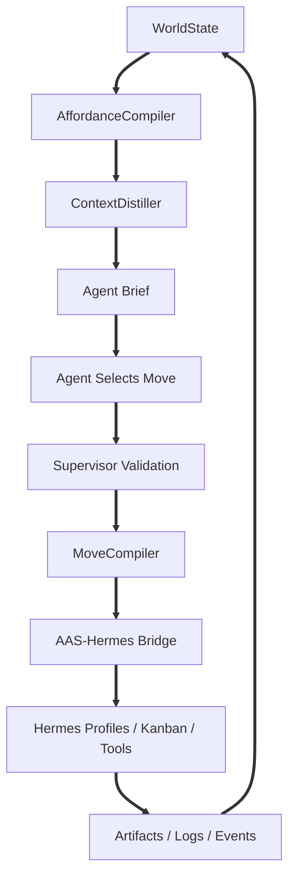
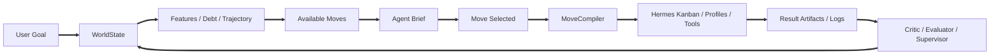

# Chapter 2.1 - Multi-Agent Architecture

## 2.1.0 Overview

This chapter defines the agent model for the A.A.S. Field Runtime. Hermes supplies the durable agent execution substrate through profiles, Kanban tasks, worker processes, memory, skills, dispatcher, and logs. A.A.S. governs what agents are allowed to see, choose, execute, learn, and commit inside an architectural design field.

### 2.1.1 Agentic Model

**Field Runtime First:** Agents do not primarily execute a human-authored graph. They operate inside a WorldState-driven environment that exposes available moves, blocked moves, active tensions, current intent, relevant artifacts, feature pressures, and commitment history. \
**Hermes Runtime:** Hermes is the base runtime for specialist profiles, task execution, profile-local memory, skills, tools, logs, and dispatcher-managed work. \
**Agent Briefs:** Before each meaningful turn, the ContextDistiller prepares an Agent Brief containing the current goal, current intent, active branch, active tension, relevant commits, relevant artifacts, scoped preferences, valid moves, blocked moves, output contract, and warnings. \
**Move Selection:** The agent selects a recommended affordance or proposes a new move. New moves must be validated by the AffordanceCompiler and Supervisor before execution. \
**Typed Execution:** Agents select moves; the MoveCompiler maps those moves to Hermes Kanban task groups and profile assignments, then bridge services monitor execution, ingest artifacts, and update WorldState.

### 2.1.2 Agentic Roles

**Affordance Compiler Agent / Service:** Generates legal moves from WorldState, process grammar, active features, design debt, trajectory, and the Move Pattern Library. \
**Context Distiller:** Produces compact Agent Briefs from WorldState, scoped preferences, memory, artifacts, evaluator results, commits, and events. It hides memory and tool complexity unless the selected move requires deeper retrieval. \
**Move Compiler:** Converts selected moves into executable Hermes Kanban plans: task group, dependencies, assigned profile, task packet path, expected artifacts, expected feature effects, and completion contract. \
**Planner Agent:** Revises move strategy, phase direction, landmarks, and process debt. It does not author static execution graphs as the main workflow object. \
**Research Agent:** Retrieves missing internal or external context only when the current move requires research or clarification. \
**Concept Agent:** Spawns concept branches, identifies design tensions, and develops early architectural hypotheses. \
**Design Development Agent:** Turns selected branches into coherent artifact plans, ground-truth strategies, drawings, and model instructions. \
**Model Agent:** Works with geometry, Rhino Compute, model validation, drawing cuts, area checks, and spatial consistency. \
**Representation Agent:** Produces renders, diagrams, board strategies, image prompts, and presentation packages. \
**Critic / Evaluator Agent:** Attacks weak concepts, finds contradictions, compares branches, and evaluates artifacts into feature scores, evidence, confidence, and critique. \
**Supervisor Agent:** Governs move legality, approvals, drift, risk, branch merge/kill/commit rules, preference conflicts, and finalization gates. \
**Curator Agent:** Reviews proposed move patterns, pattern statistics, failure modes, evaluator results, and sandbox tests before promotion into the active Move Pattern Library.

### 2.1.3 Routing and Execution Flow

**Inbound User Intent:** The user sets or updates the goal through chat or the Field Navigator. The backend normalizes the goal and initializes or updates WorldState. \
**Feature Extraction:** The runtime extracts phase, landmarks, open design debt, active tensions, artifact gaps, branch health, uncertainty, scoped preferences, and current feature scores. \
**Move Generation:** The AffordanceCompiler matches move patterns against the extracted state, instantiates candidate moves, filters illegal moves, scores expected effects, and selects a diverse top set. \
**Brief Preparation:** The ContextDistiller converts the current world into an Agent Brief for the selected role. Agents are not expected to manually browse every memory source, preference source, or tool surface. \
**Selection and Override:** Agents may choose the top move, choose a lower-scored move with rationale, or propose a new move. Overrides must explain why a higher-scored move was skipped. \
**Task Compilation:** The MoveCompiler creates Hermes task packets, dependencies, profile assignments, expected artifacts, and output contracts. \
**Execution:** Hermes profiles execute tasks through Kanban. The bridge watches task state, logs, comments, and artifact folders, then registers outputs and emits A.A.S. events. \
**Evaluation and Regeneration:** The Critic/Evaluator measures feature deltas where needed. New tensions, commits, artifacts, failures, and branch changes cause the compiler to regenerate the next set of moves.

### 2.1.4 Hermes Profile Guidance

**Profile Templates:** A.A.S. owns base profile templates such as `aas-research-base`, `aas-concept-base`, `aas-model-base`, `aas-critic-base`, and `aas-supervisor-base`, including role instructions, allowed tools, skills, and output expectations. \
**Project Profiles:** Runtime work should prefer project-scoped Hermes profiles such as `aas-concept-p123` when memory isolation matters. A cheaper fallback is shared base profiles plus strict A.A.S. brief injection. \
**Runtime Separation:** Hermes profile homes, memory, sessions, skills, task logs, and worker state belong to Hermes. A.A.S. product state belongs in the backend database and storage layer. \
**A.A.S. Context Surface:** A.A.S. should not copy full product state into profile memory. It should pass task packets and Agent Briefs containing scoped, authorized, relevant context. \
**Memory Discipline:** Durable architectural decisions should be reflected in the CommitmentLedger and relevant artifacts, not silently learned by Hermes profiles.

### 2.1.5 Anti-Patterns

**Graph as Agent Mind:** Do not make a static visual graph the primary way the agent thinks. Graphs are useful for trace and replay, not for open-ended architectural design. \
**Tool Maze Exposure:** Do not ask agents to pick raw tools such as file readers, model calls, image generators, or Rhino operations during ordinary design reasoning. Expose meaningful moves instead. \
**Memory Browsing Burden:** Do not force agents to manually reconcile many memory buckets before acting. The ContextDistiller should compile relevant context. \
**Profile Memory as Truth:** Do not let Hermes profile memory silently define project state, user preferences, or design commitments. \
**Shared Profile Bleed:** Do not use one shared specialist profile that learns all projects and users unless A.A.S. filters every task context and keeps profile memory procedural only. \
**Uncommitted Truth:** Do not let speculative branch outputs silently become canonical project truth. Only commits change the canonical design direction. \
**Ungoverned Branch Death:** Do not kill, merge, or commit high-value branches without supervisor and, where required, user approval. \
**Hidden State Mutation:** Do not let agents directly mutate product database rows or final artifacts outside MoveCompiler/bridge-controlled flows.
