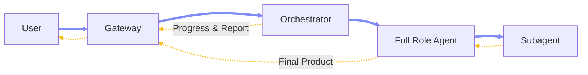
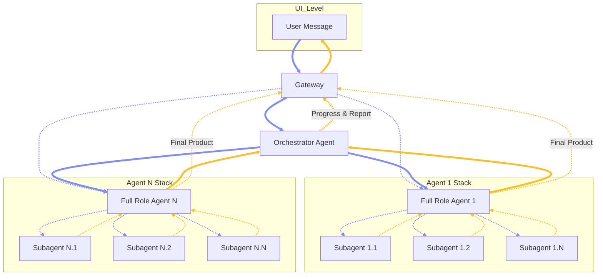
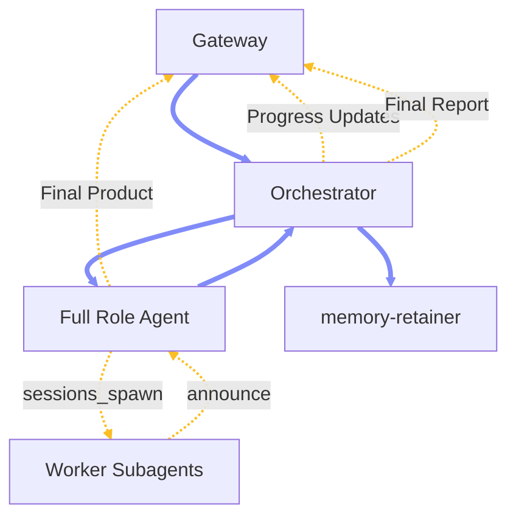

# Chapter 2.1 — Multi-Agent Architecture

## 2.1.0 Overview

This chapter defines the native multi-agent hierarchy, routing pipeline, and workspace boundaries required for an authoritative OpenClaw implementation.

### 2.1.1 Agentic Model

**Model Structure:** The agentic model is a three-tier execution hierarchy: one Orchestrator Agent at the top, multiple Full Role Agents as durable domain specialists below it, and task-scoped Subagents as narrower execution units beneath each Full Role Agent. \
**Full Role Agent:** A first-class agent instance with a defined role boundary, persistent identity, governed instructions, assigned tools, and its own full workspace — including `SOUL.md`, `AGENTS.md`, `IDENTITY.md`, `TOOLS.md`, and others. Each Full Role Agent is declared in `agents.list[]` with its own `id`, `workspace`, `agentDir`, model/tool policy, and subagent policy. The Orchestrator is itself a Full Role Agent, but with a specialized foundational role: it serves as the sole inbound coordination point rather than a domain executor. All other Full Role Agents receive work delegated through the system, plan and execute within their domain, spawn Subagents when deeper specialization is needed, and consolidate results back upward. \
**Subagent:** A task-scoped execution unit created natively via `sessions_spawn` under a Full Role Agent. Subagents operate in their own session key with narrower responsibility, reduced tool exposure, and a constrained skill profile. They are not independently addressable at the gateway and do not receive their own top-level workspace. \
**Communication Pattern:** A user message enters the gateway and routes to the Orchestrator via `bindings`. The Orchestrator delegates to one Full Role Agent via `sessions_spawn`. The Orchestrator does not deliver the final product; instead, it provides the user with step-by-step progress updates. Upon completion, the assigned Full Role Agent directly contacts the user with the final deliverable, allowing the user to continue the thread for further changes. Finally, the Orchestrator compiles and delivers a final report (success or failure) from its perspective. Optionally, a user may directly address a Full Role Agent via the gateway when an explicit `bindings` entry exposes that agent.



### 2.1.2 Agentic Roles

**Orchestrator Agent:** *(Full Role Agent)* The single top-level coordinator. Receives inbound requests from the gateway via `bindings` and routes work to the appropriate Full Role Agent using `sessions_spawn`. It does not return the final product; instead, it provides step-by-step progress updates to the user and a final execution report. It does not perform direct worker-level execution and does not spawn its own Subagents. \
**Maintainer Agent:** *(Full Role Agent)* A dedicated internal Full Role Agent — `memory-retainer` — with no user-facing communication surface. Triggered by Orchestrator handoff via `sessions_spawn(agentId: "memory-retainer")` after successful task completion, or automatically by an `agent_end` plugin hook. Holds write-grade wiki tools (`wiki_apply`, `wiki_lint`) in addition to the standard read surface (`wiki_status`, `wiki_search`, `wiki_get`). Responsible for novelty classification, fact ledger reconciliation, wiki compile and lint, and regenerating per-agent profile files. Runs on a scheduled cron as the Stage 2 full-system maintenance pass. Declared in `agents.list[]` like any other Full Role Agent but never bound to an inbound channel. \
**Execution Agents:** *(Full Role Agent)* Full Role Agents operating below the Orchestrator as domain-specific specialists. Each owns its role logic, determines whether to execute directly or spawn Worker Subagents, and controls all subordinate activity within its role boundary. Once execution is complete, the Execution Agent contacts the user directly with the final deliverable, enabling continued conversation. Declared in `agents.list[]` with their own workspace, model policy, and subagent allowlist. \
**Worker Agents:** *(Subagent)* Subagents spawned natively under Execution Agents using `sessions_spawn` to perform the most narrowly scoped tasks in the hierarchy. Inherit the parent execution context but with tighter responsibility, constrained reasoning scope, and a more targeted tool profile. Do not communicate directly with the user or gateway and have no independent top-level identity.



### 2.1.3 Routing and Agentic Pipeline

**External User to Orchestrator:** Inbound `bindings` route normal user traffic to the `orchestrator`; the most-specific binding wins, and unmatched traffic falls back to the default agent. ([OpenClaw][1]) \
**Orchestrator to Specialist:** The Orchestrator should delegate isolated task execution with `sessions_spawn(agentId: "agent-1" | "agent-n")`, which runs the task as a background sub-agent session under the selected Full Role Agent profile. ([OpenClaw][2]) \
**Nested Execution:** Execution Agents may spawn Worker Subagents when nested spawning is enabled via `agents.defaults.subagents.maxSpawnDepth >= 2`. At depth 1, the spawned session can still orchestrate children. At leaf depth, recursive orchestration tools are removed by runtime policy. Depth-1 children can orchestrate depth-2 workers — this is both documented behavior and runtime-enforced. ([OpenClaw][2]) \
**Return Path:** Worker Subagents return results to their parent Execution Agent. OpenClaw's native subagent model is announce-driven, and `sessions_send` is on the subagent deny list by default. Worker Subagents do not communicate laterally or upward to the Orchestrator directly — the parent Full Role Agent consolidates results. The Full Role Agent then delivers the final product directly to the user, allowing the user to continue the thread. ([OpenClaw][2]) \
**Cross-Agent Gates:** Cross-agent reach belongs to Full Role Agents, not Worker Subagents. For a Full Role Agent to talk across agent boundaries, `tools.sessions.visibility` must be `all`, `tools.agentToAgent.enabled` must be true, and the sender must be listed in `tools.agentToAgent.allow`. Sandboxed sessions are clamped back to `tree` visibility regardless of global settings, ensuring Worker Subagents remain local to their parent execution tree. ([OpenClaw][1]) \
**Recommended Control Shape:**


On task success, the Orchestrator hands the result package to `memory-retainer` via `sessions_spawn(agentId: "memory-retainer")` for wiki maintenance and shared-layer regeneration. Alternatively, an `agent_end` plugin hook may enqueue the same maintenance task automatically. Optional Gateway → Full Role Agent direct access is valid when an explicit `bindings` entry is defined for it. \
**Validation:** Verify final paths with `openclaw config schema` — OpenClaw validates against the live merged schema, and staying within that schema is the safest path for upgrades. \
**Reference Configuration:** The configuration below maps to current documented schema surfaces for `agents.list[]`, `bindings`, nested subagent depth, and agent-to-agent control. All agent workspaces use the native per-agent path under `~/.openclaw/agents/<id>/workspace`. Note that `maxConcurrent: 4` is a recommended deployment value for local hardware rather than a platform default. ([OpenClaw][1])

```json5
{
  agents: {
    defaults: {
      subagents: {
        maxSpawnDepth: 2,
        maxChildrenPerAgent: 5,
        maxConcurrent: 4,
        runTimeoutSeconds: 900
      }
    },
    list: [
      {
        id: "orchestrator",
        default: true,
        workspace: "~/.openclaw/agents/orchestrator/workspace",
        agentDir: "~/.openclaw/agents/orchestrator/agent",
        subagents: {
          allowAgents: ["agent-1", "agent-n", "memory-retainer"],
          requireAgentId: true
        }
      },
      {
        id: "memory-retainer",
        workspace: "~/.openclaw/agents/memory-retainer/workspace",
        agentDir: "~/.openclaw/agents/memory-retainer/agent"
        // Sole write-grade wiki maintainer. Receives wiki_apply and wiki_lint
        // in addition to the default wiki_search / wiki_get surface.
      },
      {
        id: "agent-1",
        workspace: "~/.openclaw/agents/agent-1/workspace",
        agentDir: "~/.openclaw/agents/agent-1/agent"
      },
      {
        id: "agent-n",
        workspace: "~/.openclaw/agents/agent-n/workspace",
        agentDir: "~/.openclaw/agents/agent-n/agent"
      }
    ]
  },

  bindings: [
    { agentId: "orchestrator", match: { channel: "webchat" } },

    // Optional direct specialist entrypoint
    {
      agentId: "agent-1",
      match: { channel: "discord", peer: { kind: "direct", id: "specialist-room" } }
    }
  ],

  tools: {
    agentToAgent: {
      enabled: true,
      allow: ["orchestrator", "memory-retainer", "agent-1", "agent-n"]
    },
    sessions: {
      visibility: "all"
    }
  }
}
```

[1]: https://docs.openclaw.ai/concepts/multi-agent?utm_source=chatgpt.com "Multi-Agent Routing - OpenClaw"
[2]: https://docs.openclaw.ai/tools/subagents?utm_source=chatgpt.com "Sub-Agents - OpenClaw"

### 2.1.4 Workspace Structure and Guidance

**Workspace Layout:** Each Full Role Agent has its own dedicated workspace under `~/.openclaw/agents/<agentId>/workspace/`, configured via `agents.list[].workspace` in `openclaw.json`. Subagents are execution-scoped units that operate under their parent Full Role Agent's runtime tree — they do not receive their own workspace directory or top-level agent entry. ([OpenClaw][3]) \
**Workspace Files:** Each Full Role Agent workspace contains the standard bootstrap and mind files: `AGENTS.md`, `SOUL.md`, `TOOLS.md`, `IDENTITY.md`, `USER.md`, and optionally `HEARTBEAT.md`, `MEMORY.md`, `memory/YYYY-MM-DD.md`, `skills/`, and `canvas/`. These are the stable project-context surface for agent behavior, operator notes, tool guidance, and memory. ([OpenClaw][4]) \
**State Separation:** Runtime state lives outside the workspace. Per-agent auth profiles are stored under `~/.openclaw/agents/<agentId>/agent/`, and session transcripts are stored under `~/.openclaw/agents/<agentId>/sessions/`. This separation keeps workspace files human-editable while operational auth and session data remain in the runtime state layer. ([OpenClaw][4]) \
**Bootstrap Behavior:** OpenClaw injects workspace files into project context at runtime and creates missing bootstrap files during setup unless `agents.defaults.skipBootstrap: true` is set. `BOOTSTRAP.md` is first-run only. Large workspace files are truncated according to bootstrap character limits, so role instructions should stay compact and role-specific. \
**Role Discipline:** `AGENTS.md` should define the role contract, routing boundary, and escalation rules for that Full Role Agent only. `SOUL.md` should define persona and behavioral boundaries. `TOOLS.md` should describe tool usage conventions rather than tool availability. Do not place large routing registries or duplicated architecture text in every workspace file — injected bootstrap content directly consumes context window budget. \
**Skill Placement:** Agent-local skills live in `<workspace>/skills/` and are natively loaded from there. Shared skills that should be available across all agents live in `~/.openclaw/skills/`. Skill allowlists can be set globally or per agent via `agents.list[].skills`. ([OpenClaw][3]) \
**Native-Only Approach:** This layout requires only `openclaw.json`, one workspace per Full Role Agent, built-in `sessions_spawn`-based subagents, and workspace or shared skills. No separate extensions repo, agent registry repo, or custom routing layer is needed to achieve the full orchestrator → specialist → worker hierarchy described in this chapter. \
**CLI Testing:** For operator validation and direct specialist testing, use `openclaw agent --agent <id> --message "..."` or the `openclaw agents` command surface to inspect bindings and target configured agents outside the normal external channel path. ([OpenClaw][5])

```text
~/.openclaw/
  openclaw.json
  skills/                    # optional shared skills

  agents/
    orchestrator/
      agent/
        auth-profiles.json
        auth.json
      sessions/
        sessions.json
      workspace/
        AGENTS.md
        SOUL.md
        TOOLS.md
        IDENTITY.md
        USER.md
        HEARTBEAT.md
        MEMORY.md
        memory/
          YYYY-MM-DD.md
        skills/
        canvas/
    agent-1/
      agent/
        auth-profiles.json
        auth.json
      sessions/
        sessions.json
      workspace/
        AGENTS.md
        SOUL.md
        TOOLS.md
        IDENTITY.md
        USER.md
        HEARTBEAT.md
        MEMORY.md
        memory/
          YYYY-MM-DD.md
        skills/
    agent-n/
      agent/
        auth-profiles.json
        auth.json
      sessions/
        sessions.json
      workspace/
        AGENTS.md
        SOUL.md
        TOOLS.md
        IDENTITY.md
        USER.md
        HEARTBEAT.md
        MEMORY.md
        memory/
          YYYY-MM-DD.md
        skills/
```

[3]: https://docs.openclaw.ai/tools/skills?utm_source=chatgpt.com "Skills - OpenClaw"
[4]: https://docs.openclaw.ai/concepts/agent-workspace?utm_source=chatgpt.com "Agent Workspace - OpenClaw"
[5]: https://docs.openclaw.ai/cli/agents?utm_source=chatgpt.com "agents - OpenClaw"

### 2.1.5 Anti-Patterns

**Direct Specialist Exposure by Default:** Do not bind every Full Role Agent directly to inbound channels on day one. The default public entrypoint should remain the orchestrator, with specialist Full Role Agents exposed only through explicit bindings when direct access is intentionally required. This preserves a single coordination boundary and matches OpenClaw’s native binding-based routing model. \
**Subagents as Top-Level Agents:** Do not model Worker Subagents as if they were independent Full Role Agents with their own workspace, agentDir, or direct gateway identity. In OpenClaw, subagents are spawned runs with their own session key, not separate top-level agent definitions. \
**Message Routing Instead of Task Spawning:** Do not use sessions_send as the default mechanism for delegated execution. Job-style handoff from the Orchestrator to a Full Role Agent, and from a Full Role Agent to a Worker Subagent, should use sessions_spawn, because subagents are native background runs with announce-based return flow. \
**Lateral Worker Reach:** Do not give Worker Subagents cross-agent routing authority. By default, subagents do not receive session tools, and only depth-1 orchestrator-style subagents regain limited coordination tools when nested spawning is enabled. Worker Subagents should remain local to their parent execution tree rather than acting as peer routers. \
**Shared Agent State:** Do not reuse agentDir across Full Role Agents and do not treat session identifiers as authorization. OpenClaw stores per-agent auth and session state under each agent’s own runtime path, and reusing that state directory causes auth and session collisions. \
**Workspace and Runtime Mixing in Version Control:** Do not commit the full ~/.openclaw/agents/<agentId>/ tree as if it were only authored workspace content. Workspace files are meant for private editable memory, while config, credentials, auth profiles, and session transcripts remain runtime state under ~/.openclaw/ and should be backed up separately from the workspace repo. \
**Context-Engine-First Routing:** Do not begin by pushing routing policy into a custom context engine. The prepareSubagentSpawn hook exists in the interface, but the runtime does not invoke it yet, so the stable routing surface remains bindings, agents.list[], subagents, and session tools defined in the live config schema.

