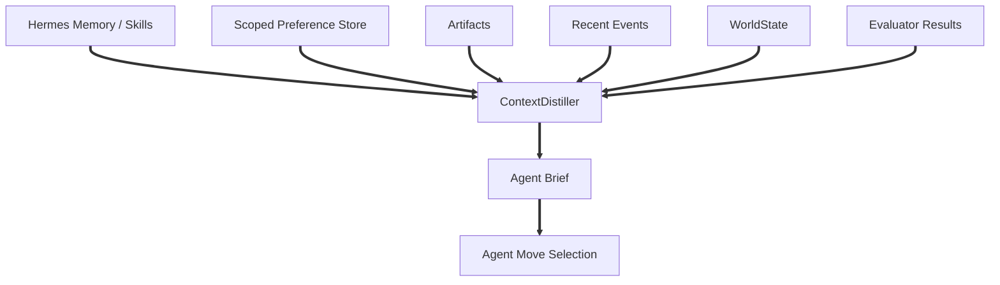
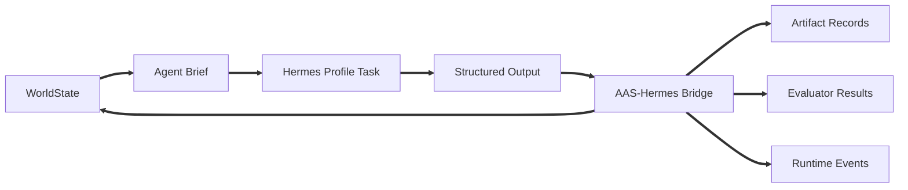

# Chapter 2.2 - Memory Architecture

## 2.2.0 Overview

This chapter defines how memory, preference scope, and system learning support the A.A.S. Field Runtime. Hermes provides profile memory, skills, and procedural learning for agents. A.A.S. provides product truth through WorldState, Agent Briefs, artifacts, tensions, branches, commits, scoped preferences, feature scores, and runtime events.

### 2.2.1 Native Memory Model

**Hermes Profile Memory:** Hermes profile memory is useful for agent habits, reusable procedures, skill improvement, prior failures, and role-specific recall. It is not active project truth. \
**Runtime Recall:** Memory retrieval is useful for background continuity, stable user preferences, prior lessons, and reusable knowledge. It is not the same as the current design world. \
**WorldState Boundary:** Current project truth lives in A.A.S. WorldState and related database records. Memory can inform WorldState, but it should not replace structured product state. \
**Commit Boundary:** Architectural decisions become canonical through commits, not through casual memory writes. Memory may summarize decisions, but the CommitmentLedger is authoritative. \
**Distillation Rule:** Agents should receive compact, relevant context through Agent Briefs. They should not be expected to call multiple memory tools unless the selected move explicitly requires deeper retrieval.



### 2.2.2 Memory Layers and Workspace Files

**Profile Memory:** Hermes profile memory stores how an agent works: procedures, role habits, skill hints, prior failures, and profile-local recall. \
**A.A.S. Product State:** Projects, sessions, WorldState snapshots, affordances, moves, move patterns, features, evaluations, tensions, branches, commits, artifacts, approvals, preferences, and runtime events belong in the A.A.S. backend. \
**Artifact Storage:** Generated documents, images, models, diagrams, board packages, validation reports, evaluator reports, and exports are stored as artifacts with lineage and references. \
**Agent Briefs:** Briefs are generated views, not permanent memory. They are produced from WorldState plus relevant memory, preferences, artifacts, commits, evaluations, and events for a specific agent role and move. \
**Snapshots and Replay:** WorldState snapshots and runtime events provide replay/debug capability without relying on chat transcript memory.

```text
Hermes profile memory:
  profile config
  role files
  skills/
  profile-local memory
  sessions
  task logs

A.A.S. persisted state:
  world_states
  affordances
  moves
  move_patterns
  feature_registry
  evaluations
  tensions
  branches
  commits
  artifacts
  preferences
  runtime_events
  agent_briefs
```

### 2.2.3 WorldState as Active Context

**WorldState:** The canonical active design state includes goal, current intent, project status, active branch, branches, artifacts, committed decisions, unresolved tensions, available moves, blocked moves, constraints, success metrics, feature state, design debt, recent events, open questions, and risks. \
**GoalState:** Stores the user goal, normalized goal, project type, desired outputs, user values, non-goals, and priority stack. \
**IntentState:** Tracks phase, focus, active question, current tension, desired next artifact, active process landmark, and current design debt pressure. \
**ProjectState:** Tracks brief, research, concept, ground truth, board, model, artifact coverage, and validation status. \
**FeatureState:** Stores measured or inferred values such as concept strength, spatial coherence, ground-truth readiness, drawing consistency, tension reduction, branch diversity, user alignment, cost, risk, and elegance. \
**Use in Memory:** Memory retrieval can supply missing history or preferences, but WorldState is the source used to compile the immediate operating situation.

### 2.2.4 Agent Brief Write and Read Path

**Read Path:** The ContextDistiller reads WorldState, selected artifacts, scoped preferences, relevant commits, active tensions, evaluator outputs, recent events, and memory snippets to produce an Agent Brief. \
**Move Context:** Each brief includes valid moves, blocked moves, feature pressures, design debt, warnings, an output contract, source manifest, and only the context needed for the role. \
**Write Path:** Agents do not directly update WorldState by prose. They return outputs through MoveCompiler/bridge-controlled contracts. The executor registers artifacts, updates branches or tensions, records feature deltas, creates events, and writes state changes. \
**Memory Side Effects:** If a durable lesson or procedure should be remembered, the system may also write a Hermes profile memory or skill update, but this is secondary to product state. \
**Reviewability:** Every important state transition should be inspectable through events, artifacts, commits, evaluations, score breakdowns, task bindings, or snapshots.



### 2.2.5 Preference Scope and User Context

**Profile Source:** Stable user context is curated from `USER.md`-style files and extraction notes. High-signal facts such as domain, working style, recurring projects, and durable constraints may enter the Preference Store. Raw evidence logs, transient one-off tasks, and tool schemas should not be injected into every agent turn. \
**User Extraction Notes:** `user_extraction_notes.md` identifies durable user context such as Architecture/AEC plus software-development domain context, concise and surgical response preferences, forwarding-ready output, secure token handling, SEO preservation, and recurring projects. These belong in scoped preference/profile records, not in project truth unless committed. \
**Preference Records:** Every preference must have tenant, scope type, scope ID, key, value, confidence, source, visibility, portability, creator, allowed consumers, and optional expiry. \
**Scope Types:** Use user, team, project, session, and agent-profile scopes. User taste is private by default. Project truth is explicit by commit. Agent memory is procedural, not user taste. \
**Resolution Order:** Explicit prompt overrides session choices; session choices override project commits where allowed; project commits override user preferences; user preferences override team standards only for that user; defaults come last. High-impact conflicts should create an affordance to resolve the conflict. \
**Context Manifests:** Every Agent Brief should include source references for preferences it used, such as project commit IDs, user preference IDs, team standards, or session-scoped instructions. \
**No Preference Bleed:** Retrieval must filter by tenant and allowed scopes before semantic search. Do not use one global vector memory without strict metadata filters.

### 2.2.6 Retrieval, Indexing, and Recall Pipeline

**Relevant Retrieval:** Retrieval is triggered by move requirements, unresolved questions, stale research, missing precedent context, user-profile needs, or evaluator uncertainty. \
**Compiled Briefs:** Agents should not receive broad memory dumps. The distiller should provide compact excerpts and references with enough provenance for inspection. \
**Artifact References:** Large artifacts should be passed by reference, not inlined into prompts. The executor resolves paths or asset IDs when dispatching work. \
**Commit Awareness:** Retrieved context must be filtered against committed decisions. A memory snippet that conflicts with a commit should become a tension or warning, not silently override project truth. \
**Search Surfaces:** Hermes profile memory, skills, scoped preferences, file reads, artifact metadata, project commits, evaluator output, and move statistics can all feed the distiller, but agents experience the result as a brief.

### 2.2.7 System Learning and Maintenance

**Commit Ledger First:** Major decisions, rationale, evidence, affected artifacts, reversibility, and approval metadata belong in commits. \
**Event-Sourced History:** Runtime events record what happened: moves generated, moves selected, Hermes tasks created, execution started, artifacts created, evaluator scores measured, tensions resolved, branches merged, commits created, warnings raised, and approvals requested. \
**Move Pattern Learning:** Move executions should log before/after WorldState, selected pattern, artifacts created, score delta, user acceptance, evaluator results, and failure modes. These logs update move stats without changing model weights. \
**Effect Learning:** Predicted feature deltas from move patterns should be compared with measured feature deltas from evaluators, then used to update sensitivity matrices and contextual reward estimates. \
**Memory Summaries:** Maintenance agents can summarize stable lessons into Hermes profile memory or shared knowledge, but they must preserve the distinction between memory summaries and canonical product records. \
**Staleness Detection:** The system should flag stale research, outdated models, invalid artifacts, unresolved critical tensions, weak move patterns, stale evaluator results, and branches that no longer align with committed truth. \
**Replayability:** WorldState snapshots plus events should be enough to reconstruct the design field state for debugging or review.

### 2.2.8 Storage Boundaries, Guidance, and Anti-Patterns

**Backend-Owned State:** A.A.S. persists WorldState objects, moves, move patterns, features, evaluations, tensions, branches, commits, artifacts, approvals, preferences, task bindings, and events in the backend database and storage layer. \
**Hermes-Owned Execution Memory:** Hermes owns profile memory, worker execution state, skills, task logs, and session-level execution context. \
**No Memory-as-Database:** Do not treat markdown memory files or Hermes profile memory as the product database. \
**No Hidden Commit:** Do not record a major design direction only in chat, memory, or profile recall. It must be a commit. \
**No Unscoped Preference:** Do not use a preference unless it has an owner, scope, source, visibility, and allowed consumer path. \
**No Raw Dump Briefs:** Do not compile massive unfiltered memory and artifact content into every agent turn. \
**No Tool-First Recall:** Do not require the agent to search everything before it can choose a move. The environment should mediate the situation. \
**No Cross-Project Profile Bleed:** Do not let one shared Hermes specialist profile carry project-specific taste, facts, or commitments into unrelated projects.
