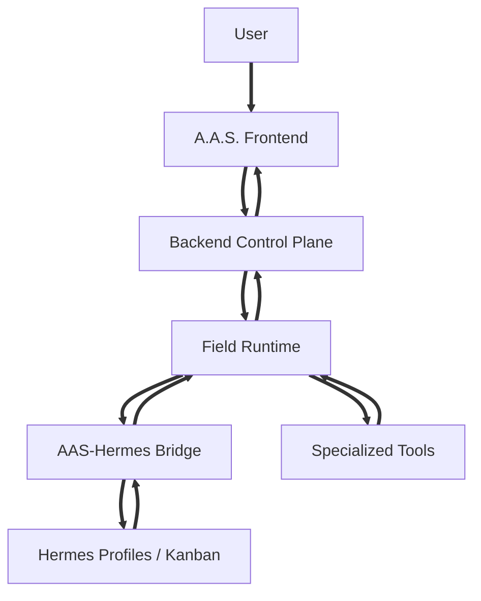
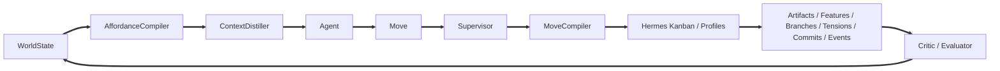

# Chapter 2.3 - Field Runtime Architecture

## 2.3.0 Overview

This chapter defines the A.A.S. Field Runtime: the design-intelligence layer above Hermes that turns architectural work into a living design field. The runtime replaces graph-first pipeline execution with WorldState, affordances, primitives, move patterns, moves, branches, tensions, commits, feature scores, briefs, Hermes execution, critique, learning, and replayable events.

### 2.3.1 Design Principles

**Affordances Over Graphs:** The system exposes meaningful next moves instead of asking the human to pre-author every workflow path. \
**Environment Mediation:** Agents should not manually browse every tool, file, memory source, and node. The environment compiles the current situation and exposes legal moves. \
**Typed Moves:** Agents choose architectural moves. A.A.S. maps those moves to Hermes tasks, artifact contracts, Rhino Compute, GPT Image V2, renderers, validators, and state updates. \
**Stable Primitives, Evolvable Patterns:** Primitive move types are few, stable, permissionable world-delta verbs. Move patterns are domain-specific architectural tactics that can be seeded, learned, sandboxed, promoted, and pruned. \
**WorldState as Canon:** The current design world is represented as structured state, not as chat history, profile memory, or a pipeline pointer. \
**Hermes as Execution Fabric:** A.A.S. compiles moves into Hermes Kanban task groups assigned to Hermes profiles. Hermes executes; A.A.S. validates and records truth. \
**Commitment Physics:** Branches can speculate, but only commits change project truth. \
**Tension Resolution:** Design conflicts are first-class objects that generate moves and can block finalization when critical. \
**Inspectable Control:** Scores, preconditions, risks, approvals, artifacts, feature deltas, task bindings, and events should remain visible and overrideable.

### 2.3.2 High-Level System Model

**Layer 1 - A.A.S. Frontend:** Presents the Field Navigator, Chat, Model Mode, artifact inspection, trace view, approvals, feature pressures, and object inspectors. \
**Layer 2 - Backend Control Plane:** Owns persistence, permissions, project state, WorldState records, artifacts, approvals, preferences, events, sessions, and API contracts. \
**Layer 3 - A.A.S. Field Runtime:** Owns WorldState compilation, affordance generation, context distillation, feature extraction, intent scoring, process grammar, design debt, move pattern selection, tension tracking, branch ecology, commitment rules, move compilation, and critic/supervisor logic. \
**Layer 4 - A.A.S.-Hermes Bridge:** Owns profile binding, Kanban task creation, dependency linking, dispatcher monitoring, log watching, artifact ingest, and event translation. \
**Layer 5 - Hermes Agent:** Provides profiles, Kanban, worker execution, memory, skills, tools, dispatcher, logs, and task state. \
**Layer 6 - Specialized Tools:** Provides geometry computation, image generation, segmentation, rendering, validation, and export.

### 2.3.3 Core Runtime Objects

**WorldState:** Canonical state of the design world: goal, intent, project status, branches, artifacts, committed decisions, unresolved tensions, available moves, blocked moves, constraints, metrics, events, questions, risks, feature state, design debt, and trajectory. \
**Affordance:** A meaningful available move with label, intent, primitive type, pattern ID, preconditions, expected gain, risk, cost, inputs, resulting artifacts, required profiles/tools, score breakdown, approval requirements, reversibility, and recommended role. \
**Move:** The selected execution intent. It references an affordance, records rationale and expected outcome, tracks approval state, maps to Hermes task bindings, and moves through queued, running, completed, failed, or cancelled statuses. \
**MovePrimitive:** A stable operation type such as update intent, create artifact, refine artifact, validate, raise tension, resolve tension, spawn branch, develop branch, compare branches, merge branches, kill branch, ask user, propose commit, commit decision, revert commit, or request execution. \
**MovePattern:** A reusable architectural tactic with preconditions, inputs, outputs, expected effects, scoring hints, risk/cost model, execution template, validation tests, examples, success stats, lifecycle status, and version. \
**IntentGradient:** Multi-family score model for comparing moves across process, design, search, execution, user alignment, learning, governance, elegance, and penalties. \
**Feature Registry:** Typed registry of measurable design/process/execution variables, including source, range, confidence, artifact hooks, and measurement method. \
**Tension:** A structured design conflict linked to artifacts, branches, severity, status, possible resolutions, and evidence. \
**Branch:** A competing design hypothesis with artifacts, evidence, weaknesses, unresolved tensions, score, lifecycle status, and next recommended move. \
**Commit:** A decision that becomes project truth with rationale, evidence, consequences, affected artifacts, affected branches, reversibility, approval, and timestamp. \
**Agent Brief:** Distilled operating context for a specific agent role and move. \
**Trajectory:** History of WorldState snapshots, moves, decisions, abandoned branches, failed moves, unresolved design debts, and process landmarks.

### 2.3.4 Runtime Loop

**Main Loop:** The user sets or updates a goal. The backend initializes or updates WorldState. The AffordanceCompiler generates moves from the Move Pattern Library. The ContextDistiller prepares a brief. The agent selects or proposes a move. The Supervisor validates it. The MoveCompiler compiles it into Hermes tasks. Hermes profiles execute. The bridge ingests logs and artifacts. Artifacts, tensions, branches, commits, feature scores, and events update. The Critic/Evaluator measures results. New moves appear. \
**Agent Turn:** Prepare brief, present valid moves, select or propose move, validate move, compile Hermes task packet, execute, record result, evaluate, update world, emit next situation. \
**User Intervention:** The user can approve or reject moves, change goals, elevate tensions, commit branches, freeze decisions, force validation, resolve preference conflicts, or manipulate objects in the Field Navigator.

### 2.3.5 Move Execution Lifecycle

1. **Move Selection:** Agent selects a recommended affordance or proposes a new move with rationale. \
2. **Legality Check:** AffordanceCompiler validates preconditions, primitive type, and move pattern state. \
3. **Risk Check:** Supervisor checks approvals, cost, safety, reversibility, drift, preference scope, and conflicts with commits. \
4. **Context Load:** ContextDistiller and compiler load required inputs, artifact refs, scoped preferences, memory snippets, branch data, evaluator results, and constraints. \
5. **Task Compilation:** MoveCompiler creates a Hermes task group with task packets, assigned profiles, dependencies, output contracts, artifact roots, and expected feature deltas. \
6. **Execution:** Hermes profiles execute tasks. Specialized tools run only through typed task packets and move contracts. \
7. **Registration:** Outputs are stored as artifacts and linked to source artifacts, branches, tensions, commits, features, task bindings, and events. \
8. **Evaluation:** Artifact evaluators measure feature deltas, critique quality, and compare predicted effects to actual effects. \
9. **World Update:** WorldState changes, events emit, move pattern stats update, and the compiler regenerates available moves.

### 2.3.6 Move Pattern Library

**Three Layers:** Move primitives are stable system verbs. Move patterns are reusable architectural tactics. Move instances are concrete actions in the current WorldState. \
**Pattern Schema:** A pattern records ID, name, description, primitive type, domain, preconditions, inputs, outputs, effects, scoring hints, risk profile, cost model, execution template, validation tests, examples, success stats, lifecycle status, and version. \
**Lifecycle:** `discover -> propose -> sandbox -> critique -> validate -> promote -> monitor -> prune`. Agents may propose patterns, but they cannot directly promote them to stable. \
**Sandbox:** Patterns are tested against saved WorldState snapshots and synthetic worlds for schema validity, artifact creation, state improvement, no commit violation, and critic score. \
**Curator:** The Move Curator deduplicates, merges variants, deprecates weak patterns, updates examples, and keeps the active library small enough to remain useful. \
**Learning:** Move pattern statistics are conditional on context: phase, active tensions, branch count, artifact coverage, prior failures, user acceptance, reward, and feature deltas.

### 2.3.7 Process Grammar, Trajectory, and Design Debt

**Process Grammar:** A.A.S. uses a soft phase model rather than a rigid pipeline. Phases include intake, research, concept, branching, ground truth, development, representation, board assembly, QA, and delivery. \
**Phase Fit:** Each move pattern has a phase-fit curve, preferred phases, discouraged phases, entry conditions, exit conditions, required artifacts, and process debts. \
**Trajectory Memory:** Ranking depends on the path already taken: snapshots, moves, commits, abandoned branches, failures, unresolved debts, and landmarks. \
**Design Debt:** The runtime tracks unresolved obligations such as unconfirmed site assumptions, uncritiqued branches, missing ground truth, unchecked render/model consistency, board hierarchy gaps, or too many open branches. \
**Unlock Value:** Moves are scored not only by immediate gain but by future moves unlocked. A section anchor may outrank a render because it unlocks model, plan, section, render QA, and board coherence.

### 2.3.8 Branch Ecology

**Purpose:** Branches let the system develop competing architectural hypotheses instead of locking onto the first plausible idea. \
**Lifecycle:** `spawn -> develop -> critique -> compare -> kill / merge / commit`. \
**Scoring:** Branches are scored by goal fit, architectural coherence, representational strength, feasibility, novelty, user taste fit, ground-truth readiness, and total value. \
**Comparison:** Branch comparison should expose shared tensions, unique strengths, unresolved risks, artifact completeness, ground-truth readiness, and representation strength. \
**Governance:** Killing, merging, or committing high-value branches requires supervisor validation and may require user approval.

### 2.3.9 Tension Engine

**Detection:** Tensions are created when the system detects contradictions, unresolved tradeoffs, artifact conflicts, branch weaknesses, preference conflicts, or validation failures. \
**Resolution Moves:** The compiler generates moves that can resolve or defer tensions. \
**Blocking Rule:** Finalization should be blocked while critical unresolved tensions remain. \
**Artifact Links:** Tensions must link to affected artifacts and branches so downstream work knows what must change after resolution. \
**Resolved State:** Resolved tensions become evidence attached to commits and constraints.

### 2.3.10 Commitment Ledger

**Commit Rule:** Only commits change project truth. \
**Commit Contents:** A commit records decision, rationale, evidence, consequences, affected artifacts, affected branches, reversibility, approval source, approval reference, and timestamp. \
**Revert Rule:** Reverting a commit creates a new event and state transition. It does not delete history. \
**Downstream Enforcement:** ContextDistiller and Supervisor must check new moves against committed decisions. Conflicts become warnings, tensions, or blocked moves.

### 2.3.11 Scoring, Features, and Evaluators

**Score Families:** The serious scoring model is not one flat score. It combines process, design, search, execution, user alignment, learning, governance, elegance, and explicit penalties. \
**Feature Registry:** Every scoring variable must be registered with family, description, type, range, measurement method, source, and confidence. No registry means score soup. \
**Feature Methods:** Features can be deterministic, graph-derived, geometry-derived, embedding-derived, or evaluator-derived. \
**Evaluator Contracts:** Concept, plan, section, model, render, board, and QA evaluators output feature scores, evidence, confidence, and critique. \
**Sensitivity Matrix:** The runtime maintains expected effects from move patterns to features, compares predictions to measured deltas, and updates the effect model over time. \
**Elegance:** Elegance rewards leverage, compression, coherence gain, multi-tension resolution, artifact reuse, simplicity, downstream unlock density, and low fragmentation. \
**Closed-Loop Fine Tuning:** The system can target a feature vector, measure current feature state, compute an error vector, choose moves predicted to reduce the error, execute, measure, update, and repeat.

### 2.3.12 Context Distillation

**Brief Composition:** Agent Briefs include current goal, current intent, active branch, current tension, relevant commits, relevant artifacts, valid moves, blocked moves, output contract, warnings, feature pressures, and design debt. \
**Memory Use:** Memory retrieval is hidden infrastructure unless the move explicitly requires deeper search. \
**Reference Passing:** Large documents, images, models, and board packages are passed by reference. \
**Output Contracts:** Briefs define what the Hermes profile must return so A.A.S. can validate, register, evaluate, and update state. \
**Preference Scope:** The brief resolves user, team, project, session, and prompt preferences through scope rules and includes a source manifest for every preference that influenced the task.

### 2.3.13 Hermes Bridge and Execution Substrate

**Bridge Responsibilities:** The `aas-hermes-bridge` creates/syncs Hermes profiles, compiles A.A.S. moves into Kanban tasks, assigns profiles, links dependencies, starts or monitors dispatch, tails logs/comments, registers artifacts, and converts Kanban events into A.A.S. field events. \
**Task Packets:** Every Hermes task receives an A.A.S. packet containing move ID, world snapshot, profile, role, goal, active tension, relevant commits, allowed outputs, artifact write path, and completion contract. \
**Bindings:** A.A.S. tracks `HermesProfileBinding`, `KanbanTaskBinding`, and `AASMoveToKanbanPlan` records so every field move can be traced to execution tasks. \
**Control Model:** A.A.S. controls task topology, dependencies, approvals, artifact registration, and truth ledger. Hermes executes tasks, uses tools, writes comments/logs, and updates task status. \
**MVP Integration:** Start with CLI bridge, then add Kanban DB watcher, log/artifact watcher, profile pack manager, and later a direct Hermes plugin/API if stable.

### 2.3.14 Event System and Observability

**Stable Events:** A.A.S. emits product events such as `aas.world.updated`, `aas.affordances.generated`, `aas.move.proposed`, `aas.move.selected`, `aas.move.started`, `aas.move.completed`, `aas.move.failed`, `aas.tension.created`, `aas.tension.resolved`, `aas.branch.spawned`, `aas.branch.merged`, `aas.branch.committed`, `aas.commit.created`, `aas.artifact.created`, `aas.evaluation.completed`, `aas.supervisor.warning`, and `aas.user.approval.required`. \
**Hermes Event Translation:** Kanban ready/running/blocked/done/failed/retry, task comments, worker heartbeat, task logs, and artifact paths are translated into stable A.A.S. events. \
**Replay:** Runtime events plus WorldState snapshots should reconstruct the design field for trace view, debugging, and review. \
**Trace View:** Graph-like execution history remains available as a debug/replay mode, not as the primary design interface.

### 2.3.15 API Surface

**World State:** `GET /api/projects/:projectId/sessions/:sessionId/world`, `POST /api/projects/:projectId/sessions/:sessionId/world/recompute`, and snapshot routes. \
**Affordances:** List, recompute, approve, and reject available moves. \
**Moves:** Create, inspect, execute, cancel, and retry moves. \
**Move Patterns:** List, propose, sandbox, validate, promote, deprecate, and inspect move patterns and success stats. \
**Features and Evaluations:** List feature registry entries, evaluator results, score breakdowns, sensitivity matrix entries, and measured deltas. \
**Tensions:** List, create, patch, resolve, and defer tensions. \
**Branches:** List, create, develop, critique, kill, merge, and commit branches. \
**Commits:** List, create, and revert commits. \
**Agent Briefs:** Generate and inspect briefs for agent turns. \
**Hermes Bridge:** Inspect profile bindings, Kanban task bindings, task packets, task logs, and bridge status.

### 2.3.16 Persistence Model

**Core Tables:** `projects`, `sessions`, `world_states`, `affordances`, `moves`, `move_patterns`, `move_pattern_stats`, `feature_registry`, `feature_scores`, `evaluations`, `sensitivity_matrix`, `design_debts`, `process_landmarks`, `trajectories`, `tensions`, `branches`, `commits`, `artifacts`, `artifact_links`, `runtime_events`, `agent_briefs`, `move_executions`, `branch_scores`, `intent_scores`, `preferences`, `approvals`, `hermes_profile_bindings`, and `kanban_task_bindings`. \
**Snapshots:** Store periodic WorldState JSON snapshots for replay and debugging. \
**Normalized Records:** Normalize core objects while keeping payload JSON for evolving move, branch, tension, scoring, feature, evaluation, and bridge details. \
**Artifact Lineage:** Artifacts link to source artifacts, branches, tensions, commits, moves, Hermes tasks, feature evaluations, and validations.

### 2.3.17 External Tool Integration

**Hermes:** MoveCompiler and the bridge use Hermes for profile execution, Kanban task coordination, profile memory/skills, logs, worker processes, and tool access. \
**Rhino Compute:** Geometry computation is invoked through model-related moves, not exposed as a raw everyday agent choice. \
**GPT Image V2:** Image generation is invoked through moves such as atmosphere studies, render refinement, board layout options, and consistency QA. \
**Validators:** Segmentation, model checks, drawing cuts, render consistency checks, evaluator reports, and board QA are validation moves linked to artifacts and commits.

### 2.3.18 Failure and Recovery Model

**Move-Local Recovery:** Failed moves can be retried, cancelled, corrected, or replaced without resetting the entire project. \
**State Preservation:** Failed outputs remain inspectable as artifacts or events where useful. \
**Supervisor Escalation:** High-risk failures, unresolved critical tensions, contradiction with commits, risky preference conflicts, or expensive reruns require supervisor review and sometimes user approval. \
**Blocked Moves:** Moves that fail preconditions should remain visible as blocked moves with clear reasons. \
**Task Recovery:** Hermes task failure, heartbeat loss, block, retry, and cancellation are translated into move status and supervisor warnings. \
**Learning From Failure:** Failed moves update contextual outcome stats and may produce Curator work to revise or deprecate weak patterns.

### 2.3.19 Field Authoring Surface

**Field Navigator:** The primary authoring surface is a spatial field where users manipulate goals, branches, tensions, moves, commits, artifacts, agents, features, and lineage. \
**Affordance Wheel:** Selecting an object opens nearby move options relevant to that object. \
**Commit Spine:** Committed decisions appear as a stable project-truth spine. \
**Branch Clusters:** Competing hypotheses appear as clusters that can be developed, compared, merged, killed, or committed. \
**Feature Pressure View:** Current design pressures such as privacy, view, coherence, risk, cost, and elegance can be visualized without exposing the full scoring matrix. \
**Trace View:** A graph view remains available for execution history, Hermes task bindings, and debugging. \
**Move Library Editor:** Advanced users can inspect stable, sandbox, proposed, and deprecated move patterns with preconditions, effects, examples, success stats, tests, and traces.

### 2.3.20 Anti-Patterns

**Static Pipeline as Primary Interface:** Do not make the human predict the full workflow before the design task unfolds. \
**Raw Tool Selection:** Do not expose low-level tool choice as the normal agent decision surface. \
**Unscored Moves:** Do not hide why a move is recommended, blocked, risky, expensive, elegance-positive, or approval-gated. \
**Chat as State:** Do not rely on chat history as the source of truth. \
**Artifact Without Lineage:** Do not create outputs that cannot be traced back to moves, branches, tensions, commits, source artifacts, evaluations, or Hermes tasks. \
**Finalization With Critical Tensions:** Do not finalize boards or delivery outputs while unresolved critical tensions remain. \
**A.A.S. Rebuilding Kanban:** Do not duplicate Hermes Kanban inside A.A.S. Use Hermes as execution substrate and keep A.A.S. focused on design semantics. \
**Unregistered Score Variables:** Do not add scoring variables that have no Feature Registry entry, source, measurement method, or confidence. \
**Unvalidated Learned Moves:** Do not let an agent promote a new move pattern directly into stable use without schema validation, sandbox tests, critic review, and supervisor approval.
