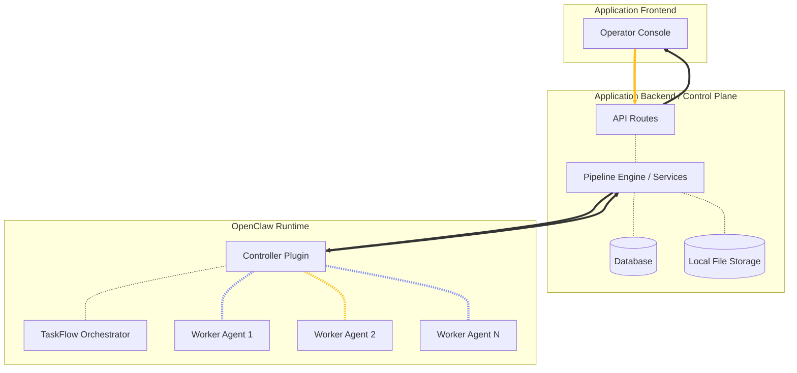
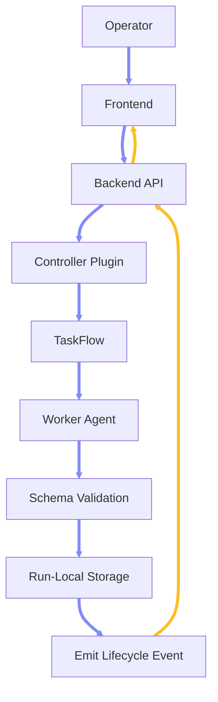
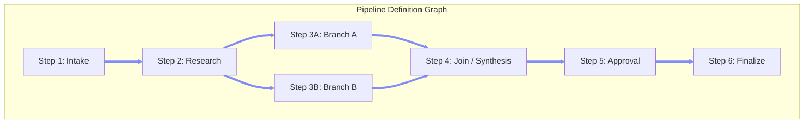
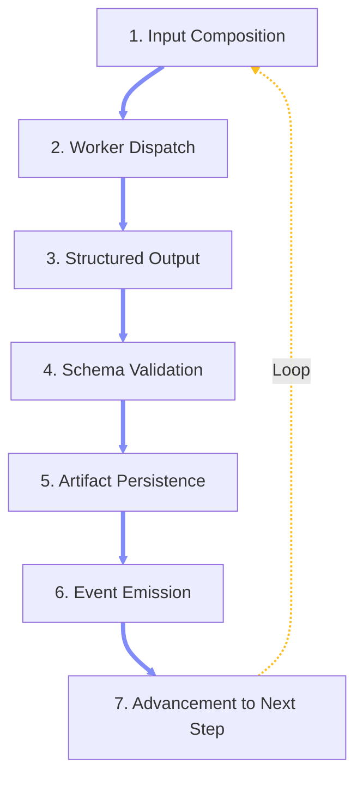
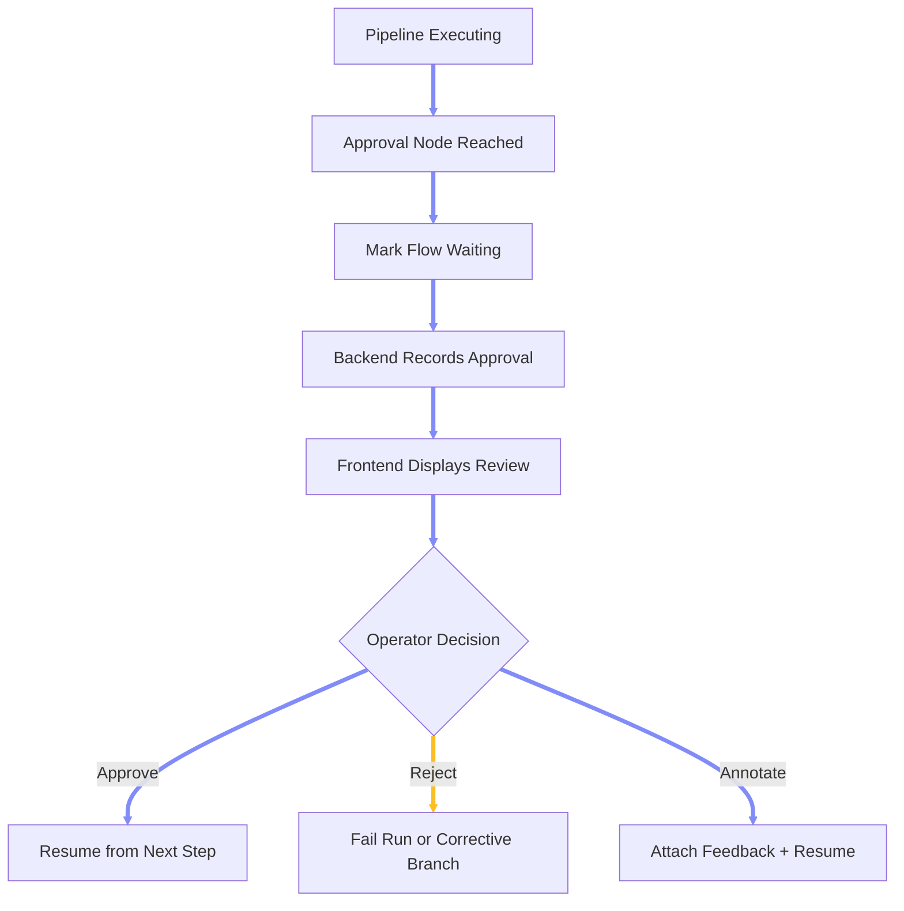
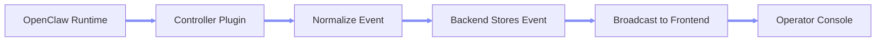
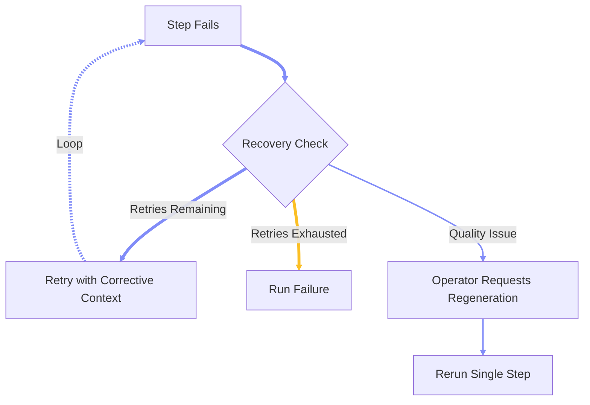

# Chapter 2.3 — Pipeline Architecture

## 2.3.0 Overview

This chapter defines the reference architecture for building structured multi-agent workflow pipelines on top of OpenClaw, covering the three-layer system model, pipeline definition, step execution, orchestration state, data handoff, human-in-the-loop checkpoints, failure recovery, and event-driven observability.

### 2.3.1 Design Principles

**Separation of Control and Execution:** The product application owns all user-facing state — projects, sessions, runs, artifacts, approvals, and event history. OpenClaw serves as the execution engine. Agents do not directly own product state; they produce bounded, typed, reviewable outputs that the application validates, stores, and advances through the pipeline. \
**Pipelines as Data:** Pipeline definitions are declarative data structures — directed graphs of typed steps — interpreted and executed by code rather than hardcoded into agent instructions. This makes pipelines inspectable, versionable, and editable by the operator without modifying agent internals. \
**Structured Contracts Between Steps:** Pipeline stages communicate through structured data contracts with declared input and output schemas, not unstructured prose. This ensures deterministic handoff, schema-validated advancement, and repeatable assembly of final deliverables. \
**Step-Local Recovery:** When failures occur, the system prefers retrying or resuming at the individual step level rather than resetting entire runs, preserving all prior valid work and minimizing wasted compute. \
**Human Steerability:** The operator maintains control at every critical decision point. Approval checkpoints, artifact previews, operator annotations, and explicit resume or reject controls are first-class pipeline primitives, not afterthoughts. \
**Inspectable and Resumable:** Every step of the pipeline produces typed, reviewable outputs. The operator can pause at approval checkpoints, inspect intermediate artifacts, reject or revise, and resume without restarting the entire workflow.

### 2.3.2 Three-Layer System Model

**Layer 1 — Application Frontend:** The operator-facing UI provides the shell for pipeline authoring, agent-driven conversation, artifact review, and domain-specific visualization. It is a typed client of backend DTOs, consuming only the backend API and never calling worker agents or OpenClaw directly. \
**Layer 2 — Application Backend (Control Plane):** The backend is the product logic layer and the source of truth for all user-facing state, including projects, pipelines, sessions, runs, artifacts, approvals, events, and domain state. It delegates execution to OpenClaw and receives normalized lifecycle events in return. Recommended stack: a TypeScript API framework (e.g., Fastify) with an ORM (e.g., Prisma) against a local-first database (e.g., SQLite), with an upgrade path to a managed database for multi-user or hosted deployments. \
**Layer 3 — OpenClaw Runtime:** OpenClaw serves as the execution engine. A product-specific Controller Plugin creates and manages TaskFlow flows, dispatches worker agents, validates step outputs against schemas, and emits lifecycle events back to the backend. TaskFlow owns durable orchestration state — current step, persistent `stateJson`, retry counters, child task linkage, and checkpoint state needed to resume execution. It does not own product business logic.



### 2.3.3 Data Flow Architecture

**Inbound Request:** The operator initiates a pipeline run from the frontend. The request flows through the backend API, which validates input, creates run records, and delegates execution to the OpenClaw Controller Plugin. \
**Step Dispatch:** The Controller Plugin reads the pipeline definition, resolves the current step, composes the step input from prior artifact paths and flow state, and launches the assigned worker agent or tool call. \
**Step Return:** The worker agent returns a structured output. The Controller Plugin validates the output against the step's declared output schema. On success, the output is written to run-local storage, TaskFlow `stateJson` is updated, and a normalized event is emitted to the backend. \
**Backend Persistence:** The backend receives each lifecycle event, updates database records (run steps, artifacts, project state), and pushes live updates to the frontend. \
**Final Assembly:** Once all pipeline steps complete, the backend registers final outputs, emits completion events, and exposes the finished deliverables to the operator.



### 2.3.4 Pipeline Definition Model

**Declarative Graph Structure:** A pipeline is a directed acyclic graph (DAG) of typed step nodes connected by edges that define execution order and data flow. The pipeline definition is stored as a persistent data structure (e.g., JSON) in the backend database, not embedded in agent instructions or hardcoded into controller logic. \
**Step Definition Contract:** Each step in the pipeline declares the following properties:

```json5
{
  stepId: "research",                     // Unique stable identifier
  label: "Research Agent",                // Human-readable display name
  nodeType: "agent | tool | approval",    // Execution type
  executorId: "research-agent",           // Agent ID or tool ID to dispatch
  inputSchema: { /* JSON Schema */ },     // Declared input contract
  outputSchema: { /* JSON Schema */ },    // Declared output contract
  retryPolicy: {
    maxAttempts: 3,
    backoffMs: 2000
  },
  approvalRequired: false,               // Whether to pause for human review
  contextMode: "inherit | summary | isolated",
  nextSteps: ["concept"]                 // Downstream step IDs
}
```

**Node Types:** Three distinct node types are available: Agent nodes (which execute a worker agent with a role, task prompt, and system prompt), Tool nodes (which invoke a specific tool or external service call), and Approval nodes (which pause execution for human review before advancing). \
**Edge Semantics:** Edges encode both execution order and data lineage. An edge from step A to step B means step B receives step A's validated output as part of its input context. Edges can carry metadata such as context mode overrides and data filtering rules. \
**Parallel Branches:** The DAG supports parallel branches where multiple steps can execute concurrently. A downstream join step can declare multiple upstream dependencies, waiting for all branches to complete before advancing. Concurrency limits are configurable per pipeline or per parallel group. \
**Pipeline Persistence:** The backend stores pipeline definitions including all node metadata, edge definitions, and layout coordinates. Pipelines are versioned and can be duplicated, renamed, or archived without affecting active runs.



### 2.3.5 Step Execution Lifecycle

**Execution Loop:** The Controller Plugin drives the pipeline forward one step at a time (or in parallel where the DAG permits). For each step, the following lifecycle applies:

1. **Input Composition:** The controller reads prior artifact paths from TaskFlow `stateJson`, composes the exact step input using the pipeline definition's data handoff rules, and resolves context mode (inherit, summary, or isolated). \
2. **Worker Dispatch:** The controller launches the assigned worker agent or tool call via `sessions_spawn`, passing the composed input payload and any role-specific instructions from the step definition. \
3. **Structured Output:** The worker returns a structured output conforming to the step's declared output schema. All important outputs must be persisted as files and registered as artifacts — agents do not rely on ephemeral chat state for pipeline continuity. \
4. **Schema Validation:** The controller validates the returned output against the step's output schema. If validation fails, the step does not advance and a structured failure is recorded. \
5. **Artifact Persistence:** On successful validation, the controller writes the step output to run-local storage, creates artifact records, and updates TaskFlow `stateJson` with the new artifact paths. \
6. **Event Emission:** The controller emits a normalized lifecycle event to the backend (e.g., `step.started`, `step.completed`, `step.failed`). The backend converts this into a stable product event, stores it, and broadcasts it to the frontend. \
7. **Advancement:** The controller resolves the next step(s) from the pipeline graph and repeats the cycle.



### 2.3.6 Context Modes and Data Handoff

**Context Inheritance:** Three context modes control how upstream information flows to each step, determining the balance between full conversational context and execution isolation. \
**`inherit` Mode:** The step receives the full summarized context from all upstream steps, including user messages, prior agent outputs, and accumulated project state. This is the default mode for steps that require broad awareness of the pipeline history. \
**`summary` Mode:** The step receives only a summarized digest of upstream outputs — typically the final structured artifacts from each prior step rather than the full conversational transcript. This reduces context window consumption while preserving data lineage. \
**`isolated` Mode:** The step receives only its explicit input payload as defined by the step contract, with no broader conversation snapshot or upstream context. This is used for steps that must operate in a controlled, deterministic environment without being influenced by unrelated upstream chatter. \
**Handoff Notes:** When one step completes, the controller can generate a structured handoff note that summarizes the step's key outputs, decisions, and any operator feedback. This note becomes part of the downstream step's input context, providing a human-readable bridge between steps. \
**Persistent Context vs. Ephemeral Context:** Persistent context (project state, accumulated artifacts, operator preferences) survives across steps and runs. Ephemeral context (in-step reasoning, intermediate scratch work) does not propagate unless explicitly promoted to an artifact. \
**Cross-Step Data References:** Steps can reference upstream artifacts by stable path rather than by embedding full content. The controller resolves these references at dispatch time, ensuring that large artifacts (images, generated files, structured documents) are passed by reference rather than inlined into the context window.

### 2.3.7 Human-in-the-Loop Checkpoints

**Approval Nodes:** Any step in the pipeline can be configured as an approval checkpoint. When the pipeline reaches an approval node, execution pauses and the operator is presented with explicit controls to approve, reject, or annotate before the pipeline advances. \
**Checkpoint State:** When execution pauses at an approval node, the controller marks the TaskFlow flow as waiting. The backend records a pending approval request with the step ID, run ID, and a descriptive message. The frontend displays the approval action to the operator with full artifact preview. \
**Approval Resolution:** The operator resolves the approval by approving (which resumes execution from the next step), rejecting (which fails the run or routes to a corrective branch), or annotating (which attaches operator feedback that becomes part of the downstream context). \
**Operator Intervention Points:** Beyond formal approval nodes, the operator can interrupt pipeline execution at any point — injecting feedback, modifying project state, or requesting a retry of the current step. The pipeline must support graceful pause and resume around these interventions. \
**Artifact Preview:** Before resolving an approval, the operator can inspect all intermediate artifacts produced by prior steps: structured JSON outputs, generated media, reports, and accumulated project state. This inspection is a core product feature, not a debugging afterthought.



### 2.3.8 Orchestration State and TaskFlow

**Dual State Ownership:** The pipeline architecture maintains two separate state systems by design: backend-owned product state and OpenClaw-owned orchestration state. This separation keeps the product stable even if the runtime is restarted, replaced, or upgraded. \
**Backend-Owned Product State:** The backend database is the source of truth for projects, runs, assets, approvals, user-facing statuses, and event history. This state survives runtime restarts and is the canonical record for all operator-visible information. \
**OpenClaw-Owned Orchestration State:** TaskFlow `stateJson` is the source of truth for current step execution, internal artifact paths, retry counters, child task linkage, temporary selection state, and checkpoint state needed to resume execution. \
**Canonical State Shape:** The TaskFlow state for a pipeline run contains the pipeline identifier, project and run identifiers, the run directory path, current execution status, current step, input references, an artifact map tracking each step's output paths, retry counters per step, execution history, and final output paths.

```json5
{
  pipelineId: "pipeline-001",
  projectId: "proj_001",
  runId: "run_001",
  runDir: "storage/projects/proj_001/runs/run_001",
  status: "running",
  currentStep: "step_03",
  inputs: {
    briefPath: "storage/projects/proj_001/runs/run_001/input/brief.json",
    referenceAssetIds: ["asset_01", "asset_02"]
  },
  artifacts: {
    step_01_output: "storage/projects/proj_001/runs/run_001/step-01/output.json",
    step_02_output: "storage/projects/proj_001/runs/run_001/step-02/output.json",
    step_03_output: null
  },
  retries: {
    step_03: 0
  },
  history: [
    { step: "step_01", status: "completed" },
    { step: "step_02", status: "completed" }
  ],
  finalOutputs: {
    primaryPath: null,
    secondaryPath: null
  }
}
```

### 2.3.9 Worker Agent Discipline

**Bounded Outputs:** Worker agents produce bounded, typed, schema-validated outputs. They do not directly mutate canonical project database rows, do not depend on hidden chat state for continuity, and do not make assumptions about downstream processing. All important outputs must be persisted as files and registered as artifacts. \
**Replaceable and Rerunnable:** Worker agents should be stateless with respect to the pipeline. Given the same input payload, a worker agent should produce a functionally equivalent output. This enables safe retries, step-level reruns, and agent substitution without side effects. \
**Schema Compliance:** Every worker output must conform to its step's declared output schema. The Controller Plugin validates outputs before advancing the pipeline. Non-compliant outputs are rejected, the step is marked as failed, and the run can retry with corrective context. \
**No Direct Product State Mutation:** Worker agents do not write directly to the product database, do not create their own run records, and do not emit user-facing events. All state mutation flows through the Controller Plugin back to the backend. \
**Agent Specialization:** Each worker agent is a domain specialist with a focused task boundary. A research agent compiles context, a synthesis agent produces structured plans, a generation agent creates media or documents, a validation agent checks quality and consistency. The pipeline graph — not the agent — determines execution order and data flow. \
**Subagent Spawning:** Worker agents may spawn subagents for narrowly scoped subtasks when nested spawning is enabled. Subagents return results to their parent worker agent, which consolidates and returns the final step output. Subagents do not communicate laterally or directly with the Controller Plugin.

### 2.3.10 Event System and Observability

**Event Normalization:** Raw execution events from the OpenClaw runtime are converted into stable, typed product events before storage and broadcast. The frontend depends only on these normalized event contracts, never on raw OpenClaw event semantics. \
**Core Event Types:** A minimal set of event types provides full pipeline observability:

| Event Type | Trigger | Payload |
|---|---|---|
| `run.started` | Pipeline run begins | Run ID, project ID, initial step |
| `step.started` | Step dispatch begins | Run ID, step ID, attempt number |
| `step.updated` | Step progress update | Run ID, step ID, progress fraction |
| `step.completed` | Step succeeds validation | Run ID, step ID, artifact paths |
| `step.failed` | Step fails validation or execution | Run ID, step ID, error detail |
| `asset.created` | New artifact registered | Run ID, asset ID, kind, path |
| `approval.required` | Approval checkpoint reached | Run ID, step ID, prompt message |
| `approval.resolved` | Operator resolves approval | Approval ID, decision, notes |
| `run.completed` | All steps finished | Run ID, final output paths |
| `run.failed` | Run terminates with failure | Run ID, failed step, error |

**Event Flow:** The Controller Plugin emits execution-side lifecycle results. The backend converts them into stable product events, stores them in the events table, and broadcasts them to the frontend via HTTP streaming, WebSocket, or Server-Sent Events. \
**Audit Trail:** Every event is persisted with a timestamp, enabling full reconstruction of any pipeline run's execution history. Events carry agent attribution metadata, recording which agent produced each output and from which pipeline step.



### 2.3.11 Controller Plugin Architecture

**Plugin Responsibility:** The Controller Plugin is a product-specific OpenClaw plugin that bridges the backend control plane and the OpenClaw runtime. It is the execution-side workflow controller — deterministic in orchestration and strict in contracts. \
**TaskFlow Management:** The plugin creates and manages TaskFlow flows, one per pipeline run. It advances the flow through the pipeline graph, dispatching worker tasks, tracking step state, and handling branching and join logic. \
**Step Interpretation:** The plugin reads the pipeline definition from the backend, interprets each step's configuration (executor type, agent ID, input/output schemas, retry policy, approval requirements), and composes the exact dispatch payload for each worker. \
**Validation Gate:** After each worker returns, the plugin validates the output against the step's declared output schema. Only validated outputs are written to storage and advanced through the pipeline. Failed validations trigger the retry policy or escalate to run failure. \
**Lifecycle Actions:** The plugin supports a complete set of lifecycle actions: start, advance, retry, resume, wait (for approval), fail, finish, and cancel. Each action transitions the TaskFlow state and emits the appropriate lifecycle event.

```text
openclaw/
  plugins/
    product-controller/
      index.ts
      pipeline-interpreter.ts
      step-dispatcher.ts
      schema-validator.ts
      event-emitter.ts
      taskflow-adapter.ts
```

### 2.3.12 Storage Model

**Storage Root:** All durable application data lives under a dedicated storage directory with organized subdirectories for databases, uploads, projects, generated assets, renders, thumbnails, cache, and logs. \
**Immutable Uploads:** Uploaded reference files are stored as immutable originals, never modified after initial storage. \
**Revisioned Artifacts:** Generated assets are stored as distinct revisioned artifacts, each with a database record and a run-local file path. This enables lineage tracking across pipeline steps and run comparisons. \
**Run-Local Organization:** Each pipeline run creates its own directory tree under the project storage path, with subdirectories for input data and each step's outputs. This isolation ensures that concurrent runs do not interfere and that any single run can be inspected or replayed independently.

```text
storage/
  db/
  uploads/
    <projectId>/
  projects/
    <projectId>/
      refs/
      runs/
        <runId>/
          input/
          step-01-<stepId>/
          step-02-<stepId>/
          step-03-<stepId>/
          step-N-<stepId>/
      exports/
  generated/
  renders/
  thumbs/
  cache/
  logs/
```

**Media Serving:** The frontend consumes backend-served asset URLs. Raw filesystem paths are never exposed to the frontend. \
**Artifact Lineage:** Each artifact record can reference a source artifact, enabling lineage chains that track how generated outputs derive from prior outputs across pipeline steps.

### 2.3.13 Failure and Recovery Model

**Step-Local Recovery:** The architecture prefers step-local recovery over whole-run resets. If a step fails — due to schema validation failure, generation quality issues, or execution errors — only that step is retried with corrective context while all prior valid outputs remain intact. \
**Validation Failures:** If a worker output fails schema validation, the step does not advance. The failure is recorded with a structured error description, and the run can retry the same step. The retry payload may include the prior failure detail as corrective context for the worker agent. \
**Quality Failures:** If a generated artifact does not meet quality standards (as determined by a downstream validation step or operator review), the artifact is preserved for reference and comparison. The operator can request a regeneration of that specific step without rerunning upstream steps. \
**Retry Policy:** Each step declares its own retry policy, including maximum attempts and backoff intervals. The Controller Plugin enforces these limits and escalates to run failure when retries are exhausted. \
**Partial Run Resume:** If a run is interrupted (runtime restart, network failure, manual cancellation), the TaskFlow `stateJson` preserves enough information to resume from the last completed step. The backend detects the interrupted state and offers the operator explicit resume or restart options. \
**Corrective Branches:** On approval rejection, the pipeline can route to a corrective branch — a predefined sequence of steps designed to address the rejection reason — rather than failing the entire run.



### 2.3.14 Frontend-to-Backend Integration

**HTTP JSON API:** The frontend communicates with the backend exclusively through typed JSON API calls over HTTP. No direct OpenClaw calls, no raw WebSocket to the runtime, no filesystem access from the browser. \
**Bootstrap Hydration:** On initial load, the frontend calls a bootstrap endpoint to receive the primary project context, saved pipelines, recent sessions, current project state, and recent artifacts in a single payload, minimizing round trips. \
**Pipeline Persistence:** Pipeline graph edits (adding nodes, removing edges, modifying step configurations) are saved to the backend atomically, replacing the full pipeline definition in a single transactional write. \
**Execution Trigger:** The operator triggers pipeline execution from the frontend. The backend creates the run record, delegates to the Controller Plugin, and begins streaming lifecycle events back to the frontend. \
**Live Updates:** The backend pushes real-time step progress, artifact creation, approval requests, and run completion events to the frontend via a streaming transport (SSE, WebSocket, or HTTP long-poll). The frontend renders these updates as a live execution narrative.

### 2.3.15 Pipeline Authoring Surface

**Visual Graph Editor:** The operator authors pipelines through a visual node-graph editor — an infinite canvas where nodes represent agents, tools, or approval checkpoints, and edges represent execution flow and data handoff. \
**Node Property Editing:** Selecting a node opens a property panel where the operator can modify the node label, stable key, node type, executor assignment (agent ID or tool ID), task prompt, system prompt, persistent context, context mode, and retry policy. \
**Edge Configuration:** Edges between nodes define not just execution order but also data flow rules: what upstream artifacts are passed, whether context is inherited or summarized, and whether the edge carries operator annotations. \
**Parallel Group Authoring:** The operator can visually create parallel branches by connecting one node to multiple downstream nodes. A join node can be placed to reconverge parallel branches, with the editor enforcing DAG constraints. \
**Pipeline-to-Execution Bridge:** From the authoring surface, the operator can directly create a new execution session bound to the current pipeline, immediately entering the execution view to begin a run. \
**Template Pipelines:** Pre-built pipeline templates can be provided for common workflows, giving the operator a starting point that can be customized for their specific domain requirements.

### 2.3.16 Anti-Patterns

**Frontend as Orchestrator:** Do not place pipeline execution logic, step sequencing, or agent dispatch in the frontend. The frontend is a typed client shell over the backend API. All orchestration flows through the backend and the Controller Plugin. \
**Agent-Owned Product State:** Do not let worker agents write directly to the product database, create their own run records, or emit user-facing events. All state mutation flows through the Controller Plugin back to the backend. This prevents hidden state, race conditions, and untraceable side effects. \
**Unstructured Handoff:** Do not pass unstructured prose between pipeline steps. Every inter-step handoff should use a declared schema. Unstructured data leads to fragile parsing, non-deterministic downstream behavior, and difficult debugging. \
**Monolithic Single-Agent Pipeline:** Do not collapse the entire pipeline into a single large agent prompt. The value of the pipeline architecture is decomposition: each step has a focused task boundary, a declared contract, and independent recoverability. \
**Chat History as State:** Do not rely on accumulated chat history as the source of truth for pipeline state. Chat is a presentation layer. Durable state belongs in the backend database and TaskFlow `stateJson`. \
**Whole-Run Retries:** Do not restart entire pipeline runs when a single step fails. Step-local recovery preserves prior valid work and is the correct default. Whole-run restarts should be an explicit operator choice, not an automatic fallback. \
**Tight Runtime Coupling:** Do not couple the frontend directly to OpenClaw runtime internals, raw event semantics, or TaskFlow state shapes. The backend's event normalization layer exists to provide a stable contract that survives runtime upgrades. \
**Approval as Afterthought:** Do not treat human-in-the-loop checkpoints as optional polish. Approval nodes, artifact preview, and operator intervention points are central to the product value of a pipeline system. They must be designed into the pipeline definition model from the start.

