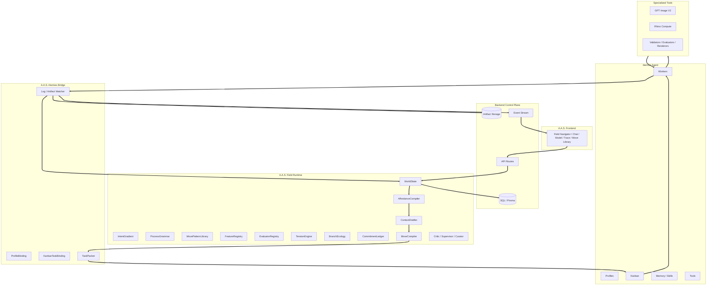

# Chapter 3.3 - Architecture

## 3.3.0 Overview

A.A.S. is a layered architecture built above Hermes Agent. The backend control plane owns product state and persistence. The Field Runtime owns design-world behavior and design intelligence. The A.A.S.-Hermes Bridge compiles moves into Hermes task groups and translates execution state back into field events. Hermes owns profile execution, Kanban, worker processes, skills, memory, logs, and task state.

### 3.3.1 System Layers

**Layer 1 - A.A.S. Frontend:** Presents the Field Navigator, Chat, Model Mode, Trace View, Move Library View, object inspector, artifact browser, approvals, feature pressures, and run status. \
**Layer 2 - Backend Control Plane:** Owns projects, sessions, WorldState snapshots, affordances, moves, move patterns, features, evaluations, tensions, branches, commits, preferences, artifacts, approvals, event history, permissions, and API contracts. \
**Layer 3 - Field Runtime:** Runs the AffordanceCompiler, ContextDistiller, IntentGradient, ProcessGrammar, DesignDebtTracker, MovePatternLibrary, FeatureRegistry, EvaluatorRegistry, TensionEngine, BranchEcology, CommitmentLedger, MoveCompiler, Critic, Supervisor, and Curator. \
**Layer 4 - A.A.S.-Hermes Bridge:** Owns profile bindings, Kanban task bindings, task packet generation, task creation, dependency linking, dispatcher monitoring, log watching, artifact ingest, and event translation. \
**Layer 5 - Hermes Agent:** Provides profiles, Kanban, worker execution, profile memory, skills, tools, dispatcher, heartbeat/retry, logs, and task state. \
**Layer 6 - External and Specialized Tools:** Provides GPT Image V2, Rhino Compute, segmentation, renderers, validators, evaluators, and export services.

### 3.3.2 Data Flow Architecture

### 3.3.3 Frontend-to-Backend Connection

**HTTP JSON API:** The frontend communicates with the backend through typed HTTP APIs. It does not call Hermes, Kanban DBs, worker logs, profile homes, or raw tools directly. \
**World Hydration:** On load, the frontend retrieves project/session context, latest WorldState, available moves, active branches, tensions, commits, feature pressures, preferences, artifacts, approvals, Hermes task bindings, and recent events. \
**Move Actions:** Selecting a field move creates or executes a `Move` through backend routes. \
**Approval Resolution:** User approvals and rejections update move, commit, branch, preference, artifact, or Hermes task state through backend routes. \
**Live Updates:** The backend streams world, move, artifact, branch, tension, commit, feature, evaluation, bridge, supervisor, and approval events to keep all views synchronized.

### 3.3.4 Backend-to-Runtime Connection

**Runtime Services:** The backend calls Field Runtime services to recompute WorldState, extract features, generate affordances, create Agent Briefs, compile moves, score branches, resolve tensions, create commits, evaluate artifacts, and update pattern statistics. \
**Persistence Boundary:** Runtime services can propose state changes, but persistence flows through backend repositories and event emission. \
**Supervisor Gate:** High-impact or risky state transitions pass through Supervisor rules before execution. \
**Execution Boundary:** MoveCompiler and the A.A.S.-Hermes Bridge are the only layers that map product-level moves to Hermes profiles, Kanban tasks, task packets, and specialized services.

### 3.3.5 Move Execution Flow

**Goal Normalization:** Convert user prompt and references into GoalState, values, outputs, constraints, non-goals, priority stack, and scoped preference context. \
**Feature Extraction:** Read WorldState and derive phase, landmarks, design debt, active tensions, feature values, artifact gaps, branch health, uncertainty, and preference conflicts. \
**Affordance Generation:** Generate legal next moves from the Move Pattern Library with score breakdown, preconditions, expected feature deltas, cost, risk, profiles, artifacts, approval requirements, reversibility, and elegance. \
**Agent Briefing:** Distill world state into a compact brief for the selected role. \
**Hermes Compilation:** Compile the move into a Hermes Kanban task group with task packets, assigned profiles, dependencies, expected artifacts, and completion contracts. \
**Task Execution:** Hermes profiles execute tasks, write logs/comments, produce artifacts, and update Kanban state. \
**Artifact Registration:** Store and link outputs with lineage, branch, tension, commit, feature, move, task, and event metadata. \
**Critique and Evaluation:** Evaluate design quality, consistency, feature deltas, spatial truth, and unresolved risks. \
**World Update:** Update branches, tensions, commits, artifacts, feature state, blocked moves, risks, questions, design debt, move pattern stats, and available moves.

### 3.3.6 Data Ownership Model

**Backend-Owned Product State:** The backend database is the source of truth for projects, sessions, WorldState snapshots, affordances, moves, move patterns, features, evaluations, tensions, branches, commits, preferences, artifacts, approvals, and events. \
**Field Runtime-Owned Behavior:** Runtime services compute moves, scores, briefs, branch transitions, feature deltas, tension updates, execution plans, and pattern learning updates. \
**Hermes-Owned Execution State:** Hermes owns profile homes, memory, skills, Kanban task execution, dispatcher state, worker logs, and task-local comments. \
**Artifact Storage:** Generated files are stored as revisioned artifacts with lineage. Raw filesystem paths are not the frontend contract. \
**Preference Boundary:** Personal preferences, team standards, project truth, session instructions, and agent skill memory are separate records/scopes. Only project commits become shared design truth.

### 3.3.7 Hermes, Rhino Compute, and Image Integration

**Hermes Bridge:** A.A.S. first integrates through CLI/task packets, then adds Kanban DB watching, log/artifact watching, profile pack sync, and later direct plugin/API integration if stable. \
**Rhino Compute:** Used through model and validation moves such as model generation, plan cuts, section cuts, area checks, privacy/view analysis, and render perspective validation. \
**GPT Image V2:** Used through representation moves such as atmosphere studies, render generation, board layout options, material studies, refinement, and segmentation QA. \
**Validation Rule:** Generated images can influence visual direction but do not become project truth unless committed and validated against ground truth. \
**Evaluator Rule:** Every evaluator output should include feature scores, evidence, confidence, and critique so scoring is inspectable.
