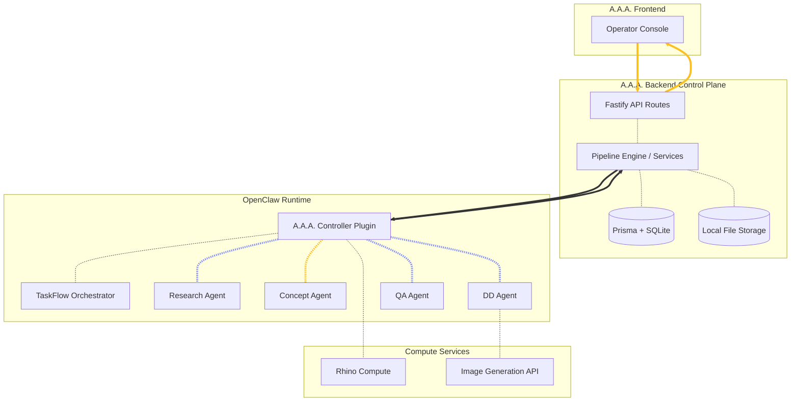

# Chapter 3.3 — Architecture

## 3.3.0 Overview

A.A.A. is a three-layer system built on top of OpenClaw, combining a Next.js operator frontend, a Fastify backend control plane, and the OpenClaw agent runtime with TaskFlow orchestration to handle complex architectural generation workflows.

### 3.3.1 System Layers

**Layer 1 — A.A.A. Frontend:** The Next.js operator console provides the UI shell for pipeline authoring (Build mode), agent-driven conversation (Chat mode), and spatial validation (Explore mode). It is a typed client of backend DTOs, consuming only the backend API and never calling worker agents or OpenClaw directly. \
**Layer 2 — A.A.A. Backend Control Plane:** The Fastify backend is the product logic layer and the source of truth for all user-facing state, including projects, pipelines, sessions, runs, artifacts, approvals, events, and project state. It is persisted via Prisma ORM against SQLite (with an upgrade path to Postgres). \
**Layer 3 — OpenClaw Runtime:** OpenClaw serves as the execution engine. The A.A.A. Controller Plugin creates and manages TaskFlow flows, dispatches worker agents, validates step outputs against schemas, and emits lifecycle events back to the backend.

### 3.3.2 Data Flow Architecture

### 3.3.3 Frontend-to-Backend Connection

**HTTP JSON API:** The frontend communicates with the backend exclusively through typed JSON fetch calls over HTTP. The backend URL is configured via `NEXT_PUBLIC_AAA_API_URL`. \
**Bootstrap Hydration:** On load, the frontend calls `GET /api/bootstrap` to receive the primary project, saved pipelines, recent chat sessions, current project state, and recent artifacts in a single payload. \
**Pipeline Persistence:** Build mode edits are saved to the backend via `PUT /api/pipelines/:pipelineId`, which replaces the pipeline metadata, nodes, and edges atomically. \
**Chat Execution Trigger:** Sending a user message via `POST /api/chat-sessions/:sessionId/messages` triggers the backend to execute the linked pipeline, persisting all resulting messages, artifacts, events, and state updates. \
**Approval Resolution:** When an approval checkpoint pauses execution, the frontend resolves it via `POST /api/approvals/:approvalId/resolve`, either resuming or failing the run.

### 3.3.4 Backend-to-Runtime Connection

**OpenClaw Controller Plugin:** The backend delegates pipeline execution to the A.A.A. Controller Plugin located at `openclaw/plugins/aaa-controller`. The plugin creates TaskFlow-managed flows, interprets step definitions, and dispatches worker tasks. \
**TaskFlow Orchestration:** TaskFlow owns durable orchestration state — current step, persistent `stateJson`, retry counters, child task linkage, and checkpoint state needed to resume execution. It does not own product business logic. \
**Event Normalization:** The controller emits raw execution-side lifecycle events. The backend converts them into stable, typed product events (e.g., `aaa.run.started`, `aaa.step.updated`, `aaa.asset.created`, `aaa.approval.required`) and broadcasts them to the UI. \
**Step Contract Enforcement:** Each pipeline step declares an input schema, output schema, retry policy, approval requirement, and next-step rules. The controller validates every worker output against its contract before advancing.

### 3.3.5 Execution Pipeline

**Brief Normalization:** A worker agent converts the raw project brief and references into a clean, structured planning brief. \
**Board Strategy:** A worker agent defines the board narrative, required sections, image shot list, and content priorities. \
**Image Generation:** The controller coordinates with media tools and optional worker agents to generate candidate imagery from structured shot definitions, persisting every variant and selection record. \
**Layout Planning:** A worker agent produces structured board region placement, hierarchy, margins, and layout rules. \
**Board Assembly:** A worker agent produces a strict board package consumed by the deterministic renderer. \
**QA Review:** A worker agent or validation service checks completeness, layout validity, asset presence, and package consistency. \
**Delivery Finalize:** The backend registers final outputs, emits completion events, and exposes download links for the finished presentation board.

### 3.3.6 Data Ownership Model

**Backend-Owned Product State:** The backend database is the source of truth for projects, runs, assets, approvals, board records, user-facing statuses, and event history. This state survives runtime restarts. \
**OpenClaw-Owned Orchestration State:** TaskFlow `stateJson` is the source of truth for current step execution, internal artifact paths, retry counters, child task linkage, and checkpoint state. This separation keeps the product stable even if the runtime is restarted or replaced.

### 3.3.7 Rhino Compute Integration

**Geometry Compute Path:** The Explore mode sends geometry commands to a Rhino Compute server instance. The server generates the 3D model and returns it to the web UI as viewable geometry. \
**Agent-Driven Analysis:** Agents use Rhino Compute for spatial operations — cutting floor plans, generating elevations and sections, performing clash detection — keeping heavy computation server-side while the frontend remains a lightweight viewer. \
**Ground Truth Enforcement:** The 3D model computed through Rhino Compute serves as the authoritative spatial reference. All generated 2D drawings must be derivable from and consistent with this model.
