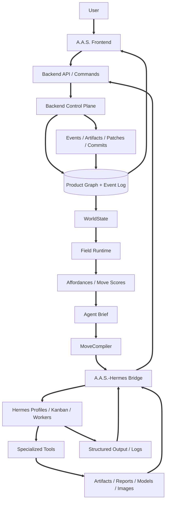

# Chapter 3.4 - A.A.S. System Architecture

## 3.4.0 Overview

A.A.S. is the product, state, and design-intelligence layer of the Autonomous Architectural System. It owns the architectural meaning of the work: goals, direction, WorldState, affordances, moves, branches, tensions, artifacts, evaluations, preferences, approvals, and commitments.

Hermes is the execution substrate documented in Chapter 2. A.A.S. uses Hermes through the A.A.S.-Hermes Bridge, but Hermes internals are not the product source of truth.

### 3.4.1 Canonical Architecture

```text
User
  -> A.A.S. Frontend
  -> A.A.S. Backend Control Plane
  -> A.A.S. Field Runtime
  -> A.A.S.-Hermes Bridge
  -> Hermes profiles / Kanban / workers
  -> specialized tools
  -> artifacts, logs, structured outputs
  -> A.A.S. backend commands and events
  -> updated WorldState
```

The system is layered by responsibility:

**A.A.S. Frontend:** Presents Chat, Draw, Model, and Architect as the primary user workspaces. The frontend is a live view and authoring surface, not the source of truth. \
**Backend Control Plane:** Owns product records, command validation, transactions, permissions, artifacts, approvals, event history, API contracts, and derived read models. \
**Field Runtime:** Computes WorldState, affordances, move scores, Agent Briefs, feature state, tensions, branches, commits, evaluations, and move execution plans. \
**A.A.S.-Hermes Bridge:** Converts approved moves into Hermes task packets, profile assignments, task bindings, artifact contracts, and event translations. \
**Hermes Agent:** Executes specialist work through profiles, Kanban tasks, workers, memory, skills, logs, and task state. \
**Specialized Tools:** Provide geometry computation, image generation, rendering, segmentation, validation, export, and evaluator services.

### 3.4.2 Data Flow



The flow is circular because A.A.S. is a stateful design environment. Outputs do not end the process; they update the design world and create the next set of meaningful moves.

### 3.4.3 Product Truth

A.A.S. product truth is backend-owned. The canonical record includes:

**Projects and Sessions:** Project identity, session state, active run context, and workspace state. \
**Direction Graph:** Object, Subject, Vector, Boundary, and Seed nodes plus typed links, snapshots, confidence, locks, and subcategories. \
**WorldState:** Derived active state containing goals, intent, branches, artifacts, tensions, commits, feature pressures, risks, questions, blocked moves, and recent events. \
**Moves and Affordances:** Candidate moves, selected moves, score breakdowns, preconditions, risks, outputs, and execution status. \
**Artifacts:** Images, boards, models, drawings, reports, renders, prompts, validations, exports, and source files with lineage. \
**Branches and Tensions:** Competing design hypotheses and structured design conflicts. \
**Commitments:** Decisions that become project truth with rationale, evidence, consequences, reversibility, and approval metadata. \
**Preferences:** Scoped user, team, project, session, agent-profile, and prompt preferences with source and precedence rules. \
**Runtime Events:** Append-only history of commands, moves, approvals, task updates, artifacts, evaluations, warnings, commits, and recovery actions.

Chat transcripts, Hermes memory, raw logs, local caches, and unregistered files can inform work, but they do not define product truth.

### 3.4.4 Core Runtime Object Catalog

The final A.A.S. architecture uses a stable object vocabulary so implementation, UI, and agent behavior stay aligned.

| Object | Meaning |
|--------|---------|
| `WorldState` | Derived active design state compiled from graph truth, commits, artifacts, preferences, evaluations, and runtime events |
| `GoalState` | User goal, normalized goal, desired outputs, non-goals, values, and priority stack |
| `IntentState` | Current phase, focus, active question, active tension, desired next artifact, landmark, and design-debt pressure |
| `ProjectState` | Brief, research, concept, ground truth, model, board, artifact coverage, and validation status |
| `DirectionNode` | Architect Mode node with one primary type: Object, Subject, Vector, Boundary, or Seed |
| `DirectionLink` | Typed relationship between direction nodes, such as influence, dependency, evidence, reference, iteration, contradiction, lineage, transformation, or output flow |
| `DirectionSnapshot` | Saved field state with layout, active nodes, locks, links, expanded/collapsed state, field mode, and event cursor |
| `ConceptState` | Lifecycle state for Seed families, design options, and concept branches |
| `ValueVector` | Placement and scoring vector explaining meaning, pressure, taste, dependency, confidence, or lineage relationships |
| `Affordance` | Available meaningful move with intent, primitive type, preconditions, expected gain, risk, cost, inputs, outputs, tools, score, approvals, and reversibility |
| `Move` | Selected execution intent applied to the field, with rationale, expected outcome, approval state, execution binding, and status |
| `Command` | Validated backend write operation that changes product records and emits events |
| `AgentPatch` | Proposed set of operations with reason, risk level, affected records, expected versions, and approval status |
| `MovePrimitive` | Stable operation type such as update intent, create artifact, validate, raise tension, spawn branch, compare branches, propose commit, commit decision, revert commit, or request execution |
| `MovePattern` | Reusable architectural tactic with preconditions, inputs, outputs, effects, scoring hints, execution template, validation tests, examples, stats, status, and version |
| `IntentGradient` | Multi-family score model for move comparison across process, design, search, execution, user alignment, learning, governance, elegance, and penalties |
| `FeatureRegistry` | Registry of measurable design/process/execution variables with range, source, confidence, artifact hooks, and measurement method |
| `Tension` | Structured design conflict linked to nodes, artifacts, branches, severity, status, possible resolutions, and evidence |
| `Branch` | Competing design hypothesis with artifacts, evidence, weaknesses, unresolved tensions, score, lifecycle state, and next recommended move |
| `Commit` | Project-truth decision with rationale, evidence, consequences, affected artifacts, affected branches, reversibility, approval, and timestamp |
| `AgentBrief` | Distilled operating context for a specific Hermes profile, role, and move |
| `Trajectory` | History of WorldState snapshots, moves, decisions, abandoned branches, failed moves, unresolved design debt, and process landmarks |

### 3.4.5 Field Runtime

The Field Runtime is the design-intelligence layer inside A.A.S. It turns product truth into useful action.

**WorldState Compiler:** Builds the active design state from graph rows, commits, artifacts, preferences, evaluations, and events. \
**AffordanceCompiler:** Generates available and blocked moves from WorldState, move patterns, feature state, process phase, design debt, and governance rules. \
**IntentGradient:** Scores candidate moves by design gain, process fit, information gain, novelty, risk, cost, governance, user alignment, learning value, and elegance. \
**ContextDistiller:** Creates compact Agent Briefs for Hermes profiles with relevant context, source manifest, output contract, and warnings. \
**MoveCompiler:** Converts approved A.A.S. moves into Hermes task packets, task groups, profile assignments, dependencies, and artifact contracts. \
**TensionEngine:** Creates, scores, and resolves design contradictions. Critical unresolved tensions can block finalization. \
**BranchEcology:** Spawns, develops, critiques, compares, merges, kills, and commits competing design hypotheses. \
**CommitmentLedger:** Records decisions that become project truth and enforces them downstream. \
**EvaluatorRegistry:** Measures artifacts, branches, models, renders, boards, and concepts with scores, evidence, confidence, and critique. \
**Supervisor:** Enforces legality, approvals, reversibility, locked records, preference conflicts, risky operations, and finalization gates.

### 3.4.6 Scoring and Search Model

A.A.S. ranks moves as useful legal experiments under uncertainty. It does not assume the next design action is known in advance.

Let `x_t` be the current WorldState and `a` be a candidate move instance. A transition estimate predicts the next state:

```text
x_{t+1} = T(x_t, a)
```

Design value is represented through registered features:

```text
J(x) = w * F(x)
```

`F(x)` is the feature vector: concept strength, coherence, novelty, feasibility, user fit, ground-truth readiness, representation quality, tension reduction, cost, risk, elegance, and other registered values.

The basic affordance score is:

```text
Score(a | x_t) =
  E[J(T(x_t, a)) - J(x_t)]
  + beta  * InformationGain(a)
  + gamma * Novelty(a)
  - lambda * Risk(a)
  - mu     * Cost(a)
  - rho    * ConstraintViolation(a)
```

Information-gain moves reduce uncertainty:

```text
InformationGain(a) =
  H(p(theta | D)) - E[H(p(theta | D, outcome(a)))]
```

A.A.S. should expose a diverse top set rather than many near-duplicate high scores:

```text
Affordances = topK_a Score(a | x_t)
```

The full scoring model is not one flat number everywhere. It combines process, design, search, execution, user alignment, learning, governance, elegance, and penalties. Phase-aware scoring can use process position `tau`, user context `u`, and learned pattern statistics `L`:

```text
Score(a | x, tau, u, L) =
  ProcessScore
  + DesignScore
  + SearchScore
  + ExecutionScore
  + UserAlignmentScore
  + LearningScore
  + GovernanceScore
  + EleganceScore
  - Penalties
```

Branch search uses quality-diversity logic. A MAP-Elites-style archive stores strong branches across behavior dimensions such as openness, privacy, sectional depth, courtyardness, thermal strategy, structural expression, material strategy, and program compactness. Pattern exploration can use contextual reward estimates such as:

```text
UCB(move) = mean_reward + c * sqrt(log(N) / n_move)
```

These formulas are implementation guides for ranking, explanation, and learning. They do not override hard constraints, approvals, locked commitments, or supervisor governance.

### 3.4.7 Agent and Service Roles

A.A.S. uses agent roles and runtime services to keep design work specialized while preserving one product truth.

**Affordance Compiler Service:** Generates legal moves from WorldState, process grammar, active features, design debt, trajectory, and the Move Pattern Library. \
**Context Distiller:** Produces compact Agent Briefs from WorldState, scoped preferences, memory, artifacts, evaluator results, commits, and events. \
**Move Compiler:** Converts selected moves into Hermes Kanban plans: task group, dependencies, assigned profile, task packet path, expected artifacts, expected feature effects, and completion contract. \
**Planner Agent:** Revises move strategy, phase direction, landmarks, and process debt. It does not author static execution graphs as the main workflow object. \
**Research Agent:** Retrieves missing internal or external context only when the selected move requires research or clarification. \
**Concept Agent:** Spawns concept branches, identifies design tensions, and develops early architectural hypotheses. \
**Design Development Agent:** Turns selected branches into coherent artifact plans, ground-truth strategies, drawings, and model instructions. \
**Model Agent:** Works with geometry, Rhino Compute, model validation, drawing cuts, area checks, and spatial consistency. \
**Representation Agent:** Produces renders, diagrams, board strategies, image prompts, and presentation packages. \
**Critic / Evaluator Agent:** Attacks weak concepts, finds contradictions, compares branches, and evaluates artifacts into feature scores, evidence, confidence, and critique. \
**Supervisor Agent:** Governs move legality, approvals, drift, risk, branch merge/kill/commit rules, preference conflicts, and finalization gates. \
**Curator Agent:** Reviews proposed move patterns, pattern statistics, failure modes, evaluator results, and sandbox tests before promotion into the active Move Pattern Library.

### 3.4.8 Move Execution Flow

1. The user or runtime updates the design situation.
2. The backend validates commands and updates product truth.
3. WorldState is recomputed from graph rows, artifacts, commits, preferences, evaluations, and events.
4. The Field Runtime generates available and blocked moves.
5. The operator or agent selects a move.
6. Supervisor rules validate risk, approval, conflict, cost, reversibility, and locked state.
7. ContextDistiller prepares the Agent Brief.
8. MoveCompiler creates Hermes task packets and task bindings.
9. Hermes executes through profiles, Kanban tasks, workers, skills, tools, logs, and artifact roots.
10. The bridge ingests logs, artifacts, status, and structured outputs.
11. A.A.S. registers artifacts, applies patches or commands, records events, and evaluates results.
12. WorldState updates and the next move set appears.

### 3.4.9 Frontend Boundary

The frontend reads derived state and submits commands. It does not own product truth and does not control Hermes directly.

**Read Path:** Hydrate project/session context, WorldState, direction graph, artifacts, approvals, moves, branches, tensions, commits, feature pressures, and recent event cursor. \
**Write Path:** Submit typed commands, move requests, approval decisions, workspace edits, artifact actions, and commit requests to the backend. \
**Live Update Path:** Apply backend events to local workspace state and reconcile optimistic edits against authoritative events. \
**Hermes Boundary:** Hermes status appears only through A.A.S. bridge events, task bindings, artifact records, and progress summaries.

### 3.4.10 Data Ownership

| Owner | Owns | Does Not Own |
|-------|------|--------------|
| A.A.S. Backend | Product truth, commands, events, artifacts, approvals, commits, preferences, WorldState snapshots | Hermes profile homes or worker-local execution state |
| Field Runtime | Move generation, scoring, briefs, evaluations, branch/tension logic, commitment rules | Durable execution worker processes |
| Hermes | Profiles, Kanban task state, worker execution, profile memory, skills, logs | A.A.S. project truth or committed decisions |
| Frontend | User interaction, workspace rendering, optimistic local edits | Canonical state or direct Hermes control |
| Specialized Tools | Computation, generation, validation, rendering, export | Project truth unless A.A.S. registers and accepts outputs |

### 3.4.11 Integration Rule

A.A.S. integrates external systems through typed moves and backend-controlled contracts. Rhino Compute, image generation, renderers, validators, and exporters are invoked because a move requires them, not because users or agents freely browse raw tools.

Generated outputs can influence design direction, but they become project artifacts or project truth only after A.A.S. registers, evaluates, links, and, where needed, commits them.
