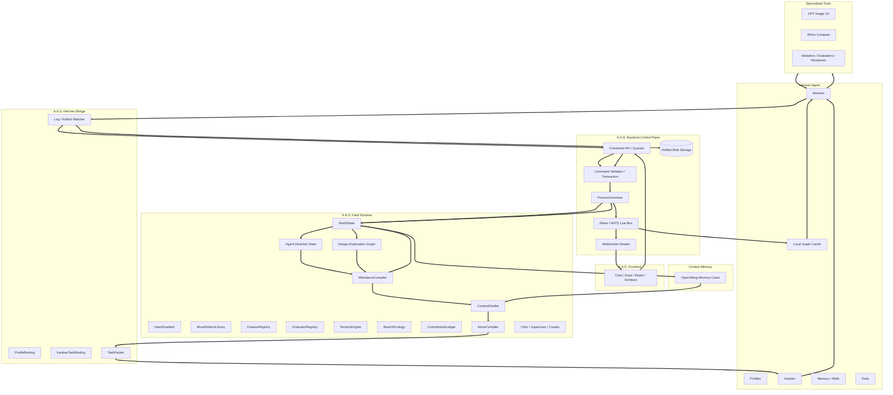

# Chapter 3.4 - Architecture

## 3.4.0 Overview

A.A.S. is a layered architecture built above Hermes Agent. The backend control plane owns canonical product state through Postgres graph rows and an append-only event log. The Field Runtime owns design-world behavior and design intelligence. The A.A.S.-Hermes Bridge compiles moves into Hermes task groups and translates execution state back into backend commands and field events. Hermes owns profile execution, Kanban, worker processes, skills, memory, logs, and task state.

### 3.4.1 System Layers

**Layer 1 - A.A.S. Frontend:** Presents exactly four workspaces: Chat, Draw, Model, and Architect. Shared inspectors, artifact browser, approvals, feature pressures, and run status support those workspaces. The frontend is a live view and never a source of truth. \
**Layer 2 - Backend Control Plane:** Owns projects, sessions, Postgres graph rows, command validation, WorldState snapshots, direction nodes, direction links, direction snapshots, concept states, affordances, moves, move patterns, features, evaluations, tensions, branches, commits, preferences, artifacts, approvals, event history, permissions, and API contracts. \
**Layer 3 - Field Runtime:** Runs the AffordanceCompiler, ContextDistiller, IntentGradient, ProcessGrammar, DesignDebtTracker, MovePatternLibrary, FeatureRegistry, EvaluatorRegistry, TensionEngine, BranchEcology, CommitmentLedger, MoveCompiler, Critic, Supervisor, and Curator. \
**Layer 4 - Event and Memory Support:** Redis or NATS transports live events. OpenViking stores retrieval memory cards. Blob storage stores artifacts. None of these is graph truth. \
**Layer 5 - A.A.S.-Hermes Bridge:** Owns profile bindings, Kanban task bindings, task packet generation, task creation, dependency linking, dispatcher monitoring, log watching, artifact ingest, event subscription, and command submission. \
**Layer 6 - Hermes Agent:** Provides profiles, Kanban, worker execution, profile memory, skills, tools, dispatcher, heartbeat/retry, logs, and task state. \
**Layer 7 - External and Specialized Tools:** Provides GPT Image V2, Rhino Compute, segmentation, renderers, validators, evaluators, and export services.

### 3.4.2 Data Flow Architecture

**Ontology Intake:** User goals, references, uploads, prompts, and site/project inputs first create or update Object and Subject nodes through backend commands. \
**Force Derivation:** Runtime services derive Vector and Boundary nodes from Object and Subject truth, then use those forces to bias move generation, branch comparison, and artifact evaluation. \
**Seed Generation:** AffordanceCompiler and BranchEcology generate, develop, compare, and retire Seed nodes as design possibilities. Seeds can gather artifacts and branches, but they do not become project truth until committed. \
**Runtime Reading:** AffordanceCompiler reads the five-node field, live subcategories, links, locks, confidence, commits, tensions, feature state, and trajectory before exposing legal moves.
**Truth Flow:** Dashboard and Hermes both read snapshots plus events from the backend. Dashboard and Hermes both write through the same command API. There is no direct Dashboard-to-Hermes truth path.

### 3.4.3 Frontend-to-Backend Connection

**HTTP JSON API:** The frontend communicates with the backend through typed command and query APIs. It does not call Hermes, Kanban DBs, worker logs, profile homes, or raw tools directly. \
**World Hydration:** On load, the frontend retrieves project/session context, latest derived WorldState, Agent Direction State, Design Exploration Graph, available moves, active branches, tensions, commits, feature pressures, preferences, artifacts, approvals, Hermes task bindings, and recent event cursor. \
**Move Actions:** Selecting a field move creates or executes a `Move` through backend routes. Direct node edits such as create, update, move, link, lock, and delete are backend commands. \
**Approval Resolution:** User approvals and rejections update move, commit, branch, preference, artifact, or Hermes task state through backend routes. \
**Live Updates:** The backend streams graph, world, move, artifact, branch, tension, commit, feature, evaluation, bridge, supervisor, patch, and approval events over WebSocket to keep all views synchronized.

### 3.4.4 Backend-to-Runtime Connection

**Runtime Services:** The backend calls Field Runtime services to recompute WorldState, update Agent Direction State, update the Design Exploration Graph, extract features, generate affordances, create Agent Briefs, compile moves, score branches, resolve tensions, create commits, evaluate artifacts, and update pattern statistics. \
**Persistence Boundary:** Runtime services can propose state changes, but persistence flows through backend commands, transactions, graph writes, and event emission. \
**Supervisor Gate:** High-impact or risky state transitions pass through Supervisor rules before execution. \
**Execution Boundary:** MoveCompiler and the A.A.S.-Hermes Bridge are the only layers that map product-level moves to Hermes profiles, Kanban tasks, task packets, and specialized services.

### 3.4.5 Move Execution Flow

**Goal Normalization:** Convert user prompt and references into GoalState, Object nodes, Subject nodes, desired outputs, non-goals, priority stack, and scoped preference context through command writes. \
**Ontology Processing:** Derive Vector and Boundary nodes from Object and Subject inputs, then let Seed candidates emerge through branch, concept, artifact, and representation moves. \
**Feature Extraction:** Read WorldState and derive phase, landmarks, design debt, active tensions, feature values, artifact gaps, branch health, uncertainty, preference conflicts, and five-node field balance. \
**Affordance Generation:** Generate legal next moves from the Move Pattern Library with score breakdown, preconditions, expected feature deltas, cost, risk, profiles, artifacts, approval requirements, reversibility, and elegance. \
**Agent Briefing:** Distill world state into a compact brief for the selected role. \
**Hermes Compilation:** Compile the move into a Hermes Kanban task group with task packets, assigned profiles, dependencies, expected artifacts, and completion contracts. \
**Task Execution:** Hermes profiles execute tasks, write logs/comments, produce artifacts, and update Kanban state. \
**Artifact Registration:** Store and link outputs with lineage, branch, tension, commit, feature, move, task, and event metadata. \
**Critique and Evaluation:** Evaluate design quality, consistency, feature deltas, spatial truth, and unresolved risks. \
**Command Commit:** Valid state changes run through `validate -> transaction -> write graph row -> write event -> publish event`. \
**World Update:** Update branches, tensions, commits, artifacts, direction nodes, direction links, concept states, feature state, blocked moves, risks, questions, design debt, move pattern stats, and available moves from the committed graph/event state.

### 3.4.6 Data Ownership Model

**Backend-Owned Product State:** Postgres graph rows plus the event log are the source of truth for projects, sessions, direction nodes with fixed primary types, live subcategories, direction links, direction snapshots, concept states, affordances, moves, move patterns, features, evaluations, tensions, branches, commits, preferences, artifacts, approvals, agent patches, and events. WorldState, Agent Direction State, and Design Exploration Graph are derived read models. \
**Field Runtime-Owned Behavior:** Runtime services compute moves, scores, briefs, branch transitions, feature deltas, tension updates, execution plans, and pattern learning updates. \
**Hermes-Owned Execution State:** Hermes owns profile homes, memory, skills, Kanban task execution, dispatcher state, worker logs, and task-local comments. Hermes does not own project truth and must write through backend commands. \
**Artifact Storage:** Generated files are stored as revisioned artifacts with lineage. Raw filesystem paths are not the frontend contract. \
**Preference Boundary:** Personal preferences, team standards, project truth, session instructions, and agent skill memory are separate records/scopes. Only project commits become committed design truth.

### 3.4.7 Hermes, Rhino Compute, and Image Integration

**Hermes Bridge:** A.A.S. first integrates through CLI/task packets, then adds Kanban DB watching, log/artifact watching, profile pack sync, and later direct plugin/API integration if stable. \
**Rhino Compute:** Used through model and validation moves such as model generation, plan cuts, section cuts, area checks, privacy/view analysis, and render perspective validation. \
**GPT Image V2:** Used through representation moves such as atmosphere studies, render generation, board layout options, material studies, refinement, and segmentation QA. \
**Validation Rule:** Generated images can influence visual direction but do not become project truth unless committed and validated against ground truth. \
**Evaluator Rule:** Every evaluator output should include feature scores, evidence, confidence, and critique so scoring is inspectable.
