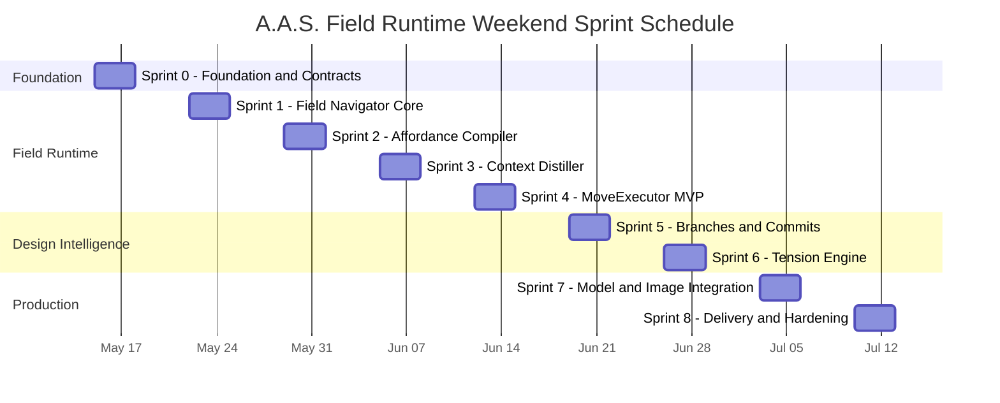

# Chapter 3.6 - Implementation Task Breakdown

## 3.6.0 Overview

This chapter provides the implementation plan for A.A.S. Field Runtime. The work is organized by runtime foundations, Field Navigator UI, affordance generation, context distillation, move execution, branch ecology, commitment, tension handling, model/image integration, and hardening.

---

## 3.6.1 Master Task List

> **Reading the list:** Level 1 (bold) = Phase. Level 2 = Domain. Level 3 = Main Task. Level 4 = Subtask.

### Phase 1 - Field Runtime Schema

1. **Shared Contracts**
   1. Define `WorldState`, `GoalState`, `IntentState`, and `ProjectState`.
   2. Define `Affordance`, `Move`, `MoveType`, `IntentScore`, and move approval state.
   3. Define `Tension`, `Branch`, `BranchScore`, `Commit`, `ArtifactRef`, `RuntimeEvent`, and `AgentBrief`.
   4. Define status enums for brief, research, concept, ground truth, board, model, branch, tension, move, approval, and artifact validation.
2. **Database**
   1. Add tables for world snapshots, affordances, moves, tensions, branches, commits, artifacts, artifact links, events, agent briefs, move executions, scores, and approvals.
   2. Add JSON payload columns for evolving runtime object details.
   3. Add migration and seed scripts.
3. **Storage**
   1. Create storage roots for projects, sessions, moves, generated artifacts, models, renders, boards, snapshots, cache, and logs.
   2. Add artifact registration and lineage utilities.

### Phase 2 - Field Navigator UI

1. **Application Shell**
   1. Left project/session sidebar.
   2. Top project and run status bar.
   3. Center workspace with Field, Chat, Model, and Trace modes.
   4. Right object inspector.
   5. Bottom status, event, and commit preview bar.
2. **Field Canvas**
   1. Render Intent Core, branch clusters, tension nodes, affordance nodes, artifact constellations, agent presence, and commit spine.
   2. Add pan, zoom, select, drag, hover, and object focus behavior.
   3. Add visual encodings for shape, motion, line type, depth, risk, blocked state, and recommendation.
3. **Inspector**
   1. Show selected object details, rationale, scores, linked artifacts, logs, approval state, and raw JSON.
   2. Add move action controls and approval controls.
4. **Trace View**
   1. Render move history, event timeline, artifact lineage, retries, failures, and approvals.
   2. Add replay/scrub controls for WorldState snapshots.

### Phase 3 - Affordance Compiler MVP

1. **Deterministic Rules**
   1. Generate first moves from goal and project status.
   2. Generate blocked moves with clear missing preconditions.
   3. Generate three to seven recommended moves for early phases.
2. **Scoring**
   1. Implement IntentGradient fields.
   2. Add score explanations.
   3. Allow agent override with rationale.
3. **Approvals**
   1. Mark moves requiring user approval.
   2. Mark moves requiring supervisor approval.
   3. Track reversibility and cost/risk.

### Phase 4 - Context Distiller MVP

1. **Agent Brief Generation**
   1. Generate briefs from WorldState, artifacts, commits, tensions, branches, events, and memory snippets.
   2. Include valid moves, blocked moves, output contract, warnings, and relevant references.
   3. Keep large artifacts by reference.
2. **Memory Integration**
   1. Query AAS memory only when move requirements need it.
   2. Filter retrieved context against committed decisions.
   3. Convert conflicts into warnings or tensions.

### Phase 5 - MoveExecutor MVP

1. **Move Execution**
   1. Validate preconditions.
   2. Load required context.
   3. Map move type to AAS agents, tools, files, or specialized services.
   4. Execute and capture structured output.
   5. Register artifacts.
   6. Update WorldState.
   7. Emit events.
2. **MVP Move Types**
   1. `CREATE_ARTIFACT`
   2. `REFINE_ARTIFACT`
   3. `ASK_USER`
   4. `VALIDATE`
   5. `COMMIT_DECISION`
3. **Failure Handling**
   1. Mark moves failed with structured error details.
   2. Support retry, cancel, and corrective replacement.
   3. Preserve failed artifacts where useful.

### Phase 6 - Branch Ecology

1. **Branch Lifecycle**
   1. Spawn branches.
   2. Develop branches.
   3. Critique branches.
   4. Compare branches.
   5. Kill, merge, or commit branches.
2. **Scoring**
   1. Implement branch scores for goal fit, architectural coherence, representational strength, feasibility, novelty, user taste fit, and ground-truth readiness.
   2. Show branch weaknesses and unresolved tensions.
3. **UI**
   1. Render branch clusters.
   2. Add branch comparison zone.
   3. Preview merge outcomes.

### Phase 7 - Commitment Ledger

1. **Commit Records**
   1. Store decision, rationale, evidence, consequences, affected artifacts, affected branches, reversibility, approval source, and approval reference.
   2. Link commits to artifacts and branch state.
2. **Commit Enforcement**
   1. Distiller includes relevant commits in Agent Briefs.
   2. Supervisor blocks or warns on commit conflicts.
   3. Revert creates new events rather than deleting history.
3. **UI**
   1. Render commit spine.
   2. Add commit, freeze, revert, and replay controls.

### Phase 8 - Tension Engine

1. **Tension Records**
   1. Create tensions with conflict, description, affected artifacts, affected branches, severity, status, possible resolutions, and evidence.
   2. Link tensions to branch and artifact objects.
2. **Resolution Moves**
   1. Generate moves to resolve, defer, or validate tensions.
   2. Block finalization on unresolved critical tensions.
3. **UI**
   1. Render tension nodes and stress lines.
   2. Show resolved tensions attached to commits as constraints.

### Phase 9 - Model and Image Integration

1. **Model Mode**
   1. Add model affordances for massing, plan cuts, section cuts, area checks, render validation, and rebuilds after commits.
   2. Integrate Rhino Compute through MoveExecutor.
   3. Version model artifacts and validation reports.
2. **Image Generation**
   1. Add GPT Image V2 moves for atmosphere studies, renders, board layouts, material studies, refinements, and segmentation QA.
   2. Package prompts from branch state, commits, ground truth, and visual constraints.
   3. Register image outputs as artifacts and critique them before selection.
3. **Board Delivery**
   1. Assemble final board from committed artifacts.
   2. Validate against ground truth and critical tension resolution.
   3. Export PNG/PDF through deterministic renderer.

### Phase 10 - Full Agent Field Runtime

1. **Hybrid Compiler**
   1. Combine deterministic rules with model-generated move proposals.
   2. Validate all proposed moves through Supervisor rules.
2. **Governance**
   1. Add approval policies for high-impact decisions, expensive batches, branch kills, finalization, reverts, and overwrites.
   2. Add drift detection and risk escalation.
3. **Replay and Training Data**
   1. Export traces containing world summary, Agent Brief, available moves, selected move, rationale, execution result, world delta, and critic feedback.
   2. Use move traces as post-training data rather than graph-generation traces.

---

## 3.6.2 Task Summary

| # | Task Area | Primary Output |
|---|-----------|----------------|
| 1 | Field Runtime Schema | WorldState, moves, branches, tensions, commits, events |
| 2 | Field Navigator UI | Spatial design-field interface |
| 3 | Affordance Compiler | Available and blocked moves with scoring |
| 4 | Context Distiller | Agent Brief generation |
| 5 | MoveExecutor | Typed move execution through AAS/tools |
| 6 | Branch Ecology | Branch lifecycle and comparison |
| 7 | Commitment Ledger | Project-truth decisions and reversibility |
| 8 | Tension Engine | Design conflict tracking and resolution |
| 9 | Model/Image Integration | Rhino Compute, GPT Image V2, validation |
| 10 | Full Runtime | Governance, replay, training traces |

---

## 3.6.3 Weekend Sprint Schedule

The schedule below keeps the original weekend cadence but redirects work toward the Field Runtime.

### Sprint 0 - Foundation and Shared Contracts *(Weekend 1)*

| Day | Hours | Tasks |
|-----|:-----:|-------|
| **Fri Eve** | 3h | Define shared runtime contracts for WorldState, moves, branches, tensions, commits, events, artifacts, and Agent Briefs. |
| **Sat** | 10h | Add Prisma schema, migrations, seed WorldState, storage roots, artifact lineage utilities, health check, and bootstrap endpoint. |
| **Sun Eve** | 4h | Build frontend shell with Field/Chat/Model/Trace modes, sidebars, top bar, and bootstrap hydration. |

**Deliverable:** Backend boots, database seeds a WorldState, and frontend shell renders the core modes.

### Sprint 1 - Field Navigator Core *(Weekend 2)*

| Day | Hours | Tasks |
|-----|:-----:|-------|
| **Fri Eve** | 3h | Implement world fetch, event stream, and object data adapters for field objects. |
| **Sat** | 10h | Render Intent Core, branch clusters, tension nodes, affordance nodes, artifact constellations, and commit spine with pan/zoom/select. |
| **Sun Eve** | 4h | Build inspector panel with scores, rationale, links, logs, approval state, and raw JSON. |

**Deliverable:** Field Navigator displays and inspects live WorldState objects.

### Sprint 2 - Affordance Compiler and Move UI *(Weekend 3)*

| Day | Hours | Tasks |
|-----|:-----:|-------|
| **Fri Eve** | 3h | Add deterministic affordance rules and blocked move explanations. |
| **Sat** | 10h | Implement IntentGradient scoring, move explanations, approval flags, reversibility, and move creation API. |
| **Sun Eve** | 4h | Add Affordance Wheel and move action controls in Field Navigator and Chat. |

**Deliverable:** Users and agents can see, inspect, and select recommended moves.

### Sprint 3 - Context Distiller and Agent Briefs *(Weekend 4)*

| Day | Hours | Tasks |
|-----|:-----:|-------|
| **Fri Eve** | 3h | Implement Agent Brief generation from WorldState and artifact references. |
| **Sat** | 10h | Add memory retrieval hooks, commit filtering, warnings, output contracts, and brief persistence. |
| **Sun Eve** | 4h | Render briefs in inspector/debug views and connect brief generation to move execution. |

**Deliverable:** Agent turns receive compact briefs instead of raw project dumps.

### Sprint 4 - MoveExecutor MVP *(Weekend 5)*

| Day | Hours | Tasks |
|-----|:-----:|-------|
| **Fri Eve** | 3h | Implement move precondition validation and execution status transitions. |
| **Sat** | 10h | Map MVP move types to local/AAS execution, artifact registration, WorldState updates, and event emission. |
| **Sun Eve** | 4h | Add retry, cancel, failure preservation, and blocked-move recovery UI. |

**Deliverable:** Typed moves execute and update WorldState end to end.

### Sprint 5 - Branch Ecology and Commitment Ledger *(Weekend 6)*

| Day | Hours | Tasks |
|-----|:-----:|-------|
| **Fri Eve** | 3h | Add branch lifecycle APIs and branch scoring. |
| **Sat** | 10h | Implement branch cluster UI, comparison mode, merge preview, kill flow, and commit flow. |
| **Sun Eve** | 4h | Add commit ledger, commit spine, commit enforcement, and revert events. |

**Deliverable:** Branches can compete and selected decisions can become project truth.

### Sprint 6 - Tension Engine *(Weekend 7)*

| Day | Hours | Tasks |
|-----|:-----:|-------|
| **Fri Eve** | 3h | Add tension records, severity/status model, and links to branches/artifacts. |
| **Sat** | 10h | Generate tension resolution moves, block finalization on critical tensions, and attach resolved tensions to commits. |
| **Sun Eve** | 4h | Render tension nodes, stress lines, and resolution controls. |

**Deliverable:** Design contradictions are visible, actionable, and enforceable.

### Sprint 7 - Model and Image Integration *(Weekend 8)*

| Day | Hours | Tasks |
|-----|:-----:|-------|
| **Fri Eve** | 3h | Add model affordances and Rhino Compute client path through MoveExecutor. |
| **Sat** | 10h | Add Model Mode viewer, model artifact versioning, plan/section cuts, area checks, and render validation. |
| **Sun Eve** | 4h | Add GPT Image V2 move packaging, output registration, critique, and selection moves. |

**Deliverable:** Model and image generation operate as typed moves tied to WorldState.

### Sprint 8 - Board Delivery, Replay, and Hardening *(Weekend 9)*

| Day | Hours | Tasks |
|-----|:-----:|-------|
| **Fri Eve** | 3h | Add board assembly move, deterministic renderer contract, and finalization gates. |
| **Sat** | 10h | Implement Trace View replay, WorldState snapshot scrubber, failure recovery polish, approvals, and governance tests. |
| **Sun Eve** | 4h | End-to-end QA: goal -> moves -> branches -> commit -> model/image -> validation -> board export. |

**Deliverable:** Field Runtime supports a complete architectural design path with replay and governance.

---

## 3.6.4 Sprint Timeline

---

## 3.6.5 Milestone Summary

| Milestone | Sprint | Target | Key Deliverable |
|-----------|:------:|:------:|-----------------|
| **M0 - Foundation** | 0 | Weekend 1 | Runtime schema, seeded WorldState, frontend shell |
| **M1 - Field UI** | 1 | Weekend 2 | Field Navigator renders WorldState |
| **M2 - Move System** | 2-4 | Weekend 5 | Affordances, briefs, and MoveExecutor MVP |
| **M3 - Design Ecology** | 5-6 | Weekend 7 | Branches, commits, and tensions |
| **M4 - Production Tools** | 7 | Weekend 8 | Rhino Compute and GPT Image V2 through moves |
| **M5 - Delivery Ready** | 8 | Weekend 9 | Board delivery, replay, governance, hardening |

**Total estimated timeline: 9 weekends, roughly 153 hours of focused development.**
