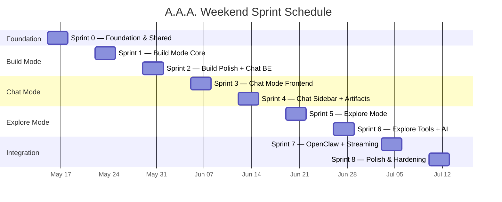

# Chapter 3.6 — Implementation Task Breakdown

## 3.6.0 Overview

This chapter provides the full implementation task list for A.A.A., organized by the three primary feature areas — Chat, Build, and Explore — with each feature decomposed into Frontend and Backend subtasks. A weekend sprint schedule is included at the end for a realistic build plan.

---

## 3.6.1 Master Task List

> **Reading the list:** Level 1 (bold) = Feature Area. Level 2 = Domain (Frontend / Backend). Level 3 = Main Task. Level 4 = Subtask.

### Chat Mode

1. **Frontend**
   1. Application Shell & Layout
      1. Left sidebar — logo and mode switcher
      2. Left sidebar — session folder list
      3. Dark-themed control plane styling
      4. Responsive panel widths
   2. Chat Message List
      1. Chronological message rendering
      2. User vs. agent message styling
      3. Auto-scroll on new messages
      4. Message grouping by agent
   3. Message Input Bar
      1. Text input component
      2. Submit triggers pipeline execution
      3. Disable input during active run
   4. Agent Attribution Labels
      1. Agent name and role badge
      2. Pipeline node origin indicator
   5. Approval Inline Controls
      1. Approve / Reject buttons
      2. Operator notes text field
      3. State transitions on resolve
   6. Right Sidebar — Tab Rail
      1. Vertical tab layout with 90° rotated labels
      2. Tab switching logic
   7. General Tab Panel
      1. Session metadata display
      2. Editable session title
      3. Agent list with role labels
      4. Agent mute toggles
   8. Project File Browser Tab
      1. Revit-style tree view
      2. Android-style icon grid view
      3. View toggle switch
   9. File Viewer / Editor Tab
      1. Markdown renderer
      2. JSON viewer
      3. Image preview
   10. Terminal Log Tab
       1. Filtered execution log view
       2. Agent-task-only filter
       3. Human-readable formatting
   11. Run Status Indicators
       1. Status badge — queued / running / waiting / completed / failed / cancelled
       2. Current step indicator
   12. Session Persistence UI
       1. Session history list
       2. Session load and switch

2. **Backend**
   1. Chat Session CRUD API
      1. `POST /api/chat-sessions` — create session bound to pipeline
      2. `GET /api/chat-sessions/:id` — load rich session detail
      3. `DELETE /api/chat-sessions/:id` — remove session
   2. Message Persistence
      1. Store user and agent messages with timestamps
      2. Agent attribution fields on each message
      3. Message ordering and pagination
   3. Pipeline-Linked Execution Trigger
      1. `POST /api/chat-sessions/:id/messages` triggers run
      2. Load linked pipeline graph
      3. Topological walk of nodes
   4. Step-by-Step Event Emission
      1. Emit `aaa.step.updated` per node
      2. Emit `aaa.asset.created` on artifact generation
      3. Emit `aaa.run.started` / `aaa.run.completed` lifecycle events
   5. Approval Record Creation & Resolution
      1. Create `AaaApproval` record on approval node
      2. Pause run and session to waiting state
      3. `POST /api/approvals/:id/resolve` — resume or fail
   6. Artifact Registration & Lineage
      1. Create `ProjectAsset` per generated artifact
      2. Source asset lineage chain
      3. File storage under `storage/` directory
   7. Context Mode Routing
      1. Implement inherit / summary / isolated modes
      2. Upstream output aggregation per mode
   8. Event Normalization
      1. Convert raw events to typed product events
      2. Persist events in `AaaEvent` table
      3. Broadcast to frontend
   9. Session Bootstrap Hydration
      1. `GET /api/bootstrap` — return project, pipelines, sessions, state
      2. Idempotent seed on first startup

---

### Build Mode

1. **Frontend**
   1. Infinite Canvas
      1. Canvas container with pan support
      2. Zoom in/out with scroll wheel
      3. Canvas coordinate system and viewport transform
   2. Node Card Rendering
      1. Position nodes by saved x/y coordinates
      2. Display node label and type icon
      3. Visual distinction — Agent / Tool / Approval
      4. Drag-to-reposition nodes
   3. Edge SVG Curve Rendering
      1. Directed bézier curves between nodes
      2. Arrow markers for flow direction
      3. Edge hover highlight
   4. Node Selection & Property Panel
      1. Click-to-select node
      2. Side panel with editable fields
      3. Fields — label, key, type, role, task prompt, system prompt, persistent context, context mode, position
   5. Add Node Control
      1. Button or menu to add Agent, Tool, or Approval node
      2. Place at default canvas position
   6. Edge Creation Control
      1. Select source → target to create edge
      2. Validate no circular dependencies
   7. Pipeline Metadata Bar
      1. Inline-editable pipeline name
      2. Pipeline description field
      3. Pipeline status display
   8. Save Pipeline Button
      1. `PUT /api/pipelines/:id` — atomic save
      2. Optimistic UI update
   9. Open Chat Session Button
      1. Create session bound to pipeline
      2. Switch to Chat mode

2. **Backend**
   1. Pipeline CRUD API
      1. `POST /api/pipelines` — create pipeline
      2. `GET /api/pipelines/:id` — load pipeline with nodes and edges
      3. `DELETE /api/pipelines/:id` — remove pipeline
   2. Atomic Pipeline Save
      1. `PUT /api/pipelines/:id` — replace metadata, nodes, edges
      2. Transaction-wrapped update
   3. Node & Edge Persistence
      1. `PipelineNode` model — label, key, type, role, prompts, context, position
      2. `PipelineEdge` model — sourceNodeId, targetNodeId
   4. Pipeline Graph Loader
      1. Load full graph for execution
      2. Resolve node references
   5. Topological Ordering Engine
      1. DAG validation — reject cycles
      2. Compute execution order from edges
   6. Pipeline Seeding & Bootstrap
      1. Seed default five-stage pipeline
      2. Seed demo artifacts
   7. Pipeline Validation
      1. Schema validation on save
      2. Reject invalid node types or missing required fields

---

### Explore Mode

1. **Frontend**
   1. WebGL 3D Viewer
      1. Three.js or equivalent renderer setup
      2. Scene, camera, lighting defaults
      3. Mesh and wireframe render modes
   2. Orbit / Pan / Zoom Controls
      1. Mouse orbit control
      2. Right-click pan
      3. Scroll wheel zoom
   3. Geometry Render Surface
      1. Parse geometry response from backend
      2. Render meshes, surfaces, and curves
      3. Shading and wireframe toggle
   4. Layer Panel
      1. List geometry layers
      2. Visibility toggle per layer
      3. Layer isolation mode
   5. Tools Panel
      1. Distance measurement tool
      2. Area measurement tool
      3. Annotation and markup tool
   6. Compute Command Controls
      1. Regenerate model with parameters
      2. Cut section plane
      3. Extract plan view
   7. Session Sidebar Integration
      1. Left sidebar with session list
      2. Mode switcher retained

2. **Backend**
   1. Rhino Compute Client
      1. HTTP client to Rhino Compute server
      2. Connection health check
   2. Geometry Command Dispatch
      1. API route to accept compute commands
      2. Forward commands to Rhino Compute
      3. Handle timeouts and retries
   3. Geometry Response Serialization
      1. Parse Rhino Compute response
      2. Serialize to frontend-consumable format
   4. Section / Plan Cut API
      1. Define section plane parameters
      2. Return cut geometry as 2D data
   5. Agent Spatial Analysis Hooks
      1. Clash detection endpoint
      2. Area calculation endpoint
      3. Clearance check endpoint
   6. Ground Truth Storage
      1. Persist computed model reference
      2. Version ground truth per project revision

---

### Shared

1. **Shared Contracts**
   1. Define all DTOs in `app/shared/src/contracts.ts`
   2. Runtime enums — `RunStatus`, `NodeType`, `ContextMode`
   3. Event type definitions
2. **Database Schema**
   1. Prisma schema for all entities
   2. Migration scripts
   3. Seed script
3. **Storage Service**
   1. Storage directory structure — `db/`, `uploads/`, `projects/`, `generated/`, `renders/`, `thumbs/`, `cache/`, `logs/`
   2. Immutable upload handler
   3. Revisioned artifact storage
   4. Media serving API
4. **OpenClaw Integration**
   1. A.A.A. Controller Plugin scaffold
   2. TaskFlow integration scaffold
   3. Worker agent dispatch interface
   4. Step contract enforcement logic
5. **AI Model Integration**
   1. GPT-4o reasoning model integration
   2. GPT Image V2 image generation integration
   3. Deterministic board renderer
6. **Event & Streaming Infrastructure**
   1. SSE or WebSocket event broadcast
   2. Frontend event listener and state update

---

## 3.6.2 Task Summary

| # | Task Area | Frontend | Backend | Total |
|---|-----------|:--------:|:-------:|:-----:|
| 1 | **Chat Mode** | 12 | 9 | **21** |
| 2 | **Build Mode** | 9 | 7 | **16** |
| 3 | **Explore Mode** | 7 | 6 | **13** |
| 4 | **Cross-Cutting** | — | 6 | **6** |
| | **Totals** | **28** | **28** | **56** |

---

## 3.6.3 Weekend Sprint Schedule

The schedule below is designed around the following weekly availability: \
**Friday evening** — ~3 hours (7 PM – 10 PM) \
**Saturday all day** — ~10 hours (9 AM – 7 PM) \
**Sunday evening** — ~4 hours (5 PM – 9 PM) \
**Total per weekend** — ~17 hours

---

### Sprint 0 — Foundation & Shared Contracts *(Weekend 1)*

| Day | Hours | Tasks |
|-----|:-----:|-------|
| **Fri Eve** | 3h | Shared contracts: define all DTOs, enums, event types in `contracts.ts`. Prisma schema for all entities. |
| **Sat** | 10h | Database migrations. Seed script. Storage service directory structure. Bootstrap endpoint (`GET /api/bootstrap`). Health check. Project CRUD API. Fastify server scaffold with plugin registration. |
| **Sun Eve** | 4h | Frontend application shell: left sidebar layout, logo, mode switcher, dark theme, responsive panel widths. Wire bootstrap fetch on load. |

**Deliverable:** Backend boots, database seeded, frontend shell renders with sidebar and mode tabs.

---

### Sprint 1 — Build Mode Core *(Weekend 2)*

| Day | Hours | Tasks |
|-----|:-----:|-------|
| **Fri Eve** | 3h | Pipeline CRUD API (POST, GET, DELETE). Atomic pipeline save (PUT). Node & Edge persistence models. |
| **Sat** | 10h | Infinite canvas: pan/zoom, coordinate system. Node card rendering with x/y positioning. Edge SVG curves with direction arrows. Drag-to-reposition. Node type icons (Agent, Tool, Approval). |
| **Sun Eve** | 4h | Node selection and property panel: editable fields (label, key, type, role, prompts, context, position). Add node control. Edge creation control. |

**Deliverable:** Full pipeline graph editor — create, edit, connect, and save pipelines.

---

### Sprint 2 — Build Mode Polish + Chat Backend Foundation *(Weekend 3)*

| Day | Hours | Tasks |
|-----|:-----:|-------|
| **Fri Eve** | 3h | Pipeline metadata bar (name, description, status). Save pipeline button wired to PUT API. Pipeline validation on save. |
| **Sat** | 10h | Chat Session CRUD API. Message persistence. Pipeline-linked execution trigger. Topological ordering engine. Pipeline graph loader. Context mode routing (inherit, summary, isolated). |
| **Sun Eve** | 4h | Step-by-step event emission. Approval record creation. Event normalization and storage. Session bootstrap hydration. |

**Deliverable:** Build mode complete. Chat backend can accept messages and execute pipelines node-by-node.

---

### Sprint 3 — Chat Mode Frontend *(Weekend 4)*

| Day | Hours | Tasks |
|-----|:-----:|-------|
| **Fri Eve** | 3h | Chat message list: chronological rendering, user vs. agent styling, auto-scroll. Message input bar with submit trigger. |
| **Sat** | 10h | Agent attribution labels. Approval inline controls (approve/reject/notes). Run status indicators. Right sidebar tab rail (vertical 90° labels). General tab panel: session metadata, agent list, mute toggles. |
| **Sun Eve** | 4h | Open Chat Session button in Build mode. Session list in left sidebar. Session load/switch. Wire message send → backend → response display loop. |

**Deliverable:** Chat mode fully functional — send message, watch agents execute, approve/reject at checkpoints.

---

### Sprint 4 — Chat Sidebar Panels + Artifacts *(Weekend 5)*

| Day | Hours | Tasks |
|-----|:-----:|-------|
| **Fri Eve** | 3h | Project File Browser tab: tree view, icon grid view, view toggle. |
| **Sat** | 10h | File Viewer/Editor tab: Markdown renderer, JSON viewer, image preview. Terminal log tab: filtered execution log, agent-task-only filter, human-readable formatting. Artifact registration & lineage in backend. |
| **Sun Eve** | 4h | Agent attribution metadata on artifacts. Artifact display in chat messages. File browser wired to project assets from API. |

**Deliverable:** Full Chat mode experience with sidebar panels, artifacts, and terminal.

---

### Sprint 5 — Explore Mode *(Weekend 6)*

| Day | Hours | Tasks |
|-----|:-----:|-------|
| **Fri Eve** | 3h | Rhino Compute client in backend. Connection health check. Geometry command dispatch API route. |
| **Sat** | 10h | WebGL 3D viewer: Three.js setup, scene/camera/lighting. Orbit/pan/zoom controls. Geometry render surface: parse response, render meshes/surfaces/curves, shading + wireframe toggle. |
| **Sun Eve** | 4h | Layer panel with visibility toggles. Session sidebar integration. Compute command controls (regenerate, section cut, plan extract). |

**Deliverable:** Explore mode renders 3D geometry from Rhino Compute with layer management.

---

### Sprint 6 — Explore Tools + AI Integration *(Weekend 7)*

| Day | Hours | Tasks |
|-----|:-----:|-------|
| **Fri Eve** | 3h | Tools panel: distance, area, annotation tools. Ground truth storage and versioning. |
| **Sat** | 10h | Section/plan cut API. Agent spatial analysis hooks (clash detection, area calc, clearance check). GPT-4o reasoning model integration. GPT Image V2 image generation integration. |
| **Sun Eve** | 4h | Deterministic board renderer scaffold. AI-generated artifact integration into pipeline execution. |

**Deliverable:** Explore mode complete. AI model integration wired into pipeline execution.

---

### Sprint 7 — OpenClaw Integration + Event Streaming *(Weekend 8)*

| Day | Hours | Tasks |
|-----|:-----:|-------|
| **Fri Eve** | 3h | A.A.A. Controller Plugin: scaffold, create TaskFlow flows, dispatch worker tasks. |
| **Sat** | 10h | TaskFlow integration: durable orchestration state, retry counters, checkpoint/resume. Step contract enforcement: input/output schema validation. Worker agent dispatch interface. SSE or WebSocket event broadcast from backend. |
| **Sun Eve** | 4h | Frontend event listener: live updates to chat, status indicators, terminal log. Replace simulated executor with real OpenClaw dispatch path. |

**Deliverable:** Real agent execution through OpenClaw with live event streaming to the UI.

---

### Sprint 8 — Polish, QA, and Hardening *(Weekend 9)*

| Day | Hours | Tasks |
|-----|:-----:|-------|
| **Fri Eve** | 3h | End-to-end flow testing: Build → Save → Chat → Execute → Approve → Explore. Bug fixes from integration testing. |
| **Sat** | 10h | Media upload and serving workflows. Revisioned artifact storage hardening. Error handling and failure recovery polish. Step-local retry logic validation. |
| **Sun Eve** | 4h | UI polish pass: animations, transitions, loading states, empty states. Final cross-mode navigation validation. |

**Deliverable:** Production-quality application with hardened persistence, error handling, and polished UI.

---

## 3.6.4 Sprint Timeline

---

## 3.6.5 Milestone Summary

| Milestone | Sprint | Target | Key Deliverable |
|-----------|:------:|:------:|-----------------|
| **M0 — Foundation** | 0 | Weekend 1 | Backend boots, DB seeded, frontend shell |
| **M1 — Build Mode** | 1–2 | Weekend 3 | Full pipeline graph editor |
| **M2 — Chat Mode** | 3–4 | Weekend 5 | Full conversational agent execution |
| **M3 — Explore Mode** | 5–6 | Weekend 7 | 3D viewer with Rhino Compute |
| **M4 — Real Execution** | 7 | Weekend 8 | OpenClaw integration, live streaming |
| **M5 — Production Ready** | 8 | Weekend 9 | Polished, hardened, end-to-end tested |

**Total estimated timeline: 9 weekends (~153 hours of focused development)**
