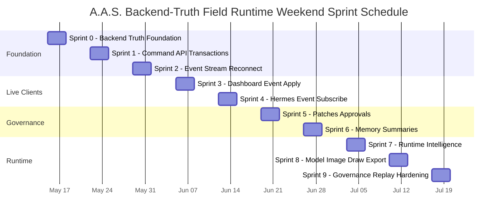

# Chapter 3.7 - Implementation Task Breakdown

## 3.7.0 Overview

This chapter provides the implementation plan for A.A.S. after the backend-truth architecture update. The work starts with canonical Postgres graph storage, command writes, event history, WebSocket sync, and shared Dashboard/Hermes client behavior before expanding into affordances, patches, approvals, memory summaries, and full design runtime services.

---

## 3.7.1 Master Task List

> **Reading the list:** Level 1 (bold) = Phase. Level 2 = Domain. Level 3 = Main Task. Level 4 = Subtask.

### Phase 1 - Postgres Graph Tables

1. **Canonical Database**
   1. Use Postgres as the target canonical DB for A.A.S. product truth.
   2. Treat SQLite only as throwaway demo/test storage if needed.
   3. Store Dashboard, Hermes, memory, and event-bus state outside the truth boundary.
2. **Graph Tables**
   1. Add `direction_nodes` with project, primary type, secondary type, title, summary, confidence, status, position, weight, locked state, creator/updater, and version.
   2. Add `direction_links` with project, source, target, relation type, strength, confidence, creator/updater, and version.
   3. Add `node_subcategories` with scope, primary type, label, description, status, usage count, merge target, created source, and archival metadata.
3. **Runtime Tables**
   1. Add `runtime_events` with actor, operation, payload, before hash, after hash, and timestamp.
   2. Add `direction_snapshots` with graph state, field mode, layout state, active nodes, locks, expanded/collapsed state, and event cursor.
   3. Add `agent_patches` with title, reason, operations, risk level, status, creator, applier, and timestamps.
   4. Add or update `approvals` for high-risk graph, branch, commit, snapshot, and generation operations.
4. **Truth Rule**
   1. Define Postgres graph rows plus runtime events as operational truth.
   2. Define WorldState, Agent Direction State, and Design Exploration Graph as derived read models.
   3. Define CommitmentLedger commits as committed design-truth gates.

### Phase 2 - Command API

1. **Command Envelope**
   1. Define command shape with project ID, actor type, actor ID, operation, payload, expected versions, idempotency key, and optional patch/approval reference.
   2. Support user, agent, system, and maintenance actors.
2. **Command Verbs**
   1. Implement `create_node`, `update_node`, `move_node`, `delete_node`, `link_nodes`, and `unlink_nodes`.
   2. Implement `lock_node`, `change_status`, `merge_nodes`, and `split_node`.
   3. Implement `create_subcategory` and `archive_subcategory`.
3. **Single Write Pipe**
   1. Route Dashboard edits through commands.
   2. Route Hermes worker edits through commands.
   3. Block any direct Dashboard-to-Hermes state mutation path.

### Phase 3 - Event Log

1. **Transaction Rule**
   1. Validate command.
   2. Start transaction.
   3. Write graph row changes.
   4. Write runtime event.
   5. Commit transaction.
   6. Publish event.
2. **Event Payloads**
   1. Include affected IDs, operation, actor type, actor ID, before hash, after hash, new versions, and timestamp.
   2. Normalize Hermes task events into stable A.A.S. runtime events.
3. **History Features**
   1. Use events for audit.
   2. Use inverse commands for undo.
   3. Use events plus snapshots for replay and reasoning traces.

### Phase 4 - WebSocket Stream

1. **Live Transport**
   1. Use WebSocket as the main Dashboard and Hermes event stream.
   2. Use Redis or NATS as the internal live event bus.
   3. Keep Redis/NATS ephemeral and recoverable from Postgres events.
2. **Reconnect**
   1. Clients reconnect with `last_event_id`.
   2. Backend sends missed events when available.
   3. Backend sends full snapshot when cursor is too old.

### Phase 5 - Dashboard Event Apply

1. **Read Path**
   1. Load bootstrap snapshot and event cursor once.
   2. Apply events to local stores after bootstrap.
   3. Avoid full graph refetch after each mutation.
2. **Write Path**
   1. Convert UI gestures into commands.
   2. Use optimistic local working state for drag and low-risk UI feedback.
   3. Reconcile local working state against backend events.
3. **Conflict UI**
   1. Roll back or merge failed optimistic position edits.
   2. Surface semantic `409 conflict` responses for user resolution.

### Phase 6 - Hermes Event Subscribe

1. **Worker Read Model**
   1. Subscribe Hermes to project event stream.
   2. Maintain local graph cache from snapshot plus events.
   3. Treat local cache as disposable and non-authoritative.
2. **Worker Loop**
   1. Apply incoming event.
   2. Ignore agent-originated echo events where appropriate.
   3. Debounce recompute for 1-3 seconds.
   4. Run ContextDistiller.
   5. Retrieve OpenViking memory.
   6. Compute affordances.
   7. Create patch or command.
3. **Pre-Write Safety**
   1. Re-read affected nodes before important writes.
   2. Check expected versions.
   3. Retry, re-plan, or suggest when command conflicts.

### Phase 7 - Version Checks

1. **Versioned Records**
   1. Add monotonically increasing `version` to nodes and links.
   2. Increment version on accepted command writes.
2. **Conflict Policy**
   1. Allow last-write-wins for most position edits.
   2. Require `expectedVersion` for semantic edits.
   3. Return `409 conflict` when expected version is stale.
3. **Semantic Fields**
   1. Protect title, summary, primary type, secondary type, status, lock state, merge, split, and delete.
   2. Treat edge append as usually safe.
   3. Treat edge delete or overwrite as versioned and possibly approval-gated.

### Phase 8 - Agent Patches

1. **Patch Records**
   1. Store patch title, reason, operations, risk level, expected versions, status, and affected IDs.
   2. Link patches to events, approvals, moves, and Hermes task bindings.
2. **Low-Risk Auto-Apply**
   1. Auto-apply extracted Object or Subject nodes.
   2. Auto-apply weak suggested edges.
   3. Auto-apply confidence updates, annotations, and draft Seeds when rules allow.
3. **High-Risk Pending**
   1. Queue delete, merge, lock, reject Seed, change Boundary, and user-authored semantic overwrite patches for approval.
   2. Preserve rejected patches for audit and learning.

### Phase 9 - Approval Rules

1. **Approval Gates**
   1. Require user approval for destructive graph changes.
   2. Require approval for high-impact branch, commit, finalization, revert, and snapshot restore operations.
   3. Require approval for expensive generation batches and risky overwrites.
2. **Soft Locks and Presence**
   1. Use `locked_by_user` to block agent overwrite.
   2. Use `agent_claim` for presence only.
   3. Show agent looking, proposing, editing, and waiting approval in the Dashboard.

### Phase 10 - Memory Summaries

1. **OpenViking Context Cards**
   1. Store project ID, related node IDs, summary, linked nodes, confidence, source event/snapshot, and refresh time.
   2. Generate cards from stable graph and event patterns.
   3. Refresh or archive stale cards.
2. **Memory Boundary**
   1. Use memory only to inform ContextDistiller and Hermes patch generation.
   2. Never let memory mutate graph directly.
   3. Preserve flow: `graph -> memory card -> retrieval -> agent patch -> command -> graph`.

---

## 3.7.2 Task Summary

| # | Task Area | Primary Output |
|---|-----------|----------------|
| 1 | Postgres Graph Tables | Canonical nodes, links, events, snapshots, patches, approvals, subcategories |
| 2 | Command API | Shared user/Hermes write pipe |
| 3 | Event Log | Audit, undo, replay, reasoning trace |
| 4 | WebSocket Stream | Live Dashboard and Hermes event sync |
| 5 | Dashboard Event Apply | Snapshot hydration, event application, optimistic working graph |
| 6 | Hermes Event Subscribe | Local graph cache, debounce, patch generation |
| 7 | Version Checks | `expectedVersion`, `409 conflict`, semantic protection |
| 8 | Agent Patches | Low-risk auto-apply and high-risk pending queue |
| 9 | Approval Rules | Destructive/high-impact gates and soft locks |
| 10 | Memory Summaries | OpenViking context cards without memory-as-truth |

---

## 3.7.3 Weekend Sprint Schedule

The schedule keeps the weekend cadence but makes backend truth and live collaboration the foundation before UI polish and full design intelligence.

### Sprint 0 - Backend Truth Foundation *(Weekend 1)*

| Day | Hours | Tasks |
|-----|:-----:|-------|
| **Fri Eve** | 3h | Define Postgres schema contracts for graph rows, events, snapshots, patches, approvals, subcategories, versions, actors, and hashes. |
| **Sat** | 10h | Add database schema, migrations, seed five primary types, seed starter subcategories, seed demo graph rows, and event cursor support. |
| **Sun Eve** | 4h | Add bootstrap read model generation for derived WorldState, Agent Direction State, and Design Exploration Graph. |

**Deliverable:** Backend has canonical graph tables, event records, and derived read model bootstrap.

### Sprint 1 - Command API and Transactions *(Weekend 2)*

| Day | Hours | Tasks |
|-----|:-----:|-------|
| **Fri Eve** | 3h | Define command envelope, actor model, idempotency, expected version fields, and command result shape. |
| **Sat** | 10h | Implement node, link, lock, status, merge, split, and subcategory command handlers with transactions. |
| **Sun Eve** | 4h | Add command tests for validation, event writes, version increments, and failed command rollback. |

**Deliverable:** User and Hermes writes can use one command pipe.

### Sprint 2 - Event Stream and Reconnect *(Weekend 3)*

| Day | Hours | Tasks |
|-----|:-----:|-------|
| **Fri Eve** | 3h | Add normalized event types, before/after hashes, actor attribution, and event cursor APIs. |
| **Sat** | 10h | Add WebSocket stream backed by Redis/NATS or local event bus adapter. |
| **Sun Eve** | 4h | Add reconnect with `last_event_id`, missed event replay, and snapshot fallback. |

**Deliverable:** Clients can stay synchronized from events and recover after disconnect.

### Sprint 3 - Dashboard Event Application *(Weekend 4)*

| Day | Hours | Tasks |
|-----|:-----:|-------|
| **Fri Eve** | 3h | Add frontend graph store hydration from snapshot plus event cursor. |
| **Sat** | 10h | Apply graph events to Chat, Draw, Model, Architect, inspector, approvals, and bottom event bar. |
| **Sun Eve** | 4h | Add optimistic node drag and rollback/merge behavior for failed writes. |

**Deliverable:** Dashboard behaves as live view/working graph, not source of truth.

### Sprint 4 - Hermes Subscription and Worker Cache *(Weekend 5)*

| Day | Hours | Tasks |
|-----|:-----:|-------|
| **Fri Eve** | 3h | Add Hermes event subscription and project graph cache bootstrap. |
| **Sat** | 10h | Add debounce loop, context distillation trigger, memory retrieval hook, and changed-node neighborhood focus. |
| **Sun Eve** | 4h | Add pre-write re-read, expected version check, and conflict recovery path. |

**Deliverable:** Hermes watches backend truth and writes through backend commands.

### Sprint 5 - Agent Patches and Approvals *(Weekend 6)*

| Day | Hours | Tasks |
|-----|:-----:|-------|
| **Fri Eve** | 3h | Add `agent_patches` lifecycle and patch-to-command application flow. |
| **Sat** | 10h | Add low-risk auto-apply rules and high-risk pending approval rules. |
| **Sun Eve** | 4h | Add approval UI/cards, patch inspect view, reject/apply events, and audit history. |

**Deliverable:** Hermes proposes safely, auto-applies low-risk work, and waits for approval on high-risk work.

### Sprint 6 - Memory Summaries *(Weekend 7)*

| Day | Hours | Tasks |
|-----|:-----:|-------|
| **Fri Eve** | 3h | Define OpenViking context card schema and provenance fields. |
| **Sat** | 10h | Generate memory cards from graph/event state and retrieve them for ContextDistiller. |
| **Sun Eve** | 4h | Add stale card detection, refresh/archive flow, and memory-boundary tests. |

**Deliverable:** Memory informs patches without becoming graph truth.

### Sprint 7 - Runtime Intelligence Integration *(Weekend 8)*

| Day | Hours | Tasks |
|-----|:-----:|-------|
| **Fri Eve** | 3h | Reconnect AffordanceCompiler to graph neighborhood, locked boundaries, strong vectors, missing pairs, and weak Seeds. |
| **Sat** | 10h | Reconnect MoveCompiler, Supervisor, BranchEcology, TensionEngine, and CommitmentLedger to commands/events. |
| **Sun Eve** | 4h | Validate commit rule: graph commands change graph truth; commits change committed design truth. |

**Deliverable:** Field Runtime uses backend truth model end to end.

### Sprint 8 - Model, Image, and Draw Export *(Weekend 9)*

| Day | Hours | Tasks |
|-----|:-----:|-------|
| **Fri Eve** | 3h | Route model and image-generation moves through commands, patches, events, and artifact registration. |
| **Sat** | 10h | Add model artifact versioning, validation reports, render QA, and Draw board package links. |
| **Sun Eve** | 4h | Gate exports on committed truth, model checks, and unresolved critical tensions. |

**Deliverable:** Model, image, and Draw outputs respect graph truth, events, and commit gates.

### Sprint 9 - Governance, Replay, and Hardening *(Weekend 10)*

| Day | Hours | Tasks |
|-----|:-----:|-------|
| **Fri Eve** | 3h | Add finalization gates, snapshot restore approval, destructive action approval, and drift detection. |
| **Sat** | 10h | Add replay/debug panels, snapshot comparison, event audit, undo via inverse commands, and conflict tests. |
| **Sun Eve** | 4h | End-to-end QA: command -> graph row -> event -> WebSocket -> dashboard apply -> Hermes observe -> patch -> approval -> command. |

**Deliverable:** A.A.S. has one truth, many live views, replay, approvals, and resilient collaboration.

---

## 3.7.4 Sprint Timeline

---

## 3.7.5 Milestone Summary

| Milestone | Sprint | Target | Key Deliverable |
|-----------|:------:|:------:|-----------------|
| **M0 - Truth Foundation** | 0 | Weekend 1 | Postgres graph tables, events, snapshots, derived read model |
| **M1 - Command Writes** | 1 | Weekend 2 | Shared Dashboard/Hermes command API |
| **M2 - Live Sync** | 2-3 | Weekend 4 | WebSocket events, reconnect, dashboard event apply |
| **M3 - Hermes Client** | 4 | Weekend 5 | Hermes event subscribe, local cache, versioned writes |
| **M4 - Governance** | 5 | Weekend 6 | Agent patches, approvals, soft locks |
| **M5 - Memory Context** | 6 | Weekend 7 | OpenViking summaries without memory truth |
| **M6 - Runtime Complete** | 7-9 | Weekend 10 | Affordances, commits, tools, replay, hardening |

**Total estimated timeline: 10 weekends, roughly 170 hours of focused development.**
