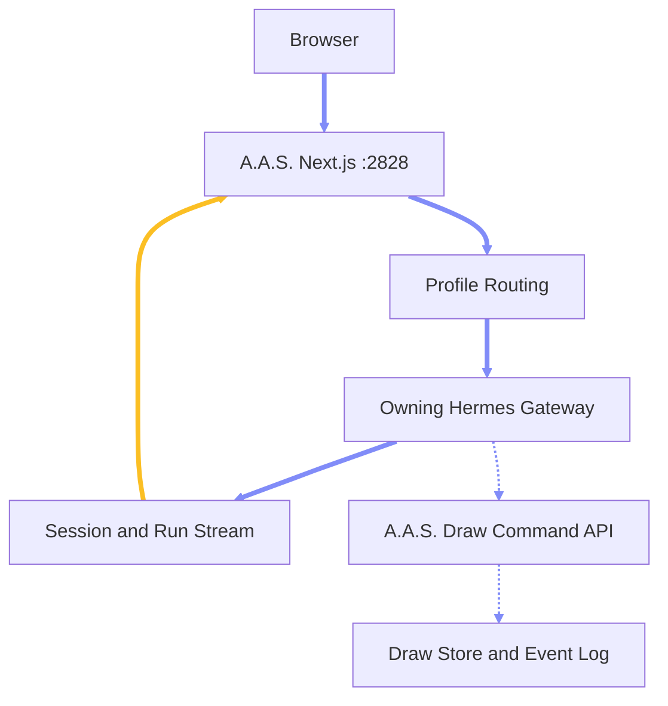
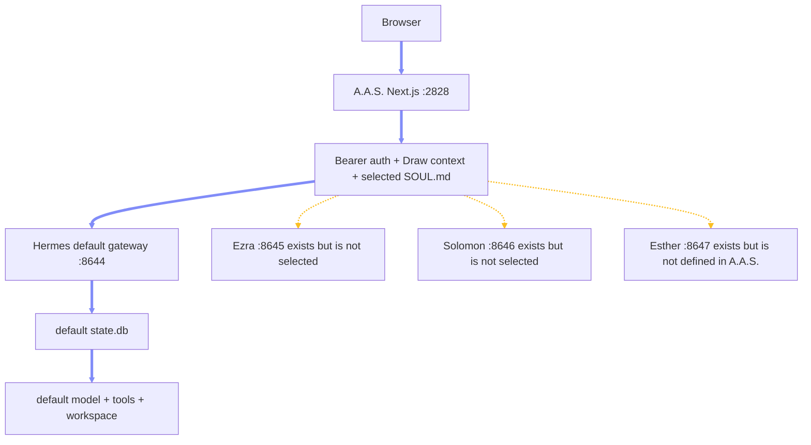
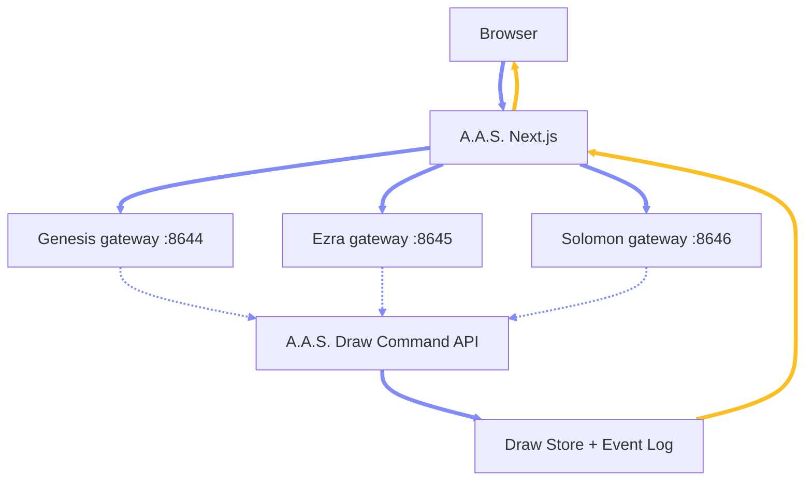

# Chapter 4.3 — Hermes Chat Integration, Profile Routing, and Draw Execution

## 4.3.0 Overview

This chapter records the verified A.A.S.-to-Hermes chat path, corrects the multi-profile routing model, defines the complete stream and persistence contracts, distinguishes Draw awareness from Draw execution, and identifies the work and live probes required for a reliable Genesis, Ezra, and Solomon architecture.

### 4.3.1 Executive Finding and Dependency Order

**Updated answer:** The current A.A.S. chat connection works as a Next.js proxy to the Hermes session API, but multi-agent behavior is not connected as intended. \
**Current request path:** Browser → A.A.S. `/api/chat/*` → Hermes gateway `:8644` → default Hermes profile/runtime. \
**Reported gateway availability:** The Hermes agent report says Ezra and Solomon gateways exist on `:8645` and `:8646`, while the reported A.A.S. deployment routes everything to `:8644`. Esther exists on `:8647`. \
**Profile routing:** Incomplete. This layer decides which Hermes runtime owns a session. \
**Stream handling:** Functional but incomplete. This layer carries run lifecycle information from Hermes back to A.A.S. \
**Draw reading:** Confirmed through per-run context injection. \
**Draw mutation:** Unverified. This layer requires the owning Hermes runtime to call an A.A.S. mutation API. \
**Dependency order:** Profile routing determines the owning runtime; the stream contract reports that runtime's lifecycle; Draw execution allows that runtime to act on A.A.S. state. \



### 4.3.2 Normal Chat Flow

**Step 1 — Restore ownership:** The browser creates or restores an A.A.S. chat session. \
**Step 2 — Create durable session:** A.A.S. creates a Hermes session. \
**Step 3 — Send through A.A.S.:** The browser sends a message to the A.A.S. stream route. \
**Step 4 — Assemble input:** A.A.S. builds the user input, images, `@` reference text, profile instructions, and Draw workspace summary. \
**Step 5 — Start Hermes stream:** A.A.S. sends the request to Hermes with `POST /api/sessions/{id}/chat/stream`. \
**Step 6 — Execute:** Hermes runs the model and tools and emits Server-Sent Events, or SSE. \
**Step 7 — Proxy events:** A.A.S. forwards the SSE stream to the browser. \
**Step 8 — Render provisional state:** The browser renders assistant deltas and tool events. \
**Step 9 — Reconcile durable state:** The browser reloads canonical message history from Hermes after the stream ends. \
**Confirmed contract:** This core flow matches both the inspected A.A.S. code and the supplied Hermes report. A.A.S. sends input and instructions; Hermes accepts string or multimodal input plus ephemeral system instructions. \
**Durable owner:** Hermes remains the durable chat store. A.A.S. reloads messages after the stream ends rather than treating streamed browser state as final truth. \

### 4.3.3 Correct Profile Routing Model

**A.A.S. assumptions:** The A.A.S. code can represent an agent through `agent_id`, `session_key`, and a profile-specific Hermes URL. \
**Hermes correction — `agent_id`:** Hermes does not use `agent_id` to route a request to a profile. \
**Hermes correction — `session_key`:** Hermes does not persist `session_key` in the session record. \
**Hermes correction — session identity:** A Hermes session response contains no profile identity. \
**Actual selector:** Correct profile routing occurs through the Hermes gateway URL and port. \

| A.A.S. agent | Hermes profile | Gateway | State database |
|---|---|---:|---|
| Genesis | default | `:8644` | `~/.hermes/state.db` |
| Ezra | ezra | `:8645` | `~/.hermes/profiles/ezra/state.db` |
| Solomon | solomon | `:8646` | `~/.hermes/profiles/solomon/state.db` |
| Esther | esther | `:8647` | Profile-specific state database; A.A.S. does not currently define Esther |

**Why the port selects the profile:** Each Hermes gateway loads its own profile configuration, workspace, tools, model, and `state.db`. \
**Invariant:** Profile identity = gateway URL. \
**Rejected invariant:** Profile identity ≠ `agent_id` field. \
**Supported A.A.S. configuration:** A.A.S. resolves per-agent URL and key settings first, then falls back to base `HERMES_API_URL` and `HERMES_API_KEY`. \
**Conceptual environment mapping:** Genesis → `HERMES_API_URL_GENESIS` → `:8644`; Ezra → `HERMES_API_URL_EZRA` → `:8645`; Solomon → `HERMES_API_URL_SOLOMON` → `:8646`. \
**Reported deployment value:** The supplied Hermes report found only `HERMES_API_URL=http://172.27.176.115:8644`, with no Genesis-, Ezra-, or Solomon-specific URLs. \
**Current result:** Genesis → `:8644`; Ezra → `:8644`; Solomon → `:8644`. \

**What selecting Ezra currently does:** A.A.S. chooses Ezra as the UI agent, reads Ezra's `SOUL.md`, sends that text as ephemeral Hermes instructions, adds Draw context, and still runs the request through the default `:8644` gateway. A.A.S. intentionally injects `SOUL.md` when the selected route is not dedicated. \
**Current Ezra equation:** Ezra in A.A.S. = default Hermes runtime + Ezra prompt text + Draw context. \
**Incorrect interpretation:** Ezra in A.A.S. currently does not equal the Ezra Hermes gateway/profile/runtime. \
**Missing Ezra runtime properties:** Ezra profile configuration, Ezra workspace, Ezra-specific tools, Ezra-specific model, and Ezra state database are not selected. \
**Solomon consequence:** The same limitation applies to Solomon and its configuration, workspace, tools, model, and state database. \

### 4.3.4 Session-to-Gateway Ownership

**Creation invariant:** A session must remain on the gateway where it was created. \
**Ezra creation example:** A.A.S. → `:8645 POST /api/sessions`; Hermes Ezra returns a session ID; A.A.S. metadata stores that session ID with `agentId=ezra` and the route resolves to `:8645`. \
**Later Ezra message:** A.A.S. reads metadata → resolves `agentId=ezra` → gets the session from `:8645` → posts the chat stream to `:8645`. \
**Primary ownership source:** A.A.S. local metadata should remain the primary source because Hermes does not return profile identity. \
**Fallback route search:** A.A.S. tries the preferred route first and, on a `404`, searches other configured gateways. This is useful recovery behavior but should not replace explicit ownership. \
**Ownership tuple:** Session ID + A.A.S. local agent metadata + gateway mapping. \
**Recommended identity:** A Hermes session is logically identified by gateway + session ID, even though generated session-ID collisions across gateways are unlikely. \

**Session operations that must use the owning gateway:** Get session; patch session; list messages; stream chat; run non-streaming chat; delete or fork; and stop the active run. \
**Recommended invariant:** One A.A.S. agent → one Hermes gateway. \
**Recommended invariant:** One Hermes session → one owning gateway. \
**Recommended invariant:** Every operation on that session → its owning gateway. \

**Metadata-loss failure:** If `.aas-data/chat-session-metadata.json` disappears, the Hermes session and conversation remain, but A.A.S. no longer knows the original A.A.S. agent. \
**Gateway inference after loss:** A.A.S. can search gateways; if the session is found on `:8645`, that gateway operationally proves Ezra ownership. \
**Current labeling risk:** Current normalization can still label the session Genesis because Hermes returns no profile field. The route that found the session should therefore contribute agent identity when local metadata is absent. \
**Duplicate-ID design risk:** A.A.S. metadata is currently keyed only by session ID, although gateway ownership is logically part of identity. \
**Route-change risk:** If Ezra moves from `:8645` to another port, existing sessions remain in the old Ezra `state.db`; the new route cannot find them unless the old gateway remains available or the data is migrated. \

### 4.3.5 Session Creation and A.A.S.-Local Metadata

**Creation payload:** A.A.S. sends `title`, `session_key`, `agent_id`, `model`, `provider`, `base_url`, `api_mode`, and `system_prompt` when it creates a session. \
**Hermes behavior — `agent_id`:** Accepted or ignored but not used for profile routing. \
**Hermes behavior — `session_key`:** Not persisted in the Hermes session. \
**Hermes behavior — profile:** No profile identity is returned in the session. \
**Hermes behavior — model fields:** Model fields are accepted as top-level session fields. \
**Hermes behavior — system prompt:** `system_prompt` is stored separately from message history. \
**Harmless but insufficient fields:** Sending `agent_id` and `session_key` is not necessarily harmful when Hermes ignores them, but neither field can prove ownership. \

**A.A.S. metadata file:** `.aas-data/chat-session-metadata.json`. \
**Stored A.A.S. fields:** `agentId`, synthetic `sessionKey`, and archive state. \
**Consequence:** Agent identity is A.A.S.-local metadata, not Hermes truth. \
**Cross-installation consequence:** If another A.A.S. installation loads the same Hermes session, Hermes cannot report the original A.A.S. agent because it returns neither `agent_id` nor `session_key`. \
**Fallback consequence:** Without local metadata or route-derived identity, A.A.S. falls back to Genesis. \
**Normalizer mismatch:** A.A.S. normalization currently looks for `agent_id` and `session_key` even though the supplied Hermes contract says those fields are not returned. \

### 4.3.6 Model Selection Contract

**Correct creation shape:** A.A.S. sends model override fields at the top level of the Hermes session payload. \

```json
{
  "model": "...",
  "provider": "...",
  "base_url": "...",
  "api_mode": "..."
}
```

**Confirmed endpoints:** This shape is correct for `POST /api/sessions` and `PATCH /api/sessions/{id}`. \
**Creation behavior:** A model selected during session creation is persisted and works. \
**Existing-session defect:** The A.A.S. PATCH handler extracts model selection but only sends `title` to Hermes; it does not add `model`, `provider`, `base_url`, or `api_mode` to the Hermes patch payload. \
**Ineffective fallback:** A.A.S. then includes model fields in each chat request, but Hermes session-chat endpoints do not consume per-request model overrides. \
**Observed UI contract:** A model change on an existing session can appear updated in the A.A.S. UI. \
**Actual Hermes contract:** The Hermes session is not patched, the per-message override is ignored, and the actual model probably remains unchanged. \
**Qualification:** “Probably” applies only to the live outcome that still requires a probe; the request-contract mismatch itself is confirmed by the supplied report. \
**Correct conceptual rule:** Hermes session model > profile configuration. \
**Required fix:** A.A.S. must persist an existing-session model change through `PATCH /api/sessions/{id}` for the selection to take effect. \

### 4.3.7 Complete Hermes Streaming Contract

**Reported success lifecycle:** `run.started` → `message.started` → assistant and tool activity → `assistant.completed` → `run.completed` → `done` → stream close. \
**Possible activity events:** `assistant.delta`, `tool.progress`, `tool.started`, `tool.completed`, and `tool.failed`, potentially repeated. \
**Error path:** `error` can occur at any point before stream close. \
**Transport keepalive:** Hermes can emit SSE comments in the form `: keepalive`. \

| Event | Explicit A.A.S. handling now | Required or relevant behavior |
|---|---|---|
| `run.started` | No | Capture run ID and establish running state immediately |
| `message.started` | No | Create an assistant placeholder with the Hermes message ID |
| `assistant.delta` | Yes | Append text and correlate by message ID |
| `tool.progress` | No | Apply an explicit progress/reasoning product policy |
| `tool.started` | Yes | Create or update one correlated active tool row |
| `tool.completed` | Yes | Update the matching tool row instead of duplicating it |
| `tool.failed` | No | Mark the matching tool row failed and show the error/preview |
| `assistant.completed` | No | Replace or verify final text and persist completion flags |
| `run.completed` | Yes | Mark run complete and begin reconciliation |
| `done` | No | Mark the protocol terminator and detect truncation |
| `error` | Yes, partially | Capture run ID and distinguish agent, transport, and interruption failures |
| `: keepalive` | No explicit comment handling | Ignore intentionally rather than producing noisy empty events |
| A.A.S.-generated Draw events | Yes | Continue rendering as local synthetic events |

**Unknown-event behavior:** A.A.S. records unknown stream events in stream history but does not give them event-specific UI behavior. \

### 4.3.8 Run and Message Lifecycle Details

**`run.started` meaning:** This is the first authoritative lifecycle event and reportedly includes `run_id`, `session_id`, `user_message`, `seq`, and `ts`. \
**Current delay:** A.A.S. ignores `run.started` and normally discovers `run_id` from the first `assistant.delta`, a tool event, or `run.completed`. \
**User impact:** Before one of those handled events arrives, the stop button has no run ID, the UI cannot show that the run started, and long reasoning or tool setup can look stalled. \
**Desired handling:** `run.started` should immediately set active run ID, active session, run status `running`, and a send phase such as started or waiting. \

**`message.started` meaning:** The assistant message now exists logically and has a `message_id` and `role=assistant`. \
**Current delay:** A.A.S. creates a local assistant row only when the first text delta arrives. \
**Tool-first impact:** A tool-first run can show tool rows before an assistant response container exists. \
**Desired handling:** Create an empty assistant placeholder keyed by the real Hermes `message_id`, then attach text deltas, tool progress, completion state, and failure state to it. This reduces synthetic client IDs and improves correlation. \

**`assistant.delta` behavior:** A.A.S. reads the delta, captures `run_id`, buffers text, and appends text to the active assistant message. \
**Correlation improvement:** Use `message_id` to route deltas instead of assuming only one assistant stream exists. \
**Concurrency note:** The current UI blocks a second local send while `isStreaming` is true, which protects ordinary browser interaction, but Hermes itself does not enforce one run per session. \

**`assistant.completed` meaning:** The final event reportedly includes `content`, `completed`, `partial`, `interrupted`, `message_id`, and `run_id`. \
**Current omission:** A.A.S. ignores the event. \
**Integrity impact:** If deltas are dropped or buffered incorrectly, A.A.S. does not use final content as a correction. \
**Desired handling:** Treat it as an end-of-message checksum: replace or verify the assistant row's content, store `partial` and `interrupted` flags, and never append the complete content after the deltas. \

**`run.completed` behavior:** A.A.S. captures the run ID, stops the active streaming state, and enters reconciliation. This is mostly correct. \
**Transport nuance:** Hermes still emits `done` afterward, so A.A.S. marks the run inactive before the stream transport fully ends. This is acceptable if the UI distinguishes run complete, stream draining, and history reconciliation; the current `reconciling` state partially expresses that distinction. \

**`done` meaning:** This is Hermes's protocol terminator, not an OpenAI-style `[DONE]` token. \
**Current omission:** A.A.S. ignores `done` and relies on stream closure. \
**Open-connection impact:** If the connection remains open after `done`, the UI waits unnecessarily. \
**Truncation impact:** If the proxy or network closes unexpectedly without `done`, A.A.S. cannot distinguish successful transport completion from a truncated stream. \
**Desired tracking:** Track `sawRunCompleted`, `sawDone`, and `streamClosed`. Treat `run.completed + done` as successful stream completion and stream close without `done` as potential truncation, then use history reconciliation to determine durable outcome. \

**Keepalive handling:** The current parser looks for `event:` and `data:` lines. Depending on chunk boundaries, a comment-only keepalive can become a default event with empty data. This is mostly harmless but noisy. Lines beginning with `:` should be ignored intentionally. \

### 4.3.9 Tool Progress, Completion, and Failure

**`tool.progress` meaning:** Hermes uses this event for progress and reasoning previews. The supplied example uses `tool_name="_thinking"` and `delta="<reasoning preview>"`. \
**Current behavior:** A.A.S. stores the raw stream event but does not render it explicitly as progress or reasoning. \
**Required product decision:** A.A.S. must choose whether to show the reasoning preview, show only a generic “Thinking…” state, intentionally ignore reasoning, or render non-reasoning tool progress only. This is a product and security policy decision, not merely a parser decision. \

**`tool.started` behavior:** A.A.S. renders an active tool row but creates a new message row with a random local ID for each event. \
**Reported Hermes fields:** `message_id`, `tool_name`, `preview`, `args`, and `run_id`. \
**Better correlation key:** `run_id + message_id + tool_name`. \
**Remaining contract weakness:** Exact uniqueness for repeated calls to the same tool is not confirmed because no `tool_call_id` was shown in the supplied stream schema. \

**`tool.completed` behavior:** A.A.S. appends another row instead of updating the matching `tool.started` row. \
**Visible duplication:** The UI can show `SEARCH — ACTIVE` and `SEARCH — COMPLETE` as two rows instead of changing one row's state. \
**Output limitation:** According to the supplied report, the completion event provides preview and arguments rather than a complete tool result, so the stream UI cannot reliably show the final tool result from that event alone. \
**Canonical result:** The persisted Hermes message history provides the canonical tool result after reconciliation. \

**`tool.failed` behavior:** A.A.S. has no explicit handling for this Hermes event. \
**Visible impact:** A started tool can remain visually active until reconciliation, and its failure reason can be absent from the visible timeline or disappear after reconciliation. \
**Desired behavior:** Mark the matching tool row `FAILED`, expose the event preview or error, and then reconcile it against persisted Hermes tool messages. \

### 4.3.10 Error Handling and Stream Reconciliation

**Hermes error shape:** The supplied report describes an error payload with `message`, `run_id`, and `session_id`. \
**Current useful behavior:** A.A.S. reads `message` as a fallback error string. \
**Missing behavior:** Capture run ID from the error; mark the assistant response failed or interrupted; mark active tools failed or interrupted; distinguish agent error from broken transport; and detect stream closure without `done`. \

**Reconciliation principle:** Stream = responsive temporary UI; Hermes messages endpoint = durable truth. \
**Current strategy:** After the stream ends, A.A.S. fetches Hermes message history and replaces the local timeline. This strategy is sound. \
**What reconciliation can fix:** Missing deltas, incomplete local text, detailed tool results, canonical message IDs, persistent finish reasons, token or reasoning metadata when normalized, tool calls, and tool-result rows. \
**What normalization can discard:** `tool_calls`, `tool_call_id`, reasoning content, token count, and finish reason if the A.A.S. message model does not represent them. \
**Current normalizer focus:** Role, content, attachment, tool name, and display metadata. \
**Qualification:** Reconciliation is authoritative only for the Hermes data that A.A.S. preserves during normalization. \
**Persistence race:** A.A.S. fetches messages immediately after stream close. Hermes persistence timing after completion or cancellation remains unverified. If the database commit lags the stream, the first history fetch can omit the final assistant message. \
**Required probe:** Measure live persistence timing before deciding whether reconciliation needs retry or backoff. \

### 4.3.11 Non-Streaming Route

**Hermes response shape:** The supplied non-streaming response is a nested message object and has no `run_id`. \

```json
{
  "message": {
    "role": "assistant",
    "content": "..."
  }
}
```

**A.A.S. compatibility:** A.A.S. supports this shape because it checks `message.content` after checking optional top-level `content`. \
**Run ID consequence:** A.A.S. exposes `runId` as `null` on this path because Hermes never returns one. \
**User impact:** The ordinary chat UI uses streaming, so this mismatch does not affect the normal chat path. \

### 4.3.12 Draw Awareness Is Confirmed

**Independent behavior:** Draw context injection works independently of Hermes profile routing. \
**Summary inputs:** A.A.S. reads local Draw state and creates a compact workspace summary containing project ID, session ID, boards, artifacts, references, recent events, board and artifact IDs, status, versions, resolvable references, and an instruction to use A.A.S. command APIs. \
**Delivery:** A.A.S. sends the summary through Hermes `instructions`. \
**Hermes instruction semantics:** Per-run, ephemeral, combined with the core profile prompt, not stored in message history, and not automatically reused on the next turn. \
**A.A.S. consequence:** Regenerating Draw context for every send is correct. \
**Timeout:** A.A.S. gives Draw-summary generation `1,250 ms`. \
**Timeout fallback:** On timeout, A.A.S. uses a stale cached summary or explicitly tells Hermes that Draw context is unavailable. \
**Operational value:** General chat remains available when the Draw store is slow. \
**Confirmed direction:** A.A.S. → Hermes: Draw state is supplied as prompt context. \

### 4.3.13 Draw Mutation Is Not Yet Proven

**Critical distinction:** Draw awareness means Hermes receives a summary of the A.A.S. workspace. Draw execution means Hermes sends an authenticated command back to A.A.S. The first is confirmed; the second is unverified. \
**Unconfirmed native integration:** The supplied Hermes report did not confirm a dedicated native A.A.S. Draw tool. \
**Unconfirmed reachability:** It did not confirm that Hermes knows a reachable A.A.S. base URL. \
**Unconfirmed identity:** It did not confirm that Hermes sends the required actor headers. \
**Unconfirmed profile access:** It did not confirm that the Draw command API is callable from every profile workspace. \
**Current safe statement:** Hermes can read summarized Draw context; reliable Hermes-to-A.A.S. Draw mutation remains unproven. \

**Required mutation round trip:** A.A.S. chat → Hermes receives Draw context → Hermes chooses a Draw tool or skill → Hermes sends an HTTP request to the A.A.S. Draw command endpoint → A.A.S. authenticates and validates actor and payload → A.A.S. applies the command → Draw event/store changes → Hermes receives the command result → Hermes explains the result → A.A.S. UI observes the changed Draw state. \
**Hard boundary:** Prompt context alone cannot perform a mutation. \

**Runtime URL requirement:** Hermes needs an A.A.S. URL reachable from the Hermes runtime. \
**Potentially invalid URL:** `http://localhost:2828` can be wrong from a WSL profile process because WSL localhost may refer to WSL rather than the Windows host, depending on networking. \
**Conceptual alternative:** `http://<windows-host-ip>:2828`; the exact current runtime URL remains unknown. \
**Environment separation:** A.A.S. `NEXT_PUBLIC_APP_URL` does not automatically configure Hermes tools because it belongs to the A.A.S. process configuration. \

**Expected actor headers:** Project documentation identifies `x-aas-actor-id` and `x-aas-actor-type`, plus a command payload containing project, actor, operation, and operation-specific data. \
**Contract qualification:** The Hermes agent only confirmed these as skill-guided expectations, not as a built-in Hermes contract. \
**Open question — request builder:** Which Hermes skill or tool constructs the request? \
**Open question — URL:** Where is the A.A.S. base URL configured? \
**Open question — deployment:** Does every profile load the skill? \
**Open question — actor:** Which actor ID does each profile use? \
**Open question — authentication:** Does A.A.S. require a secret beyond actor headers? \
**Open question — result:** Can Hermes read command responses? \
**Open question — retries:** Can Hermes retry safely? \
**Open question — conflicts:** How are optimistic version conflicts handled? \

### 4.3.14 Draw Tool Availability, Security, and Versioning

**Per-profile verification:** Dedicated gateways can have different tools and skills. A tool on Genesis does not imply the same tool is present on Ezra or Solomon. \
**Toolset probes:** `GET :8644/v1/toolsets`; `GET :8645/v1/toolsets`; `GET :8646/v1/toolsets`. \
**Skill probes:** `GET :8644/v1/skills`; `GET :8645/v1/skills`; `GET :8646/v1/skills`. \
**Workspace separation:** Default, Ezra, and Solomon have different profile workspaces. Any file-based A.A.S. skill must exist in or be visible from each intended profile environment. \

**Security boundary:** Actor headers identify a caller but are not necessarily authentication. \
**Impersonation risk:** If the Draw endpoint trusts `x-aas-actor-id: hermes-...` and `x-aas-actor-type: agent` without a secret or network restriction, any reachable caller can impersonate Hermes. \
**Qualification:** This chapter makes no claim about current enforcement. The exact Draw server authentication must be inspected or tested before A.A.S. is exposed beyond a trusted local network. \

**Version source:** Draw summaries include board version, and mutation examples use `expectedVersion`. \
**Correct optimistic flow:** Hermes reads board version N → sends mutation with `expectedVersion=N` → A.A.S. accepts only if the board is still at N → otherwise A.A.S. reports a conflict → Hermes refreshes context and retries or replans. \
**Concurrent-edit risk:** Without expected-version enforcement, simultaneous user and agent edits can overwrite one another. \

### 4.3.15 Candidate Draw Execution Designs

**Status:** These are architecture options, not claims about the current runtime. \

| Option | Mechanism | Advantages | Costs and risks |
|---|---|---|---|
| A — Generic HTTP skill | Hermes follows a `SOUL.md` or skill that defines the A.A.S. URL, endpoint, headers, schemas, and optimistic-version rules | Fast, flexible, no Hermes core change | Prompt-dependent, weaker schemas, harder validation and error UX, profile drift |
| B — Dedicated Hermes A.A.S. tool | Hermes exposes structured functions such as `aas_get_project`, `aas_list_boards`, `aas_add_text_object`, `aas_update_object`, and `aas_apply_patch` | Typed contract, consistent tool events, better validation, easier permissions, less prompt dependence | Hermes integration work and deployment to each profile gateway |
| C — A.A.S.-executed model intent | Hermes emits a structured proposed Draw command; A.A.S. validates, approves, and executes it locally | A.A.S. retains control, stronger approval/security model, no direct Hermes-to-Windows HTTP dependency | New protocol/event type, limited current tool-event output, more A.A.S. orchestration |

**Likely current direction:** The repository appears aimed closer to Option A. \
**Best long-term control:** Option B or Option C provides a stronger governed execution boundary. \

### 4.3.16 Persistence Ownership

**Hermes per-profile `state.db`:** Sessions, user messages, assistant messages, tool calls and results, model configuration, usage data, and cost data. \
**Hermes system prompt:** Stored on the session but not returned as a message row. \
**A.A.S. local sidecar:** Agent assignment, synthetic session key, and archive state. \
**Browser state:** Current session pointer, cached transcript, preferences, and recent stream events. \
**Ownership summary:** Hermes → conversation and runtime data. \
**Ownership summary:** A.A.S. server → agent label and archive metadata. \
**Ownership summary:** Browser → cache and active UI state. \

### 4.3.17 Stop and Cancellation Behavior

**Current request:** After capturing Hermes `run_id`, A.A.S. calls `POST /v1/runs/{runId}/stop`. \
**Hermes behavior:** Calls agent interrupt, cancels the task, waits up to five seconds, and returns `status: "stopping"`. \
**Guarantee level:** Best effort, not guaranteed immediate termination. \
**Gateway scope:** Run lookup is gateway-local. \
**Current routing defect:** The A.A.S. stop handler uses the base Hermes connection rather than the resolved session/profile route. \
**Why it appears to work now:** All reported A.A.S. traffic uses `:8644`, so the run and stop request reach the same gateway. \
**Failure after dedicated routing:** Ezra run created on `:8645` → A.A.S. stop sent to base `:8644` → `404 run_not_found`. \
**Required ownership state:** Run ID, session ID, agent ID, and owning upstream/gateway key. \
**Required fix:** Stop requests must route to the gateway that owns the run. \

**Cancellation event qualification:** The Hermes report confirms `run.cancelled` for `/v1/runs/{id}/events`, but it does not confirm the exact cancellation sequence on `/api/sessions/{id}/chat/stream`. A.A.S. must not assume the session-chat stream emits `run.cancelled`. \
**Required cancellation probe:** Open a session stream; capture `run.started`; call stop on the same gateway; record all remaining session-chat events; reload message history; and inspect persistence of the partial assistant message. \

### 4.3.18 Session Listing Across Profiles

**Current algorithm:** A.A.S. loops over unique profile routes, requests their session lists, combines the results, normalizes them, attaches local agent metadata, and sorts them. \
**Uniqueness key:** URL + API key. \
**Deduplication consequence:** Profiles that share the same URL and key collapse into one upstream. \
**Reported current routes:** Genesis → `:8644`; Ezra → `:8644`; Solomon → `:8644`. \
**Current visible set:** A.A.S. queries only the `:8644` session list. \
**Database consequence:** Default `state.db` sessions are visible; Ezra `state.db` and Solomon `state.db` are not queried. \
**Correct multi-profile listing:** `GET :8644/api/sessions`; `GET :8645/api/sessions`; `GET :8646/api/sessions`; normalize; attach route or local agent identity; merge; sort. \
**Enablement:** Once per-profile URLs are supplied, the existing A.A.S. route-loop design can query separate gateways. \

### 4.3.19 Current and Target Topologies

**Current accurate topology:** Based on the inspected A.A.S. code and the supplied Hermes runtime report, the browser talks to Next.js A.A.S. on `:2828`; A.A.S. adds bearer authentication, Draw context, and selected-profile `SOUL.md`; all profiles then reach the default Hermes gateway on `:8644`, its default `state.db`, and the default profile model, tools, and workspace. \
**Available but unselected gateways:** `:8645` Ezra; `:8646` Solomon; `:8647` Esther. \
**Unverified listener:** Port `:8643` has a Python listener, but usable forwarding is unverified. \
**Dead runtime port:** Port `:8642` is dead in the reported runtime. \



**Combined target topology:** The browser continues to use A.A.S. as the only frontend control plane; A.A.S. routes Genesis to `:8644`, Ezra to `:8645`, and Solomon to `:8646`; the owning Hermes profile calls the governed A.A.S. Draw command API through an explicit tool or skill; and A.A.S. persists Draw changes in its store and event log. \



**Required active-run state:** Session ID; agent ID; owning gateway; run ID; assistant message ID; stream terminal state. \
**Required Draw-mutation state:** Profile or actor; project; board; operation; expected version; resulting version; event ID. \

### 4.3.20 Current Capability Assessment

| State | Capability |
|---|---|
| Working | A.A.S.-to-Hermes authentication |
| Working | Session creation |
| Working | Persistent chat history |
| Working | Multimodal image input |
| Working | Streaming assistant text |
| Working | Basic tool events |
| Working | Draw-context injection |
| Working | Session model override at creation |
| Working | Stop for runs on the base gateway |
| Working | Browser reconciliation from Hermes history |
| Partially working | Profile personas through injected `SOUL.md` |
| Partially working | Agent identity through A.A.S.-local metadata |
| Partially working | Stream lifecycle display |
| Partially working | Tool display |
| Partially working | Health readiness detection |
| Not working as full multi-profile architecture | Ezra gateway routing |
| Not working as full multi-profile architecture | Solomon gateway routing |
| Not working as full multi-profile architecture | Profile identity from the Hermes session |
| Not working as full multi-profile architecture | Existing-session model switching |
| Not working as full multi-profile architecture | Stop across dedicated profile gateways |
| Not working as full multi-profile architecture | Session listing across the actual profile databases |
| Not working as full multi-profile architecture | Full Hermes event handling |
| Unconfirmed | Hermes-to-A.A.S. Draw mutation path |

### 4.3.21 Priority Order and Recommended Next Discussion

**Priority 1 — Fix profile routing:** This determines the correct model, tools, workspace, session database, and destination for stop requests. It is the foundation for model, session, stop, and tool correctness. \
**Priority 2 — Complete the stream lifecycle:** Minimum high-value additions are `run.started`, `tool.failed`, `assistant.completed`, and `done`, followed by gateway-aware stop. `message.started`, `tool.progress`, explicit error state, keepalive handling, and transport-truncation detection should follow as part of the complete contract. \
**Priority 3 — Prove Draw execution:** Do not infer mutation support from prompt context or tool listing. Run a mutation smoke test on every dedicated gateway. \
**Recommended next discussion:** Profile routing — how Genesis, Ezra, and Solomon map to gateway ports, session ownership, metadata, and all subsequent operations. \
**Following discussion:** Chat stream contract — missing events, stop behavior, and reconciliation. \
**Following discussion:** Draw execution — whether Hermes can mutate A.A.S. rather than only read injected context. \

### 4.3.22 End-to-End Draw Mutation Proof

**Probe step 1:** Create a session on the selected profile gateway. \
**Probe step 2:** Ask the profile to add a uniquely named text object. \
**Probe step 3:** Record the complete Hermes stream. \
**Probe step 4:** Confirm a tool invocation occurred. \
**Probe step 5:** Confirm the A.A.S. command endpoint received the request. \
**Probe step 6:** Confirm actor identity and authentication data, with secrets redacted in reports. \
**Probe step 7:** Confirm the HTTP response. \
**Probe step 8:** Confirm the Draw board version increased. \
**Probe step 9:** Confirm the resulting Draw event exists. \
**Probe step 10:** Confirm the A.A.S. UI displays the new object. \
**Probe step 11:** Reload A.A.S. and confirm the mutation persists. \
**Required profiles:** Genesis on `:8644`; Ezra on `:8645`; Solomon on `:8646`. \
**Evidence threshold:** Until this succeeds per profile, the only confirmed statement is that Hermes can read summarized Draw context; Draw mutation remains unproven. \

### 4.3.23 Focused Follow-Up Request to Hermes

**Requested work:** Perform one live session-chat cancellation probe and one live A.A.S. Draw mutation probe on each gateway. Do not infer missing results; mark every unobserved field `unknown`. \
**Cancellation evidence — gateway:** Gateway URL and port. \
**Cancellation evidence — session:** Session ID. \
**Cancellation evidence — stream:** Complete ordered SSE event names. \
**Cancellation evidence — run:** Run ID. \
**Cancellation evidence — stop:** Stop response. \
**Cancellation evidence — aftermath:** Events received after stop. \
**Cancellation evidence — durability:** Persisted messages after stop. \
**Draw evidence — profile:** Gateway and profile. \
**Draw evidence — capability:** Loaded skill or tool used. \
**Draw evidence — target:** Runtime-reachable A.A.S. base URL and exact endpoint. \
**Draw evidence — identity:** Request headers with secrets redacted. \
**Draw evidence — command:** Operation and payload summary. \
**Draw evidence — response:** HTTP status and response. \
**Draw evidence — versions:** Board version before and after. \
**Draw evidence — event:** Resulting A.A.S. event ID. \
**Draw evidence — persistence:** Whether the mutation survives an A.A.S. reload. \

### 4.3.24 Evidence, Qualifications, and Read-Only Verification

**Evidence basis:** The findings in this chapter combine prior read-only inspection of A.A.S. chat and Draw integration code with the supplied Hermes runtime report. \
**Deployment qualification:** `.env.local` was absent in the inspected workspace. The reported deployment value `HERMES_API_URL=http://172.27.176.115:8644` and the profile gateway availability came from the pasted Hermes agent report rather than local environment verification. \
**Live-verification qualification:** Existing-session model outcome, cancellation event order on the session-chat stream, post-stream persistence timing, A.A.S. runtime reachability from each profile, tool/skill availability, Draw endpoint authentication, and successful Draw mutation all still require live probes. \
**Prior read-only command:** `nl -ba src/lib/chat/chatRouteHandlers.ts | sed -n '119,168p;555,580p;615,680p;711,765p;768,810p;831,927p'`. \
**Prior read-only command:** `nl -ba src/components/chat/hooks/useChatSession.ts | sed -n '493,608p'`. \
**Prior read-only command:** `nl -ba src/lib/chat/agentHermesRouting.ts`. \
**Prior read-only command:** `nl -ba src/lib/chat/chatRouteHandlers.ts`. \
**Prior read-only command:** `nl -ba src/components/chat/hooks/useChatSession.ts`. \
**Prior read-only command:** `nl -ba src/lib/chat/chatApi.ts`. \
**Prior read-only command:** `nl -ba src/lib/chat/chatSessionMetadataStore.ts`. \
**Prior read-only command:** `nl -ba src/lib/draw/drawContextSummary.ts`. \
**Prior read-only command:** `nl -ba reference/documentation/chat-hermes-integration.md`. \
**Prior repository check:** `git status --short --branch` reported no changed files at the time of the source inspection. \
