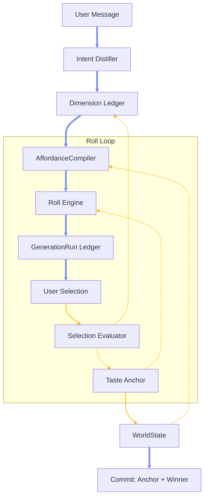
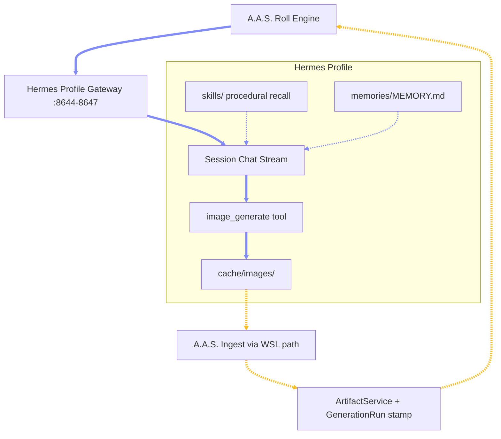

# Chapter 4.4 — Convergent Design Loop: Anchors, Ledger, and Rolls

## 4.4.0 Overview

This chapter defines the Convergent Design Loop update: a minimal extension to the A.A.S. Field Runtime that turns non-deterministic generation into a compounding narrowing process — every roll of the generative slot machine locks dimensions of the design space, conditions the next roll on a reproducible Taste Anchor, and flips from convergence to lateral exploration once the vibe is provably reproducible.

### 4.4.1 Motivation and Field Evidence

*(evidence)* **Source Session:** The Habakkuk logo session (`habakkuk_chat_session_history_20260610.xlsx`, 27 turns, 17 archived prompts) produced one successful logo image that could never be recreated from its exact prompt text. \
*(evidence)* **Root Cause:** Every generation was a text-only tool call. No reference images were passed, no seed or settings were persisted, and the canonical prompt lived in agent memory that was lost to compression. Each "re-roll from the winning prompt" was an independent draw, not a narrowed one. \
*(evidence)* **Steering Style:** The user steered almost entirely by pointing at artifacts — attaching an image and declaring "this was the most successful" — not by verbal adjectives. Selection is the rich signal; vibe vocabulary is thin. \
*(finding)* **The Illusion of Narrowing:** Prompt fidelity is not vibe fidelity. A system that archives prompts but discards generation state only appears to have memory; its reels never shrink. \
*(finding)* **The Real Requirement:** Before any narrowing intelligence is useful, the system must be able to reproduce its own outputs. Provenance and reference conditioning precede taste.

### 4.4.2 Core Thesis: A Slot Machine That Narrows Its Own Reels

*(thesis)* **Compounding Convergence:** A.A.S. is a governed slot machine whose reels shrink. Every roll generates candidates, every user reaction locks dimensions of the design space, and the AffordanceCompiler only spins the dimensions that remain open — so possibility space contracts geometrically instead of the user manually curating a flat, infinite slot. \
*(thesis)* **Two Phases, One Mechanism:** Converge rolls vary every open dimension to find the vibe. Explore rolls hold the anchor fixed and vary lateral parameters within it to find options. The mechanism — roll, select, lock, recompile — is identical in both phases. \
*(thesis)* **Adaptive Stopping:** The phase flip is decided by a convergence score (selection consistency plus anchor confidence), not a hard-coded step count. A decisive user converges in two rolls; an exploratory user takes four. Three rolls is the expected median, never a rule. \
*(thesis)* **Foundational Generality:** The loop is agent-agnostic and domain-agnostic. Any agent reads the same Ledger and Anchor from WorldState and receives the same pruned affordances, whether the deliverable is a logo, a board, a render, or a spatial concept.

### 4.4.3 New Runtime Concepts

*(new)* **Dimension Ledger:** The design space made explicit as a small set of dimensions per design type (palette, form language, materiality, mood, composition, era, density), each in state `open`, `narrowing`, or `locked`. Locked dimensions are removed from the reels and injected as constraints into every subsequent generation. The Ledger is the WorldState fragment that makes compounding mechanical instead of vibes-in-a-prompt. \
*(new)* **Taste Anchor:** A persistent provenance bundle, not a style description: pinned exemplar artifact IDs, the full GenerationRun of each exemplar, the locked dimension values, and a distilled style brief. The Anchor is project truth — it lives in the backend field store, never in agent memory, and survives sessions, agents, and modes. \
*(new)* **Roll:** A move pattern, not a new primitive. One roll composes existing primitives: spawn N candidate branches, ingest N candidate artifacts, await selection, convert selection into evaluation, update Ledger and Anchor, prune affordances. The entropy budget of each roll shrinks with every locked dimension. \
*(new)* **GenerationRun Ledger:** A mandatory provenance record stamped on every candidate artifact at ingest: exact prompt, model, settings, seed when available, reference artifact IDs, output artifact IDs, and verification result. Without it, pinning an exemplar pins an image the system cannot reason backward from.

### 4.4.4 The Convergence Loop

The full loop from user message to committed deliverable:



*(step)* **Distill:** The user message is distilled into Object and Subject seeds; the design type loads its dimension template with all dimensions open. \
*(step)* **Roll:** The AffordanceCompiler builds candidate specs that deliberately spread across open dimensions (quality-diversity coverage, not near-duplicate draws); the Roll Engine executes them through the generation substrate, conditioned on Anchor exemplars as reference inputs. \
*(step)* **Stamp:** Every candidate is ingested as a `candidate` artifact carrying a GenerationRun record linking it to its exact inputs. \
*(step)* **Select:** The user pins, picks, or rejects — the artifact-anchored gesture observed in the field evidence, made the primary primitive. \
*(step)* **Evaluate:** The Selection Evaluator deterministically maps the reaction into feature deltas: dimension transitions (`open` to `narrowing` to `locked`) and Anchor exemplar updates. No LLM critique pass is required for the base loop. \
*(step)* **Recompile:** WorldState recomputes; the next roll's affordances are already pruned. The loop repeats with a smaller entropy budget until the convergence score flips the phase or the user commits.

### 4.4.5 Phase Model: Converge, Explore, Commit

*(phase)* **Converge:** Goal is vibe acquisition. Rolls maximize coverage of open dimensions; selections lock dimensions; the Anchor accumulates exemplars and confidence. \
*(phase)* **Reproducibility Gate:** The phase flip is testable, not felt: the vibe is locked when a re-roll conditioned on the Anchor lands within evaluator-scored tolerance of its exemplars. A system that cannot pass this gate has no business exploring. \
*(phase)* **Explore:** Goal is lateral option generation. The Anchor is held as a hard reference; rolls vary only parameters, applications, and Seed variants within the locked vibe — different Seeds under the same Vector and Boundary. \
*(phase)* **Commit:** The Anchor plus the winning Seed enter the Commitment Ledger as project truth. Every downstream agent brief carries the Anchor; every future affordance respects the locked dimensions. \
*(phase)* **Recovery:** Contradictory selections drop the convergence score and raise a Tension; the next roll becomes an A/B fork between the contradicting directions instead of a narrowing roll. Dimensions can be explicitly reopened by user command, which is itself a governed, evented operation.

### 4.4.6 Provenance and Reproducibility Rules

*(rule)* **Stamp Everything:** No candidate artifact exists without a GenerationRun record. Ingest without provenance is rejected at the contract level. \
*(rule)* **Reference Conditioning:** Every Converge and Explore roll passes Anchor exemplar images as reference inputs to the generation tool. Prompt text alone is demonstrably not a vibe carrier. \
*(rule)* **Truth, Not Memory:** The Anchor and Ledger live in the backend field store and are served through WorldState. Agent memory may cache them; it never owns them. Memory compression can no longer destroy calibration. \
*(rule)* **Degraded Mode Is Explicit:** If the generation substrate cannot accept reference images, the run record marks the roll as `text_only_degraded` and the convergence score is capped — the system must not pretend a degraded roll narrows the space. \
*(rule)* **Backward Reasoning:** Any pinned image must answer "what exact inputs made you" from its run record alone, eliminating the manual image-to-prompt forensics observed in the field session.

### 4.4.7 Selection as Evaluation

*(principle)* **The Click Is the Evaluator:** In the base loop, user selection among candidates is the evaluation event. Pick, reject, pin, and dwell map deterministically to feature deltas — a cheap mapper, not a critique model. \
*(principle)* **Verbal Feedback Is a Later Layer:** Directional language ("warmer", "less corporate") is an optional enrichment parsed into the same delta format, added only after the selection path is proven. The field evidence shows selection carries the overwhelming majority of steering signal. \
*(principle)* **Contradiction Handling:** When successive selections imply incompatible dimension values, the evaluator raises a Tension instead of silently averaging — averaging taste produces mush; forking preserves it. \
*(principle)* **Lineage:** Every selection event, ledger transition, and anchor update is an event in the project event log, making the narrowing trajectory replayable and auditable.

### 4.4.8 Ontology and Architecture Alignment

*(alignment)* **No New Node Types:** The five-node ontology is untouched. The Taste Anchor is a compiled `Subject + Vector` artifact; the Dimension Ledger is the live, mechanical form of `Boundary`; candidates are `Seed` material; locked dimensions narrow Seeds through Vector and Boundary together, exactly as Chapter 3.4 prescribes. \
*(alignment)* **Affordance-Native:** Rolls are affordances generated by the AffordanceCompiler and scored by the existing IntentGradient families; the entropy budget is a scoring input, not a parallel mechanism. \
*(alignment)* **Branch Ecology Reuse:** One roll's candidate batch is a branch spawn set; selection is branch keep/kill; the Explore phase is quality-diversity archiving across open dimensions — all Chapter 3.5 machinery, sequenced by a convergence policy. \
*(alignment)* **Governance Unchanged:** Commits, approvals, tensions, supervisor gates, and artifact lifecycle states operate on the loop's outputs without modification. The update adds a policy and four runtime objects; it does not fork the architecture.

### 4.4.9 The Hermes Execution Layer

The loop's generation substrate is the installed Hermes runtime — **`hermes-agent` v0.15.1 by Nous Research**, a standalone Python agent system (not an OpenClaw derivative) living at `/home/xli24/.hermes/` with its source under `/home/xli24/.hermes/hermes-agent/`. This subchapter makes the Hermes side of the loop explicit at two levels: the runtime architecture A.A.S. integrates with, and the actual agents that execute rolls.

**High level — the runtime:** Each persistent agent runs as an isolated Hermes profile with its own gateway daemon (`hermes --profile <name> gateway run`), its own `config.yaml`, `.env`, `SOUL.md` persona, `state.db` SQLite session store (FTS5-searchable), `memories/MEMORY.md` + `USER.md`, `skills/` library, `workspace/`, `logs/`, `cron/`, and `cache/images/`. The root `~/.hermes/` is itself the Genesis profile. \
**High level — the callable surface:** Each API-enabled profile exposes an HTTP server (`API_SERVER_KEY` bearer auth): OpenAI-compatible `/v1/chat/completions` and `/v1/responses`, structured `/v1/runs` with an SSE event stream plus `stop` and `approval` endpoints, session control under `/api/sessions/*` (CRUD, `chat`, `chat/stream`, `fork`), cron automation under `/api/jobs/*`, and `/v1/capabilities` for feature detection. A.A.S. reaches these gateways only through its server-side proxy — the browser never holds a Hermes key. \
**Low level — the agent roster:** Genesis (root profile, port `8644`, orchestration persona), Ezra (`8645`, researcher), Solomon (`8646`, backend developer), Esther (`8647`, frontend developer), and Habakkuk (designer — currently **Telegram-only, no HTTP API server**). All five run on the same Codex backend with per-profile models. The designer being API-less matters: until Habakkuk's profile enables an API server, A.A.S. routes designer rolls through a shared gateway with SOUL.md injection — a deployment fact the implementation plan must absorb, not hide. \
**Low level — the roll execution path:** A roll travels `A.A.S. Roll Engine → profile gateway → session chat stream → image_generate tool → <profile>/cache/images/<prefix>_<timestamp>_<uuid8>.png → A.A.S. ingest (WSL path read) → ArtifactService + GenerationRun stamp`. The tool's return payload and the prompt sent are both in A.A.S. hands at the stream boundary — which is exactly where provenance is captured.



**The conditioning gap (decisive finding):** The agent-facing `image_generate` tool accepts exactly two parameters — `prompt` and a three-way `aspect_ratio`. The active backend (`openai-codex` plugin, `gpt-image-2-low` tier) builds its payload from prompt, size, and quality only. **No reference-image input exists in the active pipeline.** The only reference affordance anywhere in the install is an `image_style_references` capability on the inactive FAL/Krea provider path, unreachable from the agent schema. Chapter 4.4.6's substrate requirement is therefore *unmet at launch*: every roll on the current install is `text_only_degraded` by definition, and closing the gap means either activating a reference-capable provider plugin (FAL/Krea) or extending the tool schema — a Hermes-side change tracked explicitly in the implementation plan. \
**Memory is the anti-pattern, by evidence:** Hermes profile memory is a nudge-curated `MEMORY.md` capped at ~2,200 characters with periodic compaction — structurally guaranteed to lose calibration over time, which is precisely what destroyed the logo session's taste state (4.4.1). Hermes memory remains what Chapter 2.2 says it is: procedural recall. The Anchor and Ledger live in A.A.S. truth and are *injected into* agent context per roll, never *remembered by* the agent. \
**Skills already encode the lesson:** Habakkuk's profile carries `creative/aas-agent-logo-design` (calibration notes, prompt-archive export patterns, and a `references/image-generation-reproducibility.md` documenting the prompt-only failure) and Solomon's `aas-integration` skill states the boundary rule verbatim: *A.A.S. owns Draw state; Hermes agents call A.A.S. HTTP APIs and never mutate frontend state directly.* The integration is reciprocal — A.A.S. calls Hermes gateways to execute; Hermes agents call A.A.S. routes to read world state and submit commands; neither side touches the other's truth. \
**Kanban as the durable-execution future:** The install runs a real task subsystem — `kanban.db` (tasks, links, comments, events, runs, attachments), an in-gateway dispatcher on a 60-second tick with auto-decomposition and per-profile assignment, worker agents pinned via `HERMES_KANBAN_TASK`/`HERMES_KANBAN_RUN_ID`, and agent-facing `kanban_*` tools. The base loop executes rolls through session streams for latency; the kanban dispatcher is the natural home for the durable form — one roll as a task group of N candidate tasks, surviving restarts and feeding the same ingest contract — aligning the loop with Chapter 2.1's task-packet theory without modification.

### 4.4.10 Generality Across Design Domains

*(generality)* **Dimension Templates:** Each design type (logo, brand, image, board, spatial concept) declares its dimension template; the loop logic is identical across templates. A generic template covers unrecognized design types. \
*(generality)* **Abstraction Levels:** The loop operates at any altitude — converging on a brand vibe, a facade materiality, or a single image's mood — because dimensions, not domains, are the unit of narrowing. \
*(generality)* **Cross-Agent Contract:** Designer, orchestrator, research, and build agents all consume the same Anchor and Ledger through their briefs. An agent that generates respects the entropy budget; an agent that builds respects the locked values; no agent re-derives taste privately. \
*(generality)* **Cross-Mode Continuity:** An Anchor pinned in Chat conditions rolls placed in Draw and, eventually, materials and geometry checks in Model — one taste truth across all workspaces. \
*(generality)* **Cross-Channel Continuity:** Because the Anchor and Ledger live in A.A.S. truth rather than in any Hermes profile, the same taste state serves an agent reached through the A.A.S. Chat workspace and the same agent reached through Telegram — the channel is irrelevant to convergence.

### 4.4.11 Minimal Additions and Reuse Map

*(new)* **Concepts:** Dimension Ledger, Taste Anchor, Roll (move pattern), GenerationRun Ledger — four additions, zero ontology changes. \
*(new)* **Policy:** Entropy budget per roll as a function of open dimensions and phase; convergence score with a testable reproducibility gate. \
*(new)* **Substrate Requirement:** The generation tool must accept reference image inputs. This is the single hard prerequisite — and per 4.4.9 it is currently unmet: the installed `image_generate` is text-only, so closing the gap (reference-capable provider plugin or extended tool schema) is the one required Hermes-side change. Everything else rides existing paths. \
*(reuse)* **Unchanged:** Artifact lifecycle and ingest, Hermes gateway routing and session streaming, profile isolation, skills and memory boundaries, the kanban dispatcher, branch ecology, tensions, commits, approvals, events, evaluator contracts, the five-node graph, and all four workspaces.

The implementation footprint in the current frontend prototype:

```text
aas-frontend/
  src/
    lib/
      field/
        generationRun.ts
        tasteAnchor.ts
        dimensionLedger.ts
        selectionEvaluator.ts
        affordanceCompiler.ts
        rollEngine.ts
        convergence.ts
        fieldRouteHandlers.ts
  .aas-data/
    projects/
      aas-local-project/
        field/
          generation-runs.jsonl
          anchor.json
          ledger.json
```

### 4.4.12 Hardlines

**Provenance Before Taste:** No narrowing intelligence ships before GenerationRun stamping and reference-conditioned re-roll work end to end. \
**The Anchor Is Truth:** Taste state lives in the backend field store, surfaced through WorldState — never in agent memory, prompt archives, or chat history. \
**Selection Is Primary:** The loop must be fully operable through artifact-anchored selection alone; verbal feedback is enhancement, never requirement. \
**No Fake Narrowing:** A roll that cannot condition on the Anchor must be marked degraded and must not advance the convergence score. \
**No Hard-Coded Step Count:** Convergence is scored, gated, and adaptive; three rolls is a target outcome, not a rule.
