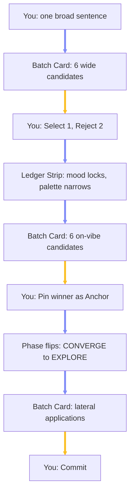
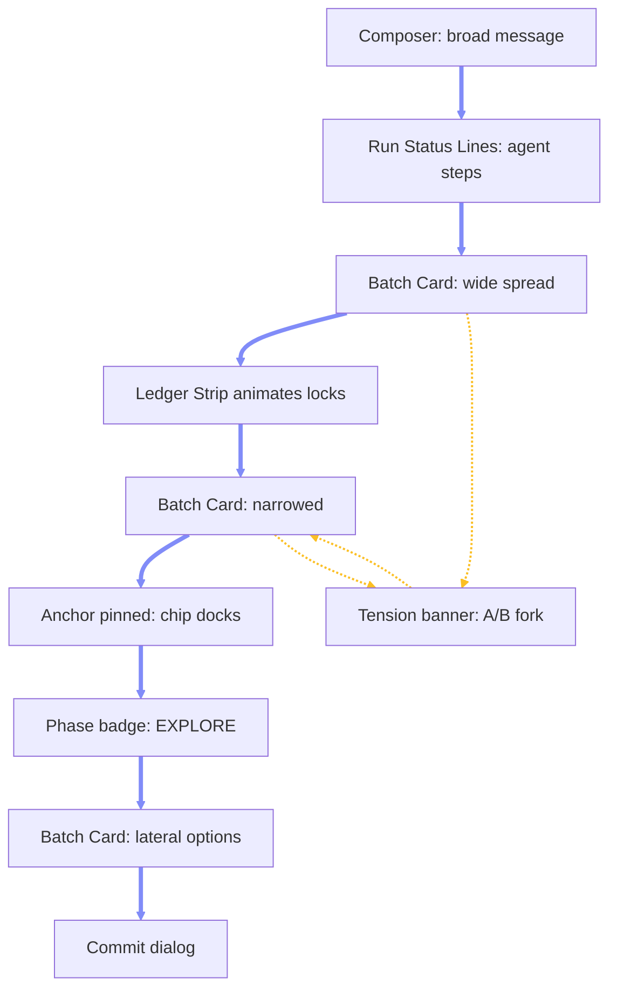

# Chapter 4.5 — Using the Convergent Loop: Flows, Simulations, and UI Guide

## 4.5.0 Overview

This chapter shows — rather than explains — how the Convergent Design Loop from Chapter 4.4 feels to use: four simulated sessions, the screen anatomy behind them, and the gesture vocabulary, written as a distilled user guide that doubles as the UX contract for the final product UI.

### 4.5.1 The Screen You Are Looking At

Before the simulations, the surfaces you will touch. Everything happens inside the existing Chat workspace — the loop adds furniture, not a new mode. This is the whole stage at mid-session, rendered as a wireframe (mockup blocks per Chapter 0.1.6 — structure and states, not pixels):

```ui
screen "A.A.S. — Chat Workspace · mid-session"
  bar "A.A.S. · Chat"
    spacer
    badge "CONVERGE" phase
    meter value=55 "convergence"
  row
    panel "Agents" w=170px
      row center
        dot online
        text "Genesis · orchestration"
      row center
        dot online
        text "Ezra · research" dim
      row center
        dot online
        text "Solomon · backend" dim
      row center
        dot online
        text "Esther · frontend" dim
      row center
        dot offline
        text "Habakkuk · designer ◀" 
      text "shared gateway · SOUL-injected" dim
    panel "Timeline" grow
      text "you: make me a moody cafe brand" mono
      text "Habakkuk: Step 1 of 3 — compiling 6 candidate prompts" dim
      text "tool: image_generate × 6" mono
      grid cols=3
        tile "nocturnal · warm" selected
        tile "pastel · bright" rejected
        tile "brutalist · mono"
        tile "deco · gold"
        tile "rustic · kraft"
        tile "neon · retro" rejected
      banner "mood locked: nocturnal — palette narrowing: warm-dark"
    panel "Field" w=210px
      text "DIMENSION LEDGER" dim
      chip "mood" state=locked value="nocturnal"
      chip "palette" state=narrowing
      chip "form" state=open
      chip "era" state=open
      chip "density" state=open
      divider
      text "ANCHOR" dim
      thumb "A1" x
      text "1 exemplar · run #r-104" dim
  bar
    thumb "A1"
    input "Roll again, steer, or commit…"
      button "Roll" primary
```

The same surfaces, named:

**Candidate Batch Card:** A grid of generated candidates appears inline in the chat timeline after every roll. Each tile has three hover actions: **Select** (this one), **Reject** (not this), **Pin as Anchor** (this is the vibe). One tap each — no typing required. \
**Ledger Strip:** A horizontal row of dimension chips in the right panel — `mood`, `palette`, `form`, `era`, `density`. Each chip is a reel: dim when **open**, pulsing when **narrowing**, solid with its value when **locked** (`mood: nocturnal`). You watch the slot machine lose reels in real time. \
**Reference Chips:** Small thumbnails docked above the composer showing what the next roll will be conditioned on — your pinned Anchor exemplars. An empty dock means the next roll is a wide, unconditioned draw. Each chip has an unpin `×`. \
**Provenance Card:** Every generated image carries an expandable footer: exact prompt, model, settings, conditioning mode, and thumbnails of the reference images that shaped it. Any image can answer "what made you" in one click. \
**Phase Indicator:** A small badge near the composer reading `CONVERGE`, `EXPLORE`, or `COMMIT-READY`, with the convergence meter beside it. You never have to ask which phase you are in. \
**Agent Picker and Agent Chip:** The sidebar lists the persistent Hermes agents (Genesis, Ezra, Solomon, Esther, Habakkuk) with live gateway health dots; the composer carries a chip naming who will execute your next roll. Agents are real, durable processes with their own memory and skills — the picker is choosing a colleague, not a setting.

### 4.5.2 Simulation A — From "Moody Café Brand" to a Locked Vibe

The canonical session. You type one broad sentence and converge in three rolls.



The same session as a transcript:

```text
YOU      make me a moody cafe brand

SYSTEM   [Ledger Strip appears: mood / palette / form / era / density — all open]
         [Batch Card: 6 candidates, deliberately spread —
          one nocturnal-warm, one pastel-bright, one brutalist-mono,
          one art-deco-gold, one rustic-kraft, one neon-retro]

YOU      [Select: nocturnal-warm]  [Reject: pastel-bright, neon-retro]

SYSTEM   [Ledger: mood -> LOCKED nocturnal · palette -> NARROWING warm-dark]
         [Convergence meter rises. Phase badge: CONVERGE]
         [Batch Card: 6 candidates — all nocturnal, warm-dark;
          now only form, era, density vary]

YOU      [Pin as Anchor: candidate #3]

SYSTEM   [Reference Chip docks above composer: thumbnail of #3]
         [Ledger: palette -> LOCKED · form -> LOCKED hand-drawn]
         [Reproducibility check: conditioned re-roll lands on-vibe]
         [Phase badge flips: EXPLORE]
```

The two decisive moments, as the screen shows them. Roll 1 — maximum spread, every reel spinning:

```ui
screen "Roll 1 — CONVERGE · all dimensions open"
  bar
    badge "CONVERGE · ROLL 1" phase
    spacer
    meter value=10 "convergence"
  grid cols=3
    tile "nocturnal · warm"
    tile "pastel · bright"
    tile "brutalist · mono"
    tile "deco · gold"
    tile "rustic · kraft"
    tile "neon · retro"
  bar
    chip "mood" state=open
    chip "palette" state=open
    chip "form" state=open
    chip "era" state=open
    chip "density" state=open
```

The instant after you pin in roll 2 — reels solidify, the anchor docks, the phase flips:

```ui
screen "Roll 2 — the pin"
  bar
    badge "EXPLORE" phase
    spacer
    meter value=78 "convergence"
  grid cols=3
    tile "noct · serif" 
    tile "noct · script"
    tile "noct · hand-drawn" pinned
  banner "Anchor updated — next rolls conditioned on this exemplar"
  bar
    chip "mood" state=locked value="nocturnal"
    chip "palette" state=locked value="warm-dark"
    chip "form" state=locked value="hand-drawn"
    chip "era" state=narrowing
    chip "density" state=open
  bar
    thumb "A1" x
    input "Explore applications, or keep refining…"
      button "Roll" primary
```

And the whole session as a UI state flow — every screen you pass through, and what moves you between them:



**What to notice:** You typed eleven words total. Every other input was a tap on an image. \
**What to notice:** Roll 1 was intentionally all over the map — that spread is the system asking its only question: *which world are we in?* \
**What to notice:** The phase flip was earned, not scheduled. The badge changed because a test re-roll reproduced your vibe, not because three rolls elapsed.

### 4.5.3 Simulation B — Exploring Inside the Vibe

You are now in `EXPLORE`. The Anchor is held; the system stops asking *what do you like* and starts asking *what do you want it to become*.

```text
YOU      show me where this can go

SYSTEM   [Batch Card: 6 lateral options under the SAME vibe —
          logo lockup · menu cover · storefront sign ·
          coffee cup sleeve · loyalty card · window decal]
         [Every tile's Provenance Card shows: conditioned on Anchor ◉]

YOU      [Select: storefront sign]  [Select: menu cover]

SYSTEM   [Batch Card: 4 variants of the storefront sign —
          same mood, same palette, same form; only composition
          and lighting vary. Ledger untouched: nothing new locks.]

YOU      [Commit: variant 2]

SYSTEM   [Commit dialog: "Anchor + Storefront Sign v2 -> project truth.
          All future agents inherit this vibe." Confirm / Cancel]
```

**What to notice:** Explore rolls never re-litigate locked dimensions — no pastel surprise can appear in roll 5. The slot machine physically lost those reels. \
**What to notice:** Selection in Explore means *develop this*, not *lock this*. The Ledger Strip stays still; only the option tree grows. \
**What to notice:** Commit is a deliberate, confirmed gesture with a plain-language consequence statement — never a side effect of picking.

### 4.5.4 Simulation C — Contradiction and the Fork

You will contradict yourself. The system forks instead of averaging.

```text
SYSTEM   [Ledger: form -> LOCKED minimal-geometric, from your last 2 picks]
         [Batch Card: 6 minimal-geometric candidates]

YOU      [Select: the one outlier with ornate hand-lettering]

SYSTEM   [Tension banner appears in timeline:
          "form: minimal-geometric (locked) vs ornate (just selected).
          Averaging taste produces mush — choose a fork."]
         [Batch Card: A/B FORK — left column: 3 best-of minimal,
          right column: 3 best-of ornate, side by side]

YOU      [Select: ornate, column B]

SYSTEM   [Ledger: form -> RE-LOCKED ornate · convergence dips, then recovers]
         [Anchor history records the pivot — nothing is silently lost]
```

The fork screen itself — one banner, two columns, one tap to resolve:

```ui
screen "A/B Fork — form contradiction"
  banner "form: minimal-geometric (locked) vs ornate (just selected) — choose a fork" warn
  row
    panel "A · minimal-geometric" grow
      grid cols=3
        tile "mark v1"
        tile "mark v2"
        tile "mark v3"
    panel "B · ornate" grow
      grid cols=3
        tile "letter v1"
        tile "letter v2" selected
        tile "letter v3"
  bar
    chip "form" state=narrowing
    spacer
    meter value=44 "convergence"
    badge "FORK PENDING" warn
```

**What to notice:** The system never scolds and never blends. A contradiction produces one clarifying screen — two columns, one tap — and the loop continues. \
**What to notice:** The dip in the convergence meter is honest feedback: changing your mind costs a roll, never the session. \
**What to notice:** The old direction stays in Anchor history. If ornate sours, the minimal branch is one click to revive, with its full provenance intact.

### 4.5.5 Simulation D — Reproducing Yesterday's Winner

The session that motivated this entire update (Chapter 4.4.1), replayed under the new system.

```text
YOU      [opens last week's project, scrolls to a generated logo]
         what made this image?

SYSTEM   [Provenance Card expands on the image itself:
          prompt — full text · model — image_gen v4 · seed — 88123
          conditioning — reference ◉ 2 exemplars (thumbnails shown)
          roll — #3 of session 2026-06-02 · dimensions at roll time]

YOU      [Pin as Anchor]

SYSTEM   [Reference Chip docks. Ledger restores the dimension values
          recorded at that roll: mood, palette, form pre-locked.]

YOU      roll me four more like it

SYSTEM   [Batch Card: 4 candidates conditioned on the pinned exemplar —
          recognizably the same vibe, varied in the open dimensions]
```

The Provenance Card, expanded on the image itself — every question the logo session could not answer, answered in one surface:

```ui
screen "Provenance Card — expanded on a generated image"
  row
    panel "" w=200px
      tile "the winning logo" pinned
    panel "GENERATION RUN #r-088" grow
      text "profile      habakkuk · shared gateway" mono
      text "tool         image_generate" mono
      text "model        gpt-image-2 (openai-codex)" mono
      text "conditioning reference ◉ 2 exemplars" mono
      text "aspect       square" mono
      text "cache path   profiles/habakkuk/cache/images/img_20260602_…png" mono
      text "roll         #3 · session 2026-06-02 · selected in roll 4" mono
      divider
      text "PROMPT" dim
      text "Create a square logo/avatar for Habakkuk — bold manuscript H…" dim
      row
        button "Copy prompt"
        button "Use as reference" primary
        button "Pin as Anchor" primary
      row
        text "REFERENCES" dim
        thumb "R1"
        thumb "R2"
```

**What to notice:** "What was the prompt for this image?" is no longer a forensic investigation — it is a click on the image itself. \
**What to notice:** Pinning an old artifact restores its *taste state*, not just its pixels. The Ledger reloads the world the image was born in. \
**What to notice:** "More like it" finally means *like it* — the re-roll carries the image as a reference input, not a hopeful paraphrase of its prompt.

### 4.5.6 Simulation E — The Agents Behind the Glass

The loop runs on real, persistent Hermes agents. You mostly do not think about them — but the UI never hides them either.

```text
YOU      [opens the agent picker in the sidebar]

SYSTEM   [Agent list with live health dots:
          ◉ Genesis   — orchestration        · gateway :8644 · online
          ◉ Ezra      — research             · gateway :8645 · online
          ◉ Solomon   — backend developer    · gateway :8646 · online
          ◉ Esther    — frontend developer   · gateway :8647 · online
          ◌ Habakkuk  — designer             · shared gateway · SOUL-injected]

YOU      [selects Habakkuk]  roll me a first batch for the cafe brand

SYSTEM   [Phase badge: CONVERGE · agent chip in composer: "Habakkuk"]
         [Timeline shows the run, not just the result:
          ▸ Habakkuk: Step 1 of 3 — compiling 6 candidate prompts
          ▸ tool: image_generate × 6   (text-only · DEGRADED badge)
          ▸ ingesting 6 artifacts · stamping GenerationRuns]
         [Batch Card appears with all 6, each tile's Provenance Card
          naming the executing profile: "habakkuk · image_generate ·
          gpt-image-2 · conditioning: text_only_degraded"]

YOU      [taps the DEGRADED badge]

SYSTEM   [Tooltip: "This Hermes install generates from prompt text only —
          reference conditioning is not available, so this roll cannot
          advance convergence. See anchor chip for status."]
```

The agent picker and a degraded roll, on screen:

```ui
screen "Agent Picker + Degraded Roll"
  row
    panel "Agents" w=210px
      row center
        dot online
        text "Genesis · orchestration · :8644"
      row center
        dot online
        text "Ezra · research · :8645"
      row center
        dot online
        text "Solomon · backend · :8646"
      row center
        dot online
        text "Esther · frontend · :8647"
      row center
        dot offline
        text "Habakkuk · designer ◀ selected"
      badge "SHARED GATEWAY · SOUL" warn
    panel "Timeline" grow
      text "Habakkuk: Step 1 of 3 — compiling 6 candidate prompts" dim
      text "tool: image_generate × 6 · text-only" mono
      badge "DEGRADED — reference conditioning unavailable" degraded
      grid cols=3
        tile "candidate 1" degraded
        tile "candidate 2" degraded
        tile "candidate 3" degraded
      bar
        meter value=55 "convergence" frozen
        text "frozen — degraded rolls cannot narrow" dim
```

**What to notice:** The agent is a real, durable being — its own gateway, its own session store, its own skills (Habakkuk carries a logo-design calibration skill it learned the hard way). You pick *who* rolls; the loop is the same for all of them. \
**What to notice:** Step-by-step status lines (`Step 1 of 3 — …`) are the Hermes personas' own operating rule surfacing in the timeline — the UI relays them, it does not invent them. \
**What to notice:** Degraded mode is named at the tile level, the badge level, and the meter — the system tells you when the slot machine's memory is unplugged, because the worst outcome is believing a narrowing that is not happening. \
**What to notice:** The provenance card names the executing profile. Six months from now, "which agent made this, with what tool, on which model" is a click — not an archaeology project.

### 4.5.7 Anatomy of the Surfaces

What each surface must contain in the final product UI.

**Candidate Batch Card:** Roll number and kind (`CONVERGE · roll 2`, `EXPLORE`, `A/B FORK`); a 4–6 tile grid; per-tile Select / Reject / Pin actions; per-tile provenance expander; a one-line caption per tile naming what varies (`era: deco · density: sparse`). \
**Ledger Strip:** One chip per dimension; three visual states (open dim, narrowing pulse, locked solid + value); a long-press or context action **Reopen** on locked chips, gated by a confirm dialog since reopening regresses convergence; chips animate at the moment a selection causes a transition — the cause-effect link must be visible, not logged. \
**Reference Chips:** Exemplar thumbnails with unpin; a `text-only` warning state when the generation tool cannot accept references — the chip grays out and the batch card banners `DEGRADED ROLL: conditioning unavailable, convergence frozen`. Degraded mode is loud, never silent. \
**Provenance Card:** Prompt (copyable), model, settings, seed when present, conditioning mode, reference thumbnails, roll lineage (`roll 3 · selected in roll 4 · pinned`), and a **Use as reference** shortcut. \
**Phase Indicator and Convergence Meter:** Phase badge plus a thin meter; the meter only moves on evidence (selections, reproducibility checks) and visibly freezes during degraded rolls. \
**Tension Banner:** Inline timeline element naming the two conflicting values in plain language and rendering the fork as a two-column batch — resolution is always a pick, never a settings dialog. \
**Agent Picker:** One row per Hermes profile with persona name, role, gateway route (dedicated port or shared + SOUL-injected), and a live health dot fed by the gateway health endpoint; selecting an agent scopes the session to that profile's gateway and session store. \
**Run Status Lines:** The Hermes agents' own `Step X of Y` status messages render inline in the timeline during a roll, along with per-tool rows (`image_generate × 6`) — the user watches the worker work; silence longer than a few seconds during an active roll is a UI defect, not a style. \
**Degraded Badge:** Whenever the executing profile's generation tool cannot accept reference conditioning, every affected tile, the batch header, and the convergence meter carry the `DEGRADED` state with a one-tap explanation — the conditioning gap is a named, visible system condition, never an inferred one.

### 4.5.8 The Gesture Vocabulary

The whole system is operable with six gestures. Typing is for starting and steering, never required for narrowing.

**Select:** *"This one."* In Converge: locks and narrows dimensions. In Explore: develops the option. The workhorse gesture. \
**Reject:** *"Not this."* Demotes the dimension values the tile carried. Optional — selection alone is sufficient signal. \
**Pin as Anchor:** *"This is the vibe."* Adds the artifact and its full generation state to the Anchor; its thumbnail docks as a reference chip; subsequent rolls are conditioned on it. \
**Reopen:** *"I changed my mind about mood."* Long-press a locked chip; confirm; the reel returns to the machine and convergence regresses honestly. \
**Commit:** *"Done — make it truth."* Confirmed dialog; Anchor plus winner enter the project ledger; every downstream agent inherits them. \
**Roll:** *"Go again."* The composer's send action while a batch is pending; entropy is decided by the Ledger, so "go again" is always context-correct — wide early, narrow late, lateral in Explore.

### 4.5.9 What to Expect — and What Not To

**Expect three rolls as the typical arc:** wide → narrowed → lateral. But the system flips phases on evidence, so a decisive session converges in two and an exploratory one takes four — the count is an outcome, not a rule. \
**Expect the first batch to look scattered:** that spread is deliberate coverage of the open dimensions, not noise. Judge roll 1 by whether *one* tile is in the right world. \
**Expect visible narrowing:** if you cannot see a chip lock after a pick, the UI has failed its contract — every selection must produce a visible Ledger consequence or a visible tension. \
**Expect provenance everywhere:** any image without an expandable provenance footer is a bug, not a style choice. \
**Do not expect adjectives to be necessary:** the loop is fully drivable by taps. Verbal steering ("warmer", "less corporate") is a future enhancement layered onto the same delta format — when absent, nothing is lost but convenience. \
**Do not expect the system to average:** contradictions fork into A/B choices. If you ever see a candidate that splits the difference between two things you picked, the evaluator has failed. \
**Do not expect silent degradation:** if reference conditioning is unavailable, the UI says so on the chip, on the batch, and on the frozen meter — a degraded roll never quietly pretends to narrow. \
**Do not expect your taste to live in the agent:** close the session, switch agents, switch modes — the Anchor and Ledger reload from project truth. An agent's `MEMORY.md` being compacted overnight costs you nothing, because the loop never trusted it with the vibe. \
**Expect the agents to be people-shaped:** each Hermes profile narrates its work in steps, carries its own skills, and answers on its own gateway. Asking Habakkuk to roll feels like briefing a designer, not submitting a form — and the same Habakkuk you brief here is the one answering on Telegram, drawing on the same project truth. \
**Expect degraded rolls at launch:** the installed `image_generate` tool is text-only today, so early sessions will show the `DEGRADED` badge and a frozen meter on conditioned re-rolls. The UI is honest about it by design; the badge disappears the day a reference-capable provider is activated, with no workflow change for you. \
**Do not expect to manage Hermes from the UI:** no port numbers to type, no API keys to paste, no profile configs to edit. The agent picker shows health and routes; everything operational stays server-side. If an agent is offline, you see a gray dot and a plain sentence — never a connection-string error.
