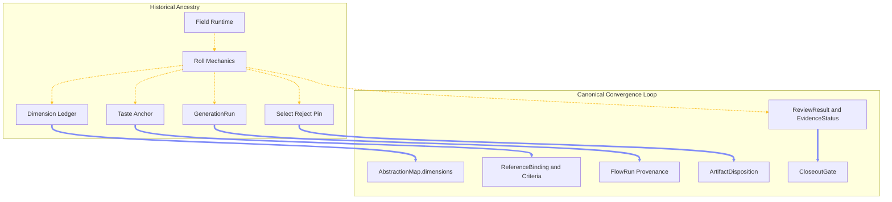
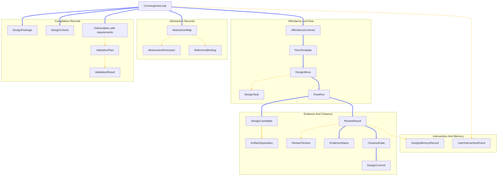
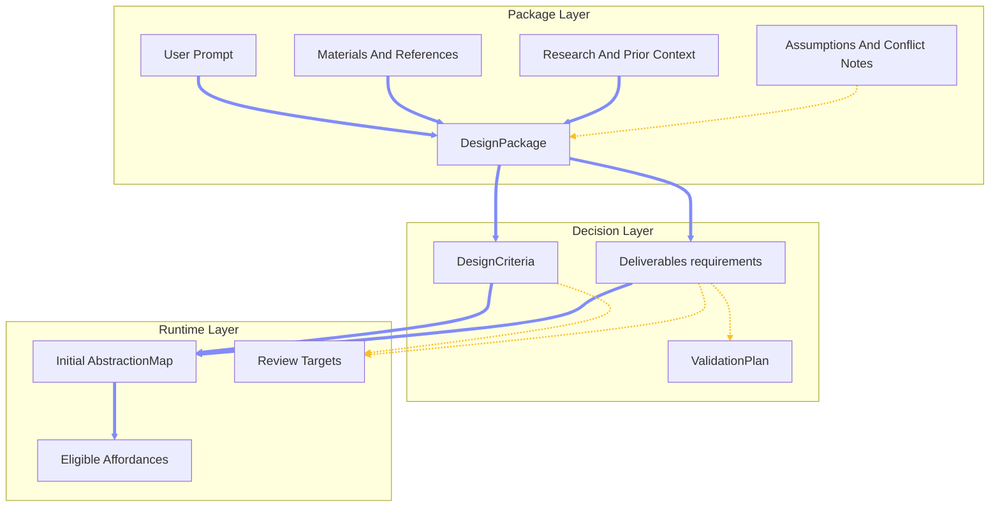
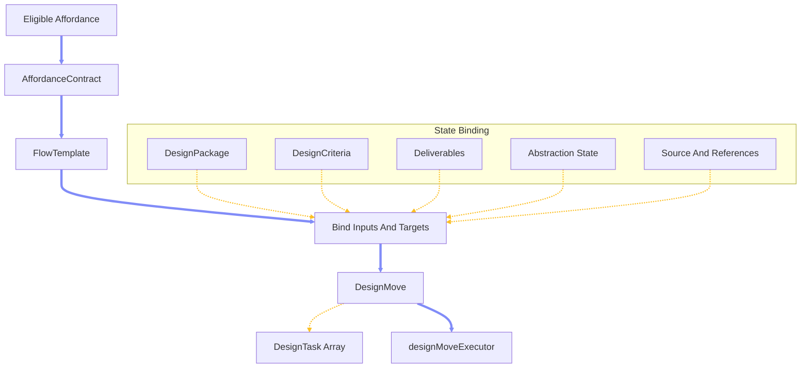
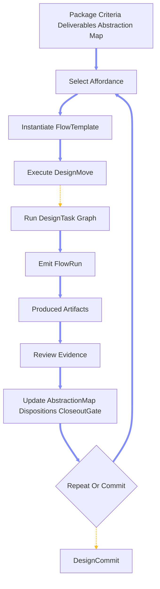
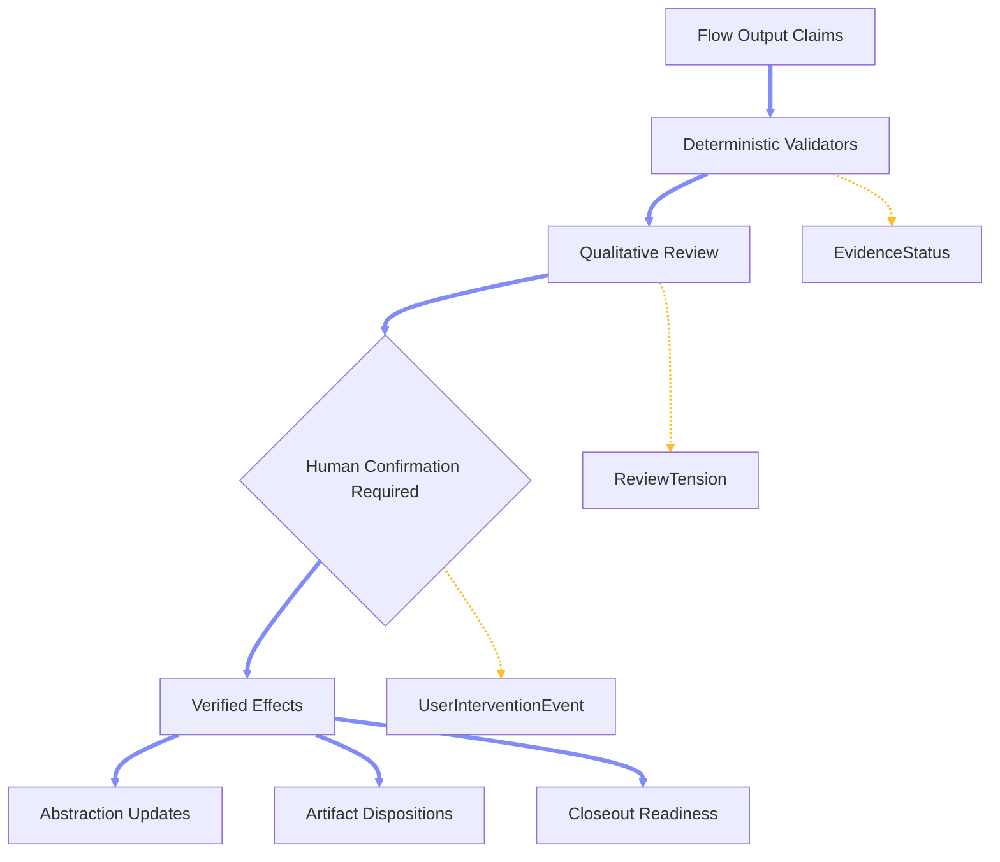
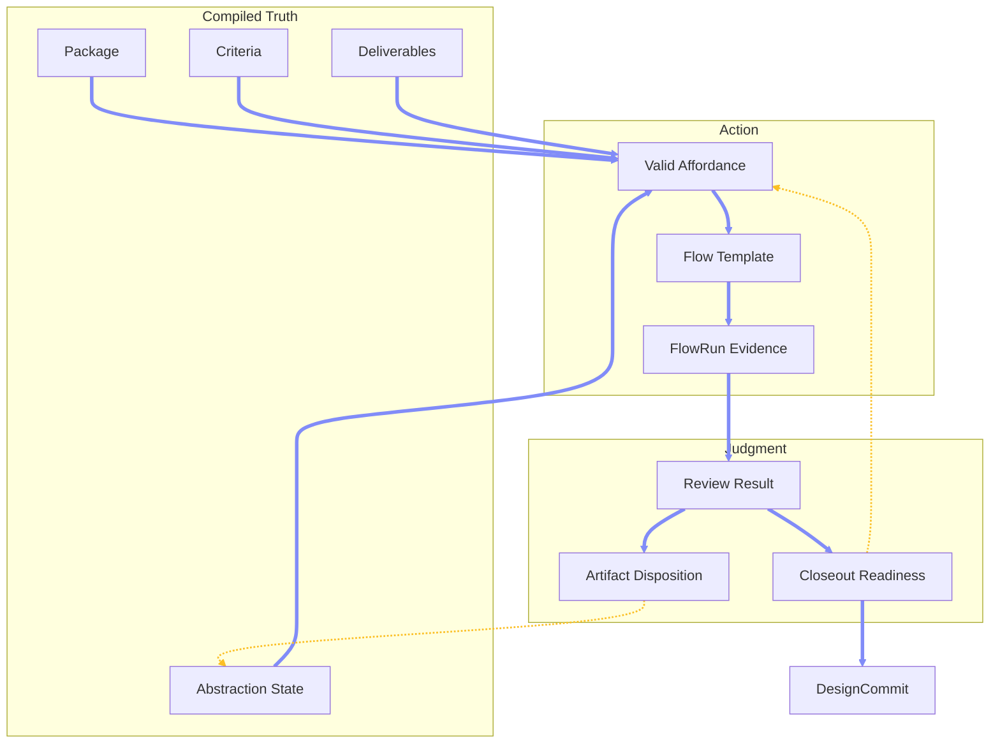

# Chapter 4.6 — Convergence Loop Architecture

## 4.6.0 Overview

This chapter replaces the older Roll-centered explanation with the canonical A.A.S. Convergence Loop architecture: evidence-based convergence over packages, criteria, deliverables, abstraction states, flow runs, reviews, dispositions, validation, and commits.

### 4.6.1 Why This Replaces Roll Without Porting Roll

*(thesis)* **Not Roll V2:** The new Convergence Loop is not a renamed Roll Engine; it absorbs Roll's useful mechanics into richer canonical records owned by the current design-native runtime. \
*(history)* **Old Roll:** Roll was candidate-batch convergence over design dimensions, anchored by selection gestures, image provenance, and a narrowing score. \
*(architecture)* **New Loop:** The Convergence Loop is evidence-based convergence over abstraction states, deliverables, criteria, flows, reviews, validations, dispositions, user interventions, and durable commits. \
*(boundary)* **Historical Ancestry:** Field and Roll explain where several ideas came from, but they are not the active architecture base and should not be migrated forward as a parallel subsystem. \
*(migration)* **Active Center:** The migration center is `src/lib/design/*`, because it already owns convergence loops, design moves, tasks, candidates, evaluations, commits, artifact bindings, command envelopes, affordance routing, and Chat projection. \
*(replacement)* **Canonical Refactor:** The target is a canonical replacement with temporary compatibility projections, not a big-bang rewrite and not a preservation project for old `src/lib/field/*` names.



*(mapping)* **Dimension Ledger:** The old ledger becomes `AbstractionMap.dimensions`, with dimensions marked `unresolved`, `partial`, `verified`, or `committed`. \
*(mapping)* **Taste Anchor:** The old anchor becomes `ReferenceBinding[]`, criteria, trusted artifact evidence, and commits, not a new `TasteAnchorV2`. \
*(mapping)* **Roll Affordance:** The old roll affordance becomes `AffordanceContract` plus `FlowTemplate`, with candidate batches expressed as ordinary flow templates. \
*(mapping)* **Candidate Batch:** The old batch becomes a bounded parallel flow group, usually through `generate_candidate_batch`, with review before canonical promotion. \
*(mapping)* **Selection Gestures:** Select, reject, and pin become `ArtifactDisposition` records with reasons, trusted dimensions, rejected dimensions, and synthesis usefulness. \
*(mapping)* **GenerationRun:** Image-only provenance becomes `FlowRun`, generalized across image generation, scripts, Hermes tasks, Codex work, validation, and other artifact-producing flows. \
*(mapping)* **Degraded Mode:** Degradation becomes `EvidenceStatus`; degraded work may be retained, but it cannot promote truth without later verification. \
*(mapping)* **Convergence Score:** The numeric score becomes a closeout/readiness projection, not canonical truth. \
*(mapping)* **Commit And Regress:** Commit and regress become `DesignCommit` plus explicit reopen or revert events, preserving append-only lineage.

### 4.6.2 The Loop As Orchestration Root

*(root)* **ConvergenceLoop:** `ConvergenceLoop` remains the orchestration root and compact index; it answers which workflow is active and which records belong to that workflow. \
*(anti-pattern)* **Not A Giant Object:** The loop should not absorb every package fact, criterion, deliverable requirement, review, validation result, memory, and intervention directly into one massive record. \
*(shape)* **Adjacent Records:** The loop points to richer canonical records: package, criteria, deliverables, abstraction map, affordance contracts, flow templates, moves, tasks, flow runs, candidates, dispositions, reviews, validations, closeout gates, commits, interventions, and scoped memory records. \
*(runtime)* **Execution Records:** `DesignMove` and `DesignTask` remain runtime execution records; `FlowTemplate` instantiates into them instead of replacing the executor. \
*(mutation)* **Command Boundary:** Existing command-envelope boundaries stay in place, because the new records still need governed mutation and event lineage. \
*(projection)* **Compatibility:** Current compact records remain only as projections while callers migrate, with old `DesignEvaluation` and `commitReady` eventually replaced by `ReviewResult` and `CloseoutGate`.



### 4.6.3 Canonical Object Model

*(canonical)* **DesignPackage:** A factual source collection containing prompt, materials, references, prior context, research, assumptions, conflict notes, and clarifying answers. \
*(canonical)* **DesignCriteria:** The derived guiding layer of goals, principles, themes, rules, and decision logic that governs design choices across abstraction states. \
*(canonical)* **Deliverables:** One deliverables object with `requirements[]`, where each requirement can be qualitative, quantitative, or mixed. \
*(canonical)* **AbstractionMap:** The project-specific map of states, dimensions, target pressures, blockers, confidence, and evidence. \
*(canonical)* **AbstractionDimension:** A single dimension of convergence, tracked by status and evidence rather than by a Roll-era reel metaphor. \
*(canonical)* **ReferenceBinding:** A trusted or negative relationship between an artifact and the dimensions, criteria, or synthesis inputs it may influence. \
*(canonical)* **AffordanceContract:** The typed declaration of what an affordance requires, attempts, refuses to resolve, may output, and must submit to review. \
*(canonical)* **FlowTemplate:** A reusable recipe that binds loop state into executable `DesignMove` and `DesignTask[]` records. \
*(canonical)* **DesignMove:** The runtime move instance dispatched through the current design executor. \
*(canonical)* **DesignTask:** The executable task unit under a move, still useful for dependencies, concurrency, and runtime ownership. \
*(canonical)* **FlowRun:** The provenance record for a concrete flow execution and its produced artifacts. \
*(canonical)* **DesignCandidate:** A candidate artifact package enriched by flow provenance, review, and disposition. \
*(canonical)* **ArtifactDisposition:** The structured state for selected, rejected, promoted, retained, synthesis-useful, off-path, or superseded artifacts. \
*(canonical)* **ReviewResult:** The layered review output that separates claimed effects from verified effects, records outcomes, and routes the loop. \
*(canonical)* **ReviewTension:** A lightweight conflict finding inside review results until recurring tensions justify a fuller lifecycle. \
*(canonical)* **ValidationPlan:** The deterministic-check plan generated from measurable deliverable requirements. \
*(canonical)* **ValidationResult:** The evidence emitted by validators such as file type, dimensions, schema, count, metadata, contrast, or parse checks. \
*(canonical)* **EvidenceStatus:** The trust state for evidence: verified, partial, degraded, unverified, or failed. \
*(canonical)* **CloseoutGate:** The structured commit gate behind any compatibility `commitReady` boolean. \
*(canonical)* **DesignCommit:** The durable act that records satisfied deliverables, reviews, validations, source artifacts, and consent evidence as project truth. \
*(canonical)* **UserInterventionEvent:** A first-class pause, stop, redirect, correction, approval, rejection, mode change, or material injection. \
*(canonical)* **DesignMemoryRecord:** A scoped memory promoted intentionally from loop data, with full promotion potentially deferred until the core loop is stable.

```ts
interface AbstractionDimension {
  id: string
  label: string
  status: "unresolved" | "partial" | "verified" | "committed"
  value?: string
  evidenceIds: string[]
  reopenedBy?: string
}

interface ReferenceBinding {
  artifactId: string
  role: "source" | "reference" | "approved_example" | "negative_example" | "synthesis_input"
  trustedFor: string[]
  notTrustedFor?: string[]
  evidenceIds: string[]
}

type EvidenceStatus = "verified" | "partial" | "degraded" | "unverified" | "failed"
```

### 4.6.4 Package, Criteria, Deliverables

*(package)* **Factual Basis:** The package preserves what was said, provided, researched, inferred, assumed, and resolved; it is a structured collection with links, not a single flat brief. \
*(criteria)* **Guiding Basis:** Criteria are derived from package lineage and become the loop's decision layer, so the system can explain why a flow is valid and why a review passed or failed. \
*(deliverables)* **Review Basis:** Deliverables define what must eventually be produced and checked, with qualitative and quantitative requirements living together inside `requirements[]`. \
*(relationship)* **Separate But Related:** Package, criteria, and deliverables must remain independently addressable because a conflict can repair package truth, criteria can regenerate from it, and deliverables can drive review without swallowing either one. \
*(start)* **Minimum Coherence:** Execution can start when the package is coherent enough to derive criteria, deliverables, source-input bindings, an initial abstraction map, validation expectations, review targets, and at least one eligible affordance. \
*(research)* **Governed Uncertainty:** The loop does not need perfect certainty before execution; it needs explicit assumptions, confidence, unresolved blockers, and interaction-mode rules for when to ask the user.



### 4.6.5 Abstraction Map And Reference Bindings

*(map)* **Project Specific:** The abstraction map is not a universal ladder; it is a project-specific field of states, dimensions, directions, target pressures, evidence, and blockers. \
*(perspective)* **Target Relative:** An artifact can be closer to the target on concept, farther on production, lateral on style, and unresolved on packaging; a single "higher" or "lower" label is too thin. \
*(dimension)* **Dimension Status:** Dimensions progress from `unresolved` to `partial` to `verified` to `committed`, and they can be reopened through review findings or user intervention. \
*(reference)* **Trusted Scope:** Reference bindings say what an artifact is trusted for and what it is not trusted for, preventing a visually liked image from becoming universal truth. \
*(anchor)* **Anchor Dissolved:** The old Taste Anchor dissolves into approved examples, source/reference bindings, criteria, commits, and trusted artifact evidence. \
*(evolution)* **Discovered Map:** The map is seeded during research, but every flow and review can discover new states, reveal blockers, or change which dimensions are ready for the next affordance.

```mermaid
%%{init: {'flowchart': {'arrowMarkerSize': 1.5}}}%%
flowchart TD
    subgraph Map [Abstraction Map]
        direction TB
        S0[Prompt Only]
        S1[Concept Framing]
        S2[Line Work]
        S3[Vector Geometry]
        S4[Color System]
        S5[Deliverable Package]
        S0 ==> S1
        S1 ==> S2
        S2 ==> S3
        S3 ==> S4
        S4 ==> S5
        S2 -.-> SV[Shape Variants]
        SV -.-> S3
        S2 -.-> CE[Color Exploration]
        CE -.-> S4
    end

    subgraph Evidence [Evidence]
        direction TB
        RB[ReferenceBinding]
        EV[Verified Effects]
        DI[Dimension Status]
    end

    RB -.-> S1
    EV ==> DI
    DI ==> S4

    linkStyle 0,1,2,3,4,10,11 stroke:#818cf8,stroke-width:4px
    linkStyle 5,6,7,8,9 stroke:#fbbf24,stroke-width:2px
```



### 4.6.6 Affordance Contracts And Flow Templates

*(contract)* **Typed Eligibility:** Affordances are validated through typed effect contracts, not word matching or agent confidence alone. \
*(attempt)* **Attempt Not Proof:** An affordance may attempt or claim movement in target dimensions, but only review can promote those dimensions to verified or committed. \
*(template)* **Flow Recipe:** A flow template is a reusable recipe that binds package, criteria, deliverables, source input, abstraction state, runtime adapters, and review targets into executable work. \
*(transition)* **Transition Types:** `FlowTransitionType` is `"explore" | "advance" | "refine" | "synthesize" | "validate" | "recover"`. \
*(roll-like)* **Ordinary Templates:** `generate_candidate_batch`, `run_ab_comparison`, `refine_candidate`, and `synthesize_verified_strengths` are ordinary flow templates, not a separate Roll architecture. \
*(runtime)* **Instantiation:** A selected template instantiates into current `DesignMove` and `DesignTask[]` records, executes through the existing runtime, emits `FlowRun`, and waits for review before canonical promotion.

```ts
type FlowTransitionType =
  | "explore"
  | "advance"
  | "refine"
  | "synthesize"
  | "validate"
  | "recover"

interface FlowTemplate {
  templateId: string
  title: string
  transitionType: FlowTransitionType
  inputSlots: string[]
  outputTargets: string[]
  effectContractId: string
  steps: Array<{
    title: string
    runtimeOwner: "aas" | "hermes" | "codex" | "external" | "unknown"
    dependsOn: string[]
    expectedOutputs: string[]
    reviewTargets: string[]
  }>
}
```



### 4.6.7 Runtime Execution: Move, Task, FlowRun

*(move)* **DesignMove:** The move is the concrete runtime instance selected by the loop and dispatched through the executor. \
*(task)* **DesignTask:** Tasks preserve dependency order, concurrency, runtime ownership, expected outputs, blockers, and execution traces. \
*(flowrun)* **FlowRun:** Every artifact-producing execution emits a `FlowRun`, making provenance general rather than image-only or Field-only. \
*(provenance)* **Input And Output Lineage:** A `FlowRun` records template, move, runtime owner, input artifacts, reference artifacts, output artifacts, settings, degraded reason, and creation time. \
*(parallel)* **Bounded Parallelism:** Candidate batches and comparison groups can run in parallel only when they share a source snapshot, declare output targets, avoid direct canonical mutation, and join through review. \
*(degraded)* **Evidence Limit:** Degraded runs can be retained and compared, but they cannot verify or commit dimensions until later evidence repairs the trust gap.

```ts
interface FlowRun {
  runId: string
  loopId: string
  flowTemplateId: string
  moveId: string
  runtimeOwner: "aas" | "hermes" | "codex" | "external"
  inputArtifactIds: string[]
  outputArtifactIds: string[]
  referenceArtifactIds: string[]
  settings: Record<string, unknown>
  evidenceStatus: EvidenceStatus
  degradedReason?: string
  createdAt: string
}
```



### 4.6.8 Review, Evidence, Disposition, Closeout

*(review)* **Layered Authority:** Review runs deterministic validators first, qualitative review second, and human confirmation when mode, confidence, or impact requires it. \
*(claims)* **Claims Are Not Proof:** Flow output claims are inspected against criteria, references, anchors, deliverable requirements, and actual artifact evidence before promotion. \
*(outcomes)* **Explicit Outcomes:** Review results route as `passed_final`, `passed_current_continue`, `failed_refine`, `failed_restart`, `failed_synthesize`, `blocked_needs_input`, `blocked_missing_dependency`, or `abandoned_off_path`. \
*(disposition)* **Retain Evidence:** Failed artifacts are usually retained with disposition metadata instead of deleted, because partial strengths, negative examples, and synthesis material are useful. \
*(tension)* **Lightweight First:** Contradictions live first in `ReviewResult.tensions[]` and blockers; a standalone tension engine is deferred unless repeated use proves it necessary. \
*(closeout)* **Gate Not Score:** Closeout readiness is a projection from final-state review, validation, qualitative verification, unresolved blockers, deliverable completeness, and interaction-mode confirmation.

```ts
interface ArtifactDisposition {
  artifactId: string
  disposition:
    | "candidate"
    | "selected"
    | "rejected"
    | "promoted"
    | "retained_for_evidence"
    | "retained_for_synthesis"
    | "abandoned_off_path"
    | "superseded"
  selectedFor?: string[]
  rejectedFor?: string[]
  evidenceIds: string[]
}

interface ReviewTension {
  id: string
  dimensionId: string
  conflict: string
  options: string[]
  severity: "low" | "medium" | "high"
  status: "open" | "resolved"
}

interface CloseoutReadiness {
  currentStatePassed: boolean
  finalStatePassed: boolean
  blockingIssues: string[]
  readyForCommit: boolean
}
```



### 4.6.9 Architectural Closeout

*(conclusion)* **The Loop Is A Reasoning Structure:** The Convergence Loop is the architecture A.A.S. uses to repeatedly ask what is known, what is unresolved, what action is valid next, what evidence came back, and whether the work is ready to become project truth. \
*(conclusion)* **Roll Becomes Ancestry:** Roll remains valuable as historical proof that selection, provenance, degradation, and narrowing matter, but its vocabulary should disappear into abstraction maps, reference bindings, flow runs, artifact dispositions, evidence status, and closeout readiness. \
*(conclusion)* **Truth Is Distributed But Governed:** Package, criteria, deliverables, abstraction state, flow execution, review, validation, disposition, and commit each own a distinct kind of truth, while `ConvergenceLoop` indexes them as one active workflow. \
*(conclusion)* **Review Is The Hinge:** The loop only advances when evidence survives review; generated claims, user gestures, validator results, and qualitative judgments become durable architecture only after they are interpreted against criteria and deliverable requirements. \
*(conclusion)* **Commit Is Not A Feeling:** A committed deliverable is not simply the best-looking artifact or the latest candidate; it is the artifact whose abstraction state, evidence, requirements, and closeout gate can withstand explanation. \
*(conclusion)* **The Core Model:** `compile truth -> choose a valid flow -> execute work -> review evidence -> update state -> repeat or commit`.


