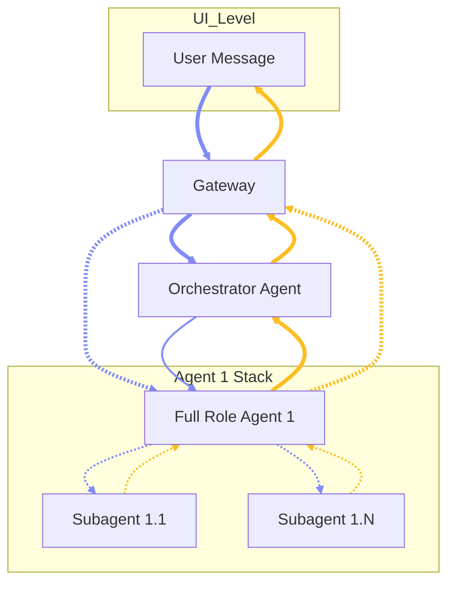

# Chapter 0 — Formatting Guide & Template

## 0.1 Overview

This file serves as the instruction manual and structural template for formatting all OpenClaw documentation chapters.

### 0.2 Typography and Highlighting
*(instruction)* **Bold Text:** Used for labels and emphasis. The UI highlights bold text in a specific color. \
*(instruction)* **Italic Text:** Used for annotations such as *(to-be-updated)*. The UI highlights italic text in a different distinct color.

### 0.3 Chapter and Heading Structure
*(instruction)* **Main Title:** Use `# Chapter [Number] — [Title]` for the top-level chapter heading. \
*(instruction)* **Overview:** The first section must be `## [Number].1 Overview` followed by a single-sentence summary of the chapter. \
*(instruction)* **Subchapters:** Use `###` headings for all remaining subchapters (e.g., `### 1.2 Subchapter Name`). \
*(instruction)* **Accordions:** Understand that `###` headings are automatically transformed into collapsible accordions by the UI.

### 0.4 Lists and Spacing Rules
*(instruction)* **No Bullet Points:** Do not use markdown bullet points (`-` or `*`). \
*(instruction)* **No Blank Lines:** Do not leave empty blank lines between list items within an accordion. \
*(instruction)* **Hard Breaks:** End each list item with a space followed by a backslash (` \`) to create a hard break. \
*(instruction)* **Item Format:** Structure items starting with an optional italic tag, then a bolded label, for example: `*(tag)* **Label:** Description \`.

### 0.5 Chapter Template Example

# Chapter X — [Chapter Title]

## X.1 Overview

This is a single-sentence summary outlining the foundational goals of this chapter.

### X.2 [Subchapter Title]

*(optional-tag)* **First Item:** Description of the first item without a bullet point. \
**Second Item:** Description of the second item, using a backslash at the end for a line break. \
**Third Item:** The final item in the subchapter.

### X.3 [Another Subchapter Title]

**Sub-item A:** Keep content structured and concise without empty lines between items. \
**Sub-item B:** Ensure all formatting rules are strictly followed.

### 0.6 Flow Charts (Mermaid)
*(instruction)* **Mermaid Parser:** The UI can parse mermaid code blocks into actual flowcharts. \
*(instruction)* **Syntax:** Use triple backticks with `mermaid` as the language identifier. \
*(instruction)* **Init Block:** Always begin with `%%{init: {'flowchart': {'arrowMarkerSize': 1.5}}}%%` to enlarge arrowheads. \
*(instruction)* **Direction:** Use `flowchart TD` for top-down architecture diagrams. \
*(instruction)* **Thick Arrows:** Use `==>` for primary (solid, thick) connections representing the main communication path. \
*(instruction)* **Dashed Arrows:** Use `-.->` for secondary connections such as internal delegation between agents and subagents. \
*(instruction)* **Subgraphs:** Use `subgraph [ID] [Label]` blocks to visually group related nodes (e.g., a Full Role Agent alongside its Subagents). \
*(instruction)* **Direction in Subgraph:** Use `direction TB` inside subgraphs to enforce top-to-bottom layout within the group. \
*(instruction)* **Color Coding:** Use `linkStyle` at the end of the diagram to apply directional color. Indigo (`#818cf8`) for downward/request flow. Amber (`#fbbf24`) for upward/response flow. \
*(instruction)* **Link Indices:** `linkStyle` targets connections by their zero-based index in the order they are declared in the diagram source.

