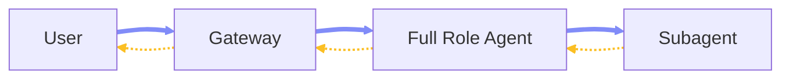
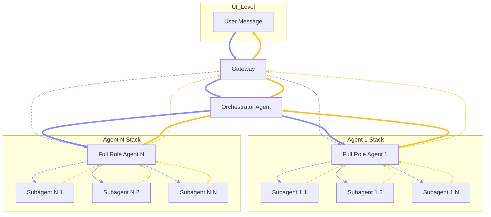

# Chapter 2 — Architecture

## 2.1 Overview

This chapter outlines the multi-agent architecture, mental models, and recommended deployment topologies for OpenClaw.

### 2.2 Agentic Model

**Model Structure:** The agentic model is a three-tier execution hierarchy: one Orchestrator Agent at the top, multiple Full Role Agents as durable domain specialists below it, and task-scoped Subagents as narrower execution units beneath each Full Role Agent. \
**Full Role Agent:** A first-class agent instance with a defined role boundary, persistent identity, governed instructions, assigned tools, and its own full workspace — including the standard workspace folder and mind files such as `SOUL.md`, `AGENTS.md`, `IDENTITY.md`, and others. The Orchestrator is itself a Full Role Agent, but with a specialized foundational role: it serves as the sole inbound coordination point rather than a domain executor. All other Full Role Agents receive work delegated through the system, plan and execute within their domain, spawn Subagents when deeper specialization is needed, and consolidate results back upward. \
**Subagent:** A task-scoped execution unit created under a Full Role Agent. Shares the parent's workspace and context boundary but operates with narrower responsibility, reduced tool exposure, and a more constrained skill profile. Subordinate to its parent Full Role Agent and not independently addressable. \
**Communication Pattern:** The default path is vertical: a user message enters the gateway, routes to the Orchestrator, which delegates to one Execution Agent, which may spawn Worker Agents internally. Results bubble back up through the same chain — Workers to their parent Execution Agent, then to the Orchestrator, then back through the gateway to the user. Optionally, a user may directly address a Full Role Agent via the gateway, bypassing the Orchestrator when direct specialist access is intentional.



### 2.3 Agentic Roles

**Orchestrator Agent:** (Full Role Agent) The single top-level coordinator. Receives inbound requests from the gateway, routes work to the appropriate Full Role Agent, and returns the final consolidated response. Does not perform direct worker-level execution and does not spawn its own Subagents. \
**Execution Agents:** (Full Role Agent) Full Role Agents operating below the Orchestrator as domain-specific specialists. Each owns its role logic, determines whether to execute directly or spawn Worker Agents, and controls all subordinate activity within its role boundary. \
**Worker Agents:** (Subagent) Subagents spawned under Execution Agents to perform the most narrowly scoped tasks in the hierarchy. Inherit the parent execution context but with tighter responsibility, constrained reasoning scope, and a more targeted tool profile. Do not communicate directly with the user or gateway and have no independent top-level identity.



### 2.4 Routing and Agentic Pipeline

**Ingress Resolution:** Inbound routing should be deterministic at the Gateway boundary. Use `bindings` to send normal user traffic to the `orchestrator` by default, and add direct bindings to specialist Full Role Agents only when direct specialist entry is intentionally exposed. OpenClaw resolves bindings by specificity, with peer-level matches ahead of broader scopes, and within a tier the first matching binding wins before fallback to the default agent. ([OpenClaw][1]) \
**Full-Agent Dispatch:** Inside the agent runtime, the Orchestrator should hand off job-style work with `sessions_spawn(agentId: "<full-role-agent>")`, not `sessions_send`. `sessions_spawn` is non-blocking, returns `runId` and `childSessionKey`, and in current source flows into `spawnSubagentDirect(...)` for native subagent execution with `agentId`, `model`, `thinking`, timeout, thread, cleanup, sandbox, and context parameters. ([OpenClaw][2]) \
**Nested Execution:** Execution Agents may spawn Worker Subagents only when nested spawning is enabled with `agents.defaults.subagents.maxSpawnDepth >= 2`. At depth 1, the spawned execution session can still orchestrate children; at leaf depth, recursive orchestration tools are removed. This is not only documented behavior but also enforced by the runtime tool-policy code. ([OpenClaw][3]) \
**Return Path:** Worker Subagents should not be treated as peer messengers. OpenClaw’s native subagent model is announce-driven, and runtime policy places `sessions_send` on the subagent deny list by default. In practice, that means Worker Subagents return results to their parent execution chain, the parent Full Role Agent consolidates, and only then does control move back upward to the Orchestrator or Gateway path. ([OpenClaw][4]) \
**Cross-Agent Gates:** Cross-agent reach belongs to Full Role Agents, not Worker Subagents. For a Full Role Agent to talk across agent boundaries, `tools.sessions.visibility` must be set to `all`, `tools.agentToAgent.enabled` must be true, and the sender must be allowed by `tools.agentToAgent.allow`. Sandboxed sessions are clamped back to `tree` visibility regardless of global settings, ensuring Worker Subagents remain local to their parent execution tree and preventing lateral orchestrator-level routing from inside a worker. The `sessions-send-tool.ts` runtime path enforces this `agentToAgent` gate directly. ([OpenClaw][5]) \
**Recommended Control Shape:** The stable control path is therefore: Gateway → Orchestrator → selected Full Role Agent → optional Worker Subagents → parent Full Role Agent → Orchestrator → Gateway response. Optional Gateway → Full Role Agent direct access is valid, but it should be an explicit binding choice, not an implicit lateral routing behavior inside the worker tree. ([OpenClaw][1]) \
**Validation:** Verify final paths with `openclaw config schema`, since OpenClaw validates against the live merged schema. \
**Reference Configuration:** The configuration below maps to current documented schema surfaces and runtime behavior for `bindings`, nested subagent depth, and agent-to-agent control. Note that `maxConcurrent: 4` is a recommended deployment value for local hardware rather than a platform default. ([OpenClaw][6])

```json5
{
  agents: {
    defaults: {
      subagents: {
        maxSpawnDepth: 2,
        maxChildrenPerAgent: 5,
        maxConcurrent: 4,
        runTimeoutSeconds: 900
      }
    },
    list: [
      {
        id: "orchestrator",
        default: true,
        workspace: "~/.openclaw/workspace-orchestrator",
        subagents: {
          allowAgents: ["agent-1", "agent-n"],
          requireAgentId: true
        }
      },
      {
        id: "agent-1",
        workspace: "~/.openclaw/workspace-agent-1"
      },
      {
        id: "agent-n",
        workspace: "~/.openclaw/workspace-agent-n"
      }
    ]
  },

  bindings: [
    { agentId: "orchestrator", match: { channel: "webchat" } },

    // Optional direct specialist entrypoint
    {
      agentId: "agent-1",
      match: { channel: "discord", peer: { kind: "direct", id: "specialist-room" } }
    }
  ],

  tools: {
    agentToAgent: {
      enabled: true,
      allow: ["orchestrator", "agent-1", "agent-n"]
    },
    sessions: {
      visibility: "all"
    }
  }
}
```

[1]: https://docs.openclaw.ai/concepts/multi-agent?utm_source=chatgpt.com "Multi-Agent Routing - OpenClaw"
[2]: https://docs.openclaw.ai/concepts/session-tool?utm_source=chatgpt.com "Session Tools - OpenClaw"
[3]: https://docs.openclaw.ai/tools/subagents?utm_source=chatgpt.com "Sub-Agents - OpenClaw"
[4]: https://docs.openclaw.ai/concepts/session-tool "Session Tools - OpenClaw"
[5]: https://docs.openclaw.ai/gateway/configuration-reference?utm_source=chatgpt.com "Configuration Reference - OpenClaw"
[6]: https://docs.openclaw.ai/concepts/multi-agent "Multi-Agent Routing - OpenClaw"

### 2.5 Workspace Structure and Guidance

**Workspace Layout:** Each Full Role Agent should have its own dedicated workspace under `~/.openclaw/`, while Subagents remain execution-scoped units under their parent Full Role Agent rather than receiving their own top-level workspace. OpenClaw defines an agent as a scoped unit with its own workspace, `agentDir`, and session store, so workspace isolation belongs to Full Role Agents, not Worker Subagents. \
**Workspace Files:** Each Full Role Agent workspace should contain the standard bootstrap and mind files used by OpenClaw: `AGENTS.md`, `SOUL.md`, `TOOLS.md`, `IDENTITY.md`, `USER.md`, and optionally `HEARTBEAT.md`, `MEMORY.md`, `memory/YYYY-MM-DD.md`, `skills/`, and `canvas/`. These files are the stable project-context surface for agent behavior, operator notes, tool guidance, and memory. \
**State Separation:** Runtime state should stay outside the workspaces. Per-agent auth profiles belong under `~/.openclaw/agents/<agentId>/agent/auth-profiles.json`, and session transcripts belong under `~/.openclaw/agents/<agentId>/sessions/`. This separation keeps workspace files human-editable while agent state, auth, and session stores remain operational data. \
**Bootstrap Behavior:** OpenClaw injects the standard workspace files into project context at run time and creates missing bootstrap files during setup unless `agents.defaults.skipBootstrap: true` is set. `BOOTSTRAP.md` is first-run only, and large workspace files are truncated according to bootstrap character limits, so role instructions should stay compact and role-specific. \
**Role Discipline:** `AGENTS.md` should define the role contract, routing boundary, and escalation rules for that Full Role Agent only. `SOUL.md` should define persona and behavioral boundaries. `TOOLS.md` should describe tool usage conventions rather than tool availability. Do not place large routing registries or duplicated architecture text in every workspace file, because injected bootstrap content directly consumes context window budget. \
**Skill Placement:** Shared reviewed skills should live in `~/.openclaw/skills`, while agent-specific skills should live in the owning workspace's `skills/` directory. This preserves a clean split between global reusable capabilities and role-local specializations. \
**Subagent Scope:** Subagents do **not** get sibling folders under `~/.openclaw/workspace-*` or `~/.openclaw/agents/*`. They execute under the owning Full Role Agent's runtime tree and inherit that parent's workspace boundary for task execution.

```text
dev/
  openclaw-upstream/
  openclaw-extensions/
    router/
    pipeline/
    dashboard/
    sync/
    skills/
      route-task/
      board-read/
      board-write/
      memory-append/
    scripts/
  openclaw-agent-registry/
    agents/
      orchestrator/
        AGENTS.md
        SOUL.md
        TOOLS.md
        IDENTITY.md
        USER.md
      agent-1/
        AGENTS.md
        SOUL.md
        TOOLS.md
        IDENTITY.md
        USER.md
      agent-n/
        AGENTS.md
        SOUL.md
        TOOLS.md
        IDENTITY.md
        USER.md
    schemas/
      board.schema.json
      memory.schema.json
    templates/
      workspace/
```

```text
.openclaw/
  openclaw.json
  skills/
  workspace-orchestrator/
    AGENTS.md
    SOUL.md
    TOOLS.md
    IDENTITY.md
    USER.md
    HEARTBEAT.md
    MEMORY.md
    memory/
      YYYY-MM-DD.md
    skills/
    canvas/
  workspace-agent-1/
    AGENTS.md
    SOUL.md
    TOOLS.md
    IDENTITY.md
    USER.md
    HEARTBEAT.md
    MEMORY.md
    memory/
      YYYY-MM-DD.md
    skills/
  workspace-agent-n/
    AGENTS.md
    SOUL.md
    TOOLS.md
    IDENTITY.md
    USER.md
    HEARTBEAT.md
    MEMORY.md
    memory/
      YYYY-MM-DD.md
    skills/
  agents/
    orchestrator/
      agent/
        auth-profiles.json
        auth.json
      sessions/
        sessions.json
    agent-1/
      agent/
        auth-profiles.json
        auth.json
      sessions/
        sessions.json
    agent-n/
      agent/
        auth-profiles.json
        auth.json
      sessions/
        sessions.json
```

### 2.7 Agent Invocation

**External User to Orchestrator:** Inbound `bindings` route messages to the orchestrator; the most-specific binding wins, falling back to the default agent. \
**Orchestrator to Specialist:** Use `sessions_spawn(agentId: "agent-1" | "agent-n")` for isolated task runs. \
**CLI Testing:** Use `openclaw agent --agent <id> --message "..."` to target a configured agent directly, useful for testing specialist prompts and tools.

### 2.8 Anti-Patterns

**Context Engine Routing:** Do not put routing logic into a custom context engine first, as `prepareSubagentSpawn` is not invoked yet by runtime. \
**Day 1 Exposure:** Do not expose every specialist with inbound bindings on day 1; bind only the orchestrator to avoid accidental direct-user access to high-privilege agents. \
**Session IDs as Auth:** Do not treat session IDs as auth; session identifiers are routing selectors, not authorization tokens.


