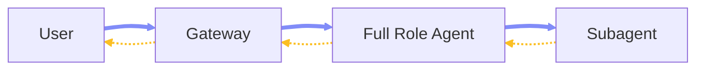
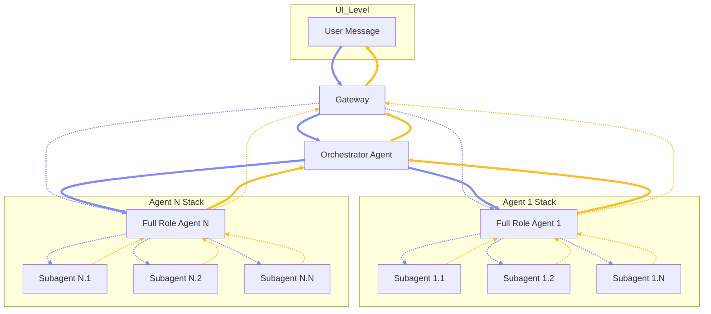

# Chapter 2 — Architecture

## 2.1 Overview

This chapter outlines the multi-agent architecture, mental models, and recommended deployment topologies for OpenClaw.

### 2.2 Agentic Model

**Model Structure:** The agentic model is a three-tier execution hierarchy: one Orchestrator Agent at the top, multiple Full Role Agents as durable domain specialists below it, and task-scoped Subagents as narrower execution units beneath each Full Role Agent. \
**Full Role Agent:** A first-class agent instance with a defined role boundary, persistent identity, governed instructions, assigned tools, and its own full workspace — including the standard workspace folder and mind files such as `SOUL.md`, `AGENTS.md`, `IDENTITY.md`, and others. The Orchestrator is itself a Full Role Agent, but with a specialized foundational role: it serves as the sole inbound coordination point rather than a domain executor. All other Full Role Agents receive work delegated through the system, plan and execute within their domain, spawn Subagents when deeper specialization is needed, and consolidate results back upward. \
**Subagent:** A task-scoped execution unit created under a Full Role Agent. Shares the parent's workspace and context boundary but operates with narrower responsibility, reduced tool exposure, and a more constrained skill profile. Subordinate to its parent Full Role Agent and not independently addressable. \
**Communication Pattern:** The default path is vertical: a user message enters the gateway, routes to the Orchestrator, which delegates to one Execution Agent, which may spawn Worker Agents internally. Results bubble back up through the same chain — Workers to their parent Execution Agent, then to the Orchestrator, then back through the gateway to the user. Optionally, a user may directly address a Full Role Agent via the gateway, bypassing the Orchestrator when direct specialist access is intentional.

### 2.3 Agentic Roles

**Orchestrator Agent:** (Full Role Agent) The single top-level coordinator. Receives inbound requests from the gateway, routes work to the appropriate Full Role Agent, and returns the final consolidated response. Does not perform direct worker-level execution and does not spawn its own Subagents. \
**Execution Agents:** (Full Role Agent) Full Role Agents operating below the Orchestrator as domain-specific specialists. Each owns its role logic, determines whether to execute directly or spawn Worker Agents, and controls all subordinate activity within its role boundary. \
**Worker Agents:** (Subagent) Subagents spawned under Execution Agents to perform the most narrowly scoped tasks in the hierarchy. Inherit the parent execution context but with tighter responsibility, constrained reasoning scope, and a more targeted tool profile. Do not communicate directly with the user or gateway and have no independent top-level identity.

### 2.4 Delegation Pattern

**`sessions_spawn`:** Use `sessions_spawn(agentId: "<specialist>")` as the primary dispatch for job-style work. \
**Spawn Benefits:** It creates an isolated background run, returns immediately with `runId` and `childSessionKey`, reports completion back through the announce chain, and can target another agent ID if allowed. \
**`sessions_send`:** Use `sessions_send` only for persistent specialist conversation where the orchestrator must talk to an already-existing specialist session. \
**Messaging vs Execution:** `sessions_send` is session-to-session messaging, whereas `sessions_spawn` is task execution.

### 2.5 Orchestration Chain

**Depth 0:** `orchestrator` main session. \
**Depth 1:** Specialist run under `research`, `builder`, or `ops` (gets `sessions_spawn`, `subagents`, etc.). \
**Depth 2:** Worker leaf subagents spawned by that specialist (never gets recursive spawn). \
**Execution Flow:** User talks to `orchestrator`, which spawns a specialist under that full agent's profile, the specialist spawns leaf subagents if needed, and results bubble up from child to specialist to orchestrator to user.

### 2.6 Separation Rules

**Orchestrator:** Broad visibility, narrow mutation authority, can route and synthesize, and should not own every dangerous tool. \
**Research:** Read-heavy tools like web, search, memory, and file read, and likely no `exec` permissions. \
**Builder:** Code and file mutation, shell/process execution, and may be sandboxed but writable. \
**Ops:** Diagnostics, logs, maintenance, and probably the strongest approvals. \
**Policies:** OpenClaw supports per-agent sandbox and per-agent tool policy; agent-specific sandbox settings override global defaults, and tool policy is filtered through all layers with deny always winning.

### 2.7 Cross-Agent Calling

**Visibility Gate:** `tools.sessions.visibility: "all"` allows session tools to target any session, while default visibility is `tree` (sees only current session plus spawned subagents). \
**Targeting Gate:** Cross-agent targeting requires `tools.agentToAgent`. \
**Worker Visibility:** Workers should usually stay at `tree` visibility. \
**Orchestrator Visibility:** Only the orchestrator should get cross-agent reach. \
**Sandbox Verification:** If you sandbox the orchestrator, verify you are not being clamped back to `tree` by sandbox session-visibility rules.

### 2.8 File Structure

**Workspace Configuration:** Keep each workspace (`workspace-orchestrator`, `workspace-research`, etc.) in `~/.openclaw/` alongside the main `openclaw.json`. \
**Workspace Contents:** Include `AGENTS.md`, `SOUL.md`, `TOOLS.md`, `IDENTITY.md`, `USER.md`, `HEARTBEAT.md`, and a `skills/` directory. \
**Agent Data:** Keep `auth-profiles.json` and `sessions/` separated per agent under `~/.openclaw/agents/<agentId>/`. \
**Context Injection:** Workspace bootstrap files are injected into project context automatically.

### 2.9 Workspace Guidance

**Bootstrap Injection:** OpenClaw injects `AGENTS.md`, `SOUL.md`, `TOOLS.md`, `IDENTITY.md`, `USER.md`, `HEARTBEAT.md`, and first-run `BOOTSTRAP.md` into project context. \
**Disable Auto-creation:** If you pre-seed workspaces yourself, set `agents.defaults.skipBootstrap: true` to disable auto-creation. \
**Role Specificity:** Keep each full agent's `AGENTS.md` role-specific and short, focusing only on the role contract, decision boundary, and escalation rules. \
**Avoid Bloat:** Do not dump giant routing registries into every workspace file; large bootstrap files are truncated by config caps.

### 2.10 Minimal Config Strategy

**Default Agent:** Use one public default agent (`orchestrator`) bound to inbound channels like `webchat`. \
**Internal Specialists:** Configure internal specialists (`research`, `builder`, `ops`) without direct external bindings. \
**Subagent Defaults:** Set `maxSpawnDepth: 2`, `maxChildrenPerAgent: 5`, `maxConcurrent: 4`, and a reasonable `runTimeoutSeconds` in `agents.defaults.subagents`. \
**Orchestrator Setup:** Allow the orchestrator to route to other agents by configuring `allowAgents` and setting `requireAgentId: true`. \
**Agent Communication:** Enable `tools.agentToAgent` for your designated full agents and set `tools.sessions.visibility: "all"`. \
**Validation:** Verify final field paths against `openclaw config schema` as config validation is strict.

### 2.11 Agent Invocation

**External User to Orchestrator:** Inbound `bindings` route messages to the orchestrator; the most-specific binding wins, falling back to the default agent. \
**Orchestrator to Specialist:** Use `sessions_spawn(agentId: "research" | "builder" | "ops")` for isolated task runs. \
**CLI Testing:** Use `openclaw agent --agent <id> --message "..."` to target a configured agent directly, useful for testing specialist prompts and tools.

### 2.12 Anti-Patterns

**Context Engine Routing:** Do not put routing logic into a custom context engine first, as `prepareSubagentSpawn` is not invoked yet by runtime. \
**Day 1 Exposure:** Do not expose every specialist with inbound bindings on day 1; bind only the orchestrator to avoid accidental direct-user access to high-privilege agents. \
**Session IDs as Auth:** Do not treat session IDs as auth; session identifiers are routing selectors, not authorization tokens.

