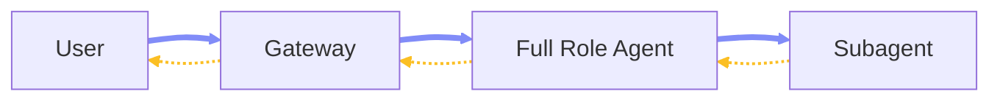
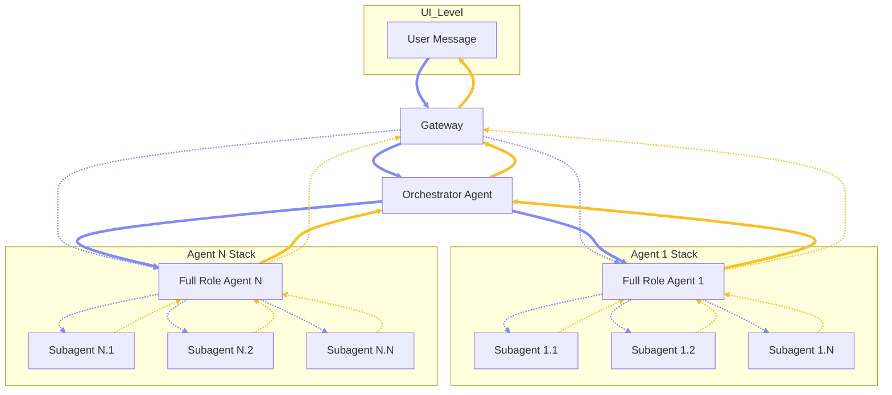

# Chapter 2 — Architecture

## 2.1 Overview

This chapter outlines the multi-agent architecture, mental models, and recommended deployment topologies for OpenClaw.

### 2.2 Agentic Model

**Model Structure:** The agentic model is a three-tier execution hierarchy: one Orchestrator Agent at the top, multiple Full Role Agents as durable domain specialists below it, and task-scoped Subagents as narrower execution units beneath each Full Role Agent. \
**Full Role Agent:** A first-class agent instance with a defined role boundary, persistent identity, governed instructions, assigned tools, and its own full workspace — including `SOUL.md`, `AGENTS.md`, `IDENTITY.md`, `TOOLS.md`, and others. Each Full Role Agent is declared in `agents.list[]` with its own `id`, `workspace`, `agentDir`, model/tool policy, and subagent policy. The Orchestrator is itself a Full Role Agent, but with a specialized foundational role: it serves as the sole inbound coordination point rather than a domain executor. All other Full Role Agents receive work delegated through the system, plan and execute within their domain, spawn Subagents when deeper specialization is needed, and consolidate results back upward. \
**Subagent:** A task-scoped execution unit created natively via `sessions_spawn` under a Full Role Agent. Subagents operate in their own session key with narrower responsibility, reduced tool exposure, and a constrained skill profile. They are not independently addressable at the gateway and do not receive their own top-level workspace. \
**Communication Pattern:** The default path is vertical: a user message enters the gateway, routes to the Orchestrator via `bindings`, which delegates to one Full Role Agent via `sessions_spawn`, which may spawn Worker Subagents internally. Results bubble back up through the same chain — Workers to their parent Full Role Agent, then to the Orchestrator, then back through the gateway to the user. Optionally, a user may directly address a Full Role Agent via the gateway when an explicit `bindings` entry exposes that agent.



### 2.3 Agentic Roles

**Orchestrator Agent:** *(Full Role Agent)* The single top-level coordinator. Receives inbound requests from the gateway via `bindings`, routes work to the appropriate Full Role Agent using `sessions_spawn`, and returns the final consolidated response. Does not perform direct worker-level execution and does not spawn its own Subagents. \
**Execution Agents:** *(Full Role Agent)* Full Role Agents operating below the Orchestrator as domain-specific specialists. Each owns its role logic, determines whether to execute directly or spawn Worker Subagents, and controls all subordinate activity within its role boundary. Declared in `agents.list[]` with their own workspace, model policy, and subagent allowlist. \
**Worker Agents:** *(Subagent)* Subagents spawned natively under Execution Agents using `sessions_spawn` to perform the most narrowly scoped tasks in the hierarchy. Inherit the parent execution context but with tighter responsibility, constrained reasoning scope, and a more targeted tool profile. Do not communicate directly with the user or gateway and have no independent top-level identity.



### 2.4 Routing and Agentic Pipeline

**Ingress Resolution:** Inbound routing is deterministic at the Gateway boundary. `bindings` send normal user traffic to the `orchestrator` by default. Additional bindings expose specialist Full Role Agents only when direct specialist entry is intentionally required. OpenClaw resolves bindings by specificity — peer-level matches win before broader scopes, and within a tier the first matching binding wins before fallback to the default agent. ([OpenClaw][1]) \
**Full-Agent Dispatch:** The Orchestrator hands off job-style work using the built-in `sessions_spawn` tool with `agentId` set to the target Full Role Agent. `sessions_spawn` supports `allowAgents`, `requireAgentId`, depth limits, timeouts, and concurrency — it is the native, non-blocking mechanism for delegated background subagent execution. ([OpenClaw][2]) \
**Nested Execution:** Execution Agents may spawn Worker Subagents when nested spawning is enabled via `agents.defaults.subagents.maxSpawnDepth >= 2`. At depth 1, the spawned session can still orchestrate children. At leaf depth, recursive orchestration tools are removed by runtime policy. Depth-1 children can orchestrate depth-2 workers — this is both documented behavior and runtime-enforced. ([OpenClaw][2]) \
**Return Path:** Worker Subagents return results to their parent Execution Agent. OpenClaw's native subagent model is announce-driven, and `sessions_send` is on the subagent deny list by default. Worker Subagents do not communicate laterally or upward to the Orchestrator directly — the parent Full Role Agent consolidates results before control moves back up the chain. ([OpenClaw][2]) \
**Cross-Agent Gates:** Cross-agent reach belongs to Full Role Agents, not Worker Subagents. For a Full Role Agent to talk across agent boundaries, `tools.sessions.visibility` must be `all`, `tools.agentToAgent.enabled` must be true, and the sender must be listed in `tools.agentToAgent.allow`. Sandboxed sessions are clamped back to `tree` visibility regardless of global settings, ensuring Worker Subagents remain local to their parent execution tree. ([OpenClaw][1]) \
**Recommended Control Shape:** Gateway → Orchestrator → selected Full Role Agent → optional Worker Subagents → parent Full Role Agent → Orchestrator → Gateway response. Optional Gateway → Full Role Agent direct access is valid when an explicit `bindings` entry is defined for it. \
**Validation:** Verify final paths with `openclaw config schema` — OpenClaw validates against the live merged schema, and staying within that schema is the safest path for upgrades. \
**Reference Configuration:** The configuration below maps to current documented schema surfaces for `agents.list[]`, `bindings`, nested subagent depth, and agent-to-agent control. All agent workspaces use the native per-agent path under `~/.openclaw/agents/<id>/workspace`. Note that `maxConcurrent: 4` is a recommended deployment value for local hardware rather than a platform default. ([OpenClaw][1])

```json5
{
  agents: {
    defaults: {
      subagents: {
        maxSpawnDepth: 2,
        maxChildrenPerAgent: 5,
        maxConcurrent: 4,
        runTimeoutSeconds: 900
      }
    },
    list: [
      {
        id: "orchestrator",
        default: true,
        workspace: "~/.openclaw/agents/orchestrator/workspace",
        agentDir: "~/.openclaw/agents/orchestrator/agent",
        subagents: {
          allowAgents: ["agent-1", "agent-n"],
          requireAgentId: true
        }
      },
      {
        id: "agent-1",
        workspace: "~/.openclaw/agents/agent-1/workspace",
        agentDir: "~/.openclaw/agents/agent-1/agent"
      },
      {
        id: "agent-n",
        workspace: "~/.openclaw/agents/agent-n/workspace",
        agentDir: "~/.openclaw/agents/agent-n/agent"
      }
    ]
  },

  bindings: [
    { agentId: "orchestrator", match: { channel: "webchat" } },

    // Optional direct specialist entrypoint
    {
      agentId: "agent-1",
      match: { channel: "discord", peer: { kind: "direct", id: "specialist-room" } }
    }
  ],

  tools: {
    agentToAgent: {
      enabled: true,
      allow: ["orchestrator", "agent-1", "agent-n"]
    },
    sessions: {
      visibility: "all"
    }
  }
}
```

[1]: https://docs.openclaw.ai/gateway/configuration-reference?utm_source=chatgpt.com "Configuration Reference - OpenClaw"
[2]: https://docs.openclaw.ai/tools/subagents?utm_source=chatgpt.com "Sub-Agents - OpenClaw"

### 2.5 Workspace Structure and Guidance

**Workspace Layout:** Each Full Role Agent has its own dedicated workspace under `~/.openclaw/agents/<agentId>/workspace/`, configured via `agents.list[].workspace` in `openclaw.json`. Subagents are execution-scoped units that operate under their parent Full Role Agent's runtime tree — they do not receive their own workspace directory or top-level agent entry. ([OpenClaw][3]) \
**Workspace Files:** Each Full Role Agent workspace contains the standard bootstrap and mind files: `AGENTS.md`, `SOUL.md`, `TOOLS.md`, `IDENTITY.md`, `USER.md`, and optionally `HEARTBEAT.md`, `MEMORY.md`, `memory/YYYY-MM-DD.md`, `skills/`, and `canvas/`. These are the stable project-context surface for agent behavior, operator notes, tool guidance, and memory. ([OpenClaw][4]) \
**State Separation:** Runtime state lives outside the workspace. Per-agent auth profiles are stored under `~/.openclaw/agents/<agentId>/agent/`, and session transcripts are stored under `~/.openclaw/agents/<agentId>/sessions/`. This separation keeps workspace files human-editable while operational auth and session data remain in the runtime state layer. ([OpenClaw][4]) \
**Bootstrap Behavior:** OpenClaw injects workspace files into project context at runtime and creates missing bootstrap files during setup unless `agents.defaults.skipBootstrap: true` is set. `BOOTSTRAP.md` is first-run only. Large workspace files are truncated according to bootstrap character limits, so role instructions should stay compact and role-specific. \
**Role Discipline:** `AGENTS.md` should define the role contract, routing boundary, and escalation rules for that Full Role Agent only. `SOUL.md` should define persona and behavioral boundaries. `TOOLS.md` should describe tool usage conventions rather than tool availability. Do not place large routing registries or duplicated architecture text in every workspace file — injected bootstrap content directly consumes context window budget. \
**Skill Placement:** Agent-local skills live in `<workspace>/skills/` and are natively loaded from there. Shared skills that should be available across all agents live in `~/.openclaw/skills/`. Skill allowlists can be set globally or per agent via `agents.list[].skills`. ([OpenClaw][3]) \
**Native-Only Approach:** This layout requires only `openclaw.json`, one workspace per Full Role Agent, built-in `sessions_spawn`-based subagents, and workspace or shared skills. No separate extensions repo, agent registry repo, or custom routing layer is needed to achieve the full orchestrator → specialist → worker hierarchy described in this chapter.

```text
~/.openclaw/
  openclaw.json
  skills/                    # optional shared skills

  agents/
    orchestrator/
      agent/
        auth-profiles.json
        auth.json
      sessions/
        sessions.json
      workspace/
        AGENTS.md
        SOUL.md
        TOOLS.md
        IDENTITY.md
        USER.md
        HEARTBEAT.md
        MEMORY.md
        memory/
          YYYY-MM-DD.md
        skills/
        canvas/
    agent-1/
      agent/
        auth-profiles.json
        auth.json
      sessions/
        sessions.json
      workspace/
        AGENTS.md
        SOUL.md
        TOOLS.md
        IDENTITY.md
        USER.md
        HEARTBEAT.md
        MEMORY.md
        memory/
          YYYY-MM-DD.md
        skills/
    agent-n/
      agent/
        auth-profiles.json
        auth.json
      sessions/
        sessions.json
      workspace/
        AGENTS.md
        SOUL.md
        TOOLS.md
        IDENTITY.md
        USER.md
        HEARTBEAT.md
        MEMORY.md
        memory/
          YYYY-MM-DD.md
        skills/
```

[3]: https://docs.openclaw.ai/tools/skills?utm_source=chatgpt.com "Skills - OpenClaw"
[4]: https://docs.openclaw.ai/concepts/agent-workspace?utm_source=chatgpt.com "Agent Workspace - OpenClaw"

### 2.7 Agent Invocation

**External User to Orchestrator:** Inbound `bindings` route messages to the orchestrator; the most-specific binding wins, falling back to the default agent. \
**Orchestrator to Specialist:** Use `sessions_spawn(agentId: "agent-1" | "agent-n")` for isolated task runs. \
**CLI Testing:** Use `openclaw agent --agent <id> --message "..."` to target a configured agent directly, useful for testing specialist prompts and tools.

### 2.8 Anti-Patterns

**Context Engine Routing:** Do not put routing logic into a custom context engine first, as `prepareSubagentSpawn` is not invoked yet by runtime. \
**Day 1 Exposure:** Do not expose every specialist with inbound bindings on day 1; bind only the orchestrator to avoid accidental direct-user access to high-privilege agents. \
**Session IDs as Auth:** Do not treat session IDs as auth; session identifiers are routing selectors, not authorization tokens.


