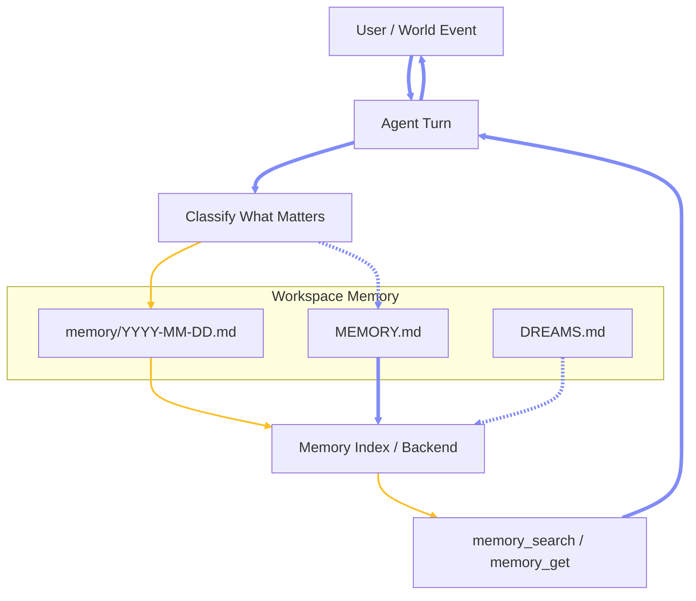
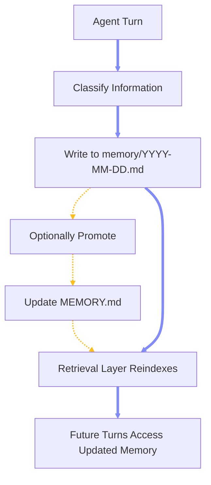

# Chapter 2.2 — Memory Architecture

## 2.2.0 Overview

This chapter defines how OpenClaw persists, retrieves, consolidates, and isolates native memory across agent workspaces, memory backends, and optional memory-adjacent plugins.

### 2.2.1 Native Memory Model

**Source of Truth:** Native memory is file-backed, not hidden model state. OpenClaw only remembers what gets written to disk inside the agent workspace.  \
**Core Layers:** The native model separates curated long-term memory in `MEMORY.md`, rolling short-term memory in `memory/YYYY-MM-DD.md`, and optional dreaming output in `DREAMS.md`.  \
**Continuity Principle:** The model wakes up fresh and reconstructs continuity from runtime context injection, session history, retrieved memory snippets, and any enabled plugin-owned pre-reply memory stages.  \
**Per-Agent Scope:** Memory belongs to the Full Role Agent that owns the workspace. Each top-level agent has its own memory root, its own retrieval index, and its own operating context.  \
**Subagent Boundary:** Subagents are execution-scoped children under a parent agent tree rather than independent memory-owning agents. They inherit the parent role boundary instead of receiving a separate top-level workspace memory root.  \
**Working Rule:** If knowledge must survive beyond the current reasoning window, it must be written to a workspace file or promoted through the native memory pipeline.



### 2.2.2 Memory Layers and Workspace Files

**`MEMORY.md`:** Curated long-term memory for durable facts, preferences, decisions, lessons learned, and stable user context. This is the canonical long-horizon memory file rather than a raw activity log. \
**`memory/YYYY-MM-DD.md`:** Dated working memory for observations, task context, recent events, and unrefined notes that may later be promoted into durable memory. \
**`DREAMS.md`:** Optional human-readable dream diary and sweep summary file used by the dreaming system to surface reflections, grounded backfill output, and memory-consolidation artifacts for review. \
**`AGENTS.md`:** Operational instructions plus standing memory discipline. This file defines what should be written down, what must not be forgotten, and which memory behaviors are safe inside the role boundary. \
**`USER.md`:** Stable user-profile context that should remain operator-authored and explicit rather than being rediscovered repeatedly from chat history. \
**`IDENTITY.md`:** Identity surface for name, vibe, emoji, and avatar. Not memory storage in the retrieval sense, but part of the self-model that persists across sessions. \
**`TOOLS.md`:** Tool usage conventions and learned operator preferences for how tools should be used, documented, and corrected over time.  \
**`HEARTBEAT.md`:** Proactive maintenance and check-in surface for scheduled main-session turns. This is memory-adjacent operational state rather than semantic memory storage, but it strongly shapes ongoing maintenance behavior.  \
**Bootstrap Context:** Workspace bootstrap files are injected into runtime context with size caps and truncation limits, while deeper memory recall stays retrieval-driven instead of injecting the full memory corpus every turn.  \
**Security Discipline:** Treat the workspace as private memory. Durable personal context belongs in agent-owned files, not in shared channel transcripts or assumptions kept only in ephemeral reasoning. 

```text
~/.openclaw/agents/<agentId>/
  agent/
    auth-profiles.json
    auth.json
  sessions/
    sessions.json
  workspace/
    AGENTS.md
    SOUL.md
    TOOLS.md
    IDENTITY.md
    USER.md
    HEARTBEAT.md
    MEMORY.md
    DREAMS.md
    memory/
      YYYY-MM-DD.md
```

### 2.2.3 Multi Agent Memory Files

**Shared Compilation Layer:** A custom shared consolidation layer at `~/.openclaw/agents/_shared/` holds canonical master profiles and structured cross-agent fact ledgers. This is an operator-owned compilation surface rather than a native OpenClaw agent workspace or native memory root; native memory continues to live in each Full Role Agent workspace under `~/.openclaw/agents/<agentId>/workspace/`. \
**Two-Stage Consolidation:** Stage 1 is event-driven consolidation triggered by plugin hooks, while Stage 2 is a scheduled full-system rebuild via cron to ensure eventual consistency across the multi-agent deployment. \
**Hook Terminology:** Consolidation logic should primarily trigger on the plugin hooks `agent_end` (for task success) or `session_end` (for session closure). Internal hooks like `message:sent` represent outbound delivery rather than true task success and should only be used as a coarse fallback. \
**Canonical Files:** Use master files only for stable, profile-like data including `USER.master.md`, `TOOLS.master.md`, and optional `MEMORY.master.md`. Structured candidate facts are staged in `facts/inbox/` before being resolved into the persistent `facts/ledger.jsonl`. \
**Daily Memory Boundary:** Dated memory files in `memory/YYYY-MM-DD.md` remain local to each Full Role Agent workspace as native append-oriented working memory. Centralized compilation of daily logs is not the default model; instead, durable facts are extracted from local logs into the shared ledger to regenerate profile views. \
**Generated Outputs:** The consolidation engine generates per-agent `USER.md`, `TOOLS.md`, and optional curated `MEMORY.md` from the shared master layer. These are filtered, agent-specific views of the global context, while daily `memory/` directories remain local and agent-owned. \
**Scripting Architecture:** Concerns are separated into `collect-shared-facts.ts` for appending candidate facts to the shared inbox and `rebuild-shared-views.ts` for resolving conflicts, updating master files, and regenerating per-agent workspace outputs. \
**Full-System Fallback:** Run the reconciler via cron several times per day as an isolated background job to ensure missed updates are folded into the shared ledger and all generated workspace files are refreshed. \
**Conflict Policy:** Same key with newer timestamp wins. Higher confidence beats lower when timestamps are close. Agent-scoped facts remain agent-scoped unless explicitly marked global. Privacy-flagged facts never propagate to specialist views. Orchestrator receives a broad summary; specialists receive narrow slices. 

**Shared Layer Folder Shape**

```text
~/.openclaw/agents/_shared/
  USER.master.md
  TOOLS.master.md
  MEMORY.master.md
  facts/
    inbox/
      orchestrator/
      agent-1/
      agent-n/
    ledger.jsonl
```

**Generated Output Shape**

```text
~/.openclaw/agents/
  orchestrator/
    workspace/
      TOOLS.md
      USER.md
      MEMORY.md
      memory/
  agent-1/
    workspace/
      TOOLS.md
      USER.md
      MEMORY.md
      memory/
  agent-n/
    workspace/
      TOOLS.md
      USER.md
      MEMORY.md
      memory/
```

**Example Cron:**

```bash
openclaw cron add \
  --name "Rebuild shared memory views" \
  --cron "0 */6 * * *" \
  --session isolated \
  --agent orchestrator \
  --message "Run shared fact reconciliation and regenerate master files plus all per-agent memory views." \
  --no-deliver
```


### 2.2.4 Agent Memory Write Path

**Write Mechanism:** Agents do not “store memory” implicitly; all persistence happens through explicit writes to workspace files. Memory writing is either performed through tool calls (when available) or direct file mutation within the workspace context. \
**Tool-Level Write Path:** When a memory write tool is available (e.g., file write or structured memory tool), the agent issues a tool call with a payload describing the target file, content, and intent. This follows the same execution pattern as any other tool:


\
**File-Level Write Path:** In native operation without a specialized write tool, the agent writes memory by appending or modifying Markdown files inside its workspace. Typical targets are `memory/YYYY-MM-DD.md` for working memory and `MEMORY.md` for curated long-term memory. The runtime treats these as normal file operations rather than hidden state mutation. \
**Working Memory Writes:** Short-term observations, task context, and intermediate conclusions are written to the current dated file under `memory/`. This file acts as an append-only log during active execution and is optimized for rapid capture rather than structure. \
**Long-Term Memory Writes:** Durable knowledge is written into `MEMORY.md`, but not continuously. The agent must first decide that information is stable, relevant beyond the current task, and worth promoting. This introduces a separation between capture and consolidation. \
**Promotion Boundary:** The transition from working memory to long-term memory is a deliberate step. The agent either performs this directly (by editing `MEMORY.md`) or emits a structured promotion instruction that is later applied. This prevents pollution of long-term memory with transient data. \
**Subagent Write Constraints:** Subagents do not own independent memory roots. They write only within the execution scope of their parent agent, typically contributing to working memory or returning structured results. They must not directly modify long-term memory without parent mediation. \
**Isolation Rules:** Each Full Role Agent writes only within its own workspace directory. Cross-agent memory writes require explicit tool-level permission and are not part of the default execution path. This preserves memory boundaries and prevents unintended state sharing. \
**Write Visibility:** Once a file is written, it becomes immediately visible to subsequent reads in the same session. Indexing layers update asynchronously, so semantic retrieval may lag behind direct file reads. \
**Consistency Model:** File writes are atomic at the runtime level but not transactional across multiple files. Agents should avoid partial multi-file updates and instead write complete, self-contained entries. \
**Recommended Control Flow:**



### 2.2.5 Retrieval, Indexing, and Recall Pipeline

**Memory Tools:** Native recall is exposed through `memory_search` for semantic retrieval and `memory_get` for direct file or line reads. These tools are supplied by the active memory plugin, with `memory-core` as the default native path. \
**Index Inputs:** The builtin engine indexes `MEMORY.md` plus `memory/*.md`, chunking content into retrieval units and keeping the workspace files as the durable source of truth. \
**Hybrid Retrieval:** OpenClaw can combine keyword retrieval and embedding-based vector retrieval, then merge results into a single recall set instead of relying on one search mode only. \
**Reindex Behavior:** File changes trigger debounced reindexing, while provider, model, or chunking changes trigger a full rebuild of the per-agent memory index. \
**Recall Quality Controls:** MMR reduces duplicate retrievals, temporal decay boosts recency for older daily notes, and evergreen files such as `MEMORY.md` remain exempt from decay. \
**Additional Sources:** `memorySearch.extraPaths` can extend recall beyond the default workspace memory roots, while experimental session memory can index transcripts into the same retrieval surface. \
**Optional Sidecar Backend:** QMD is an optional local-first sidecar backend for reranking, query expansion, extra directories, and stronger transcript-oriented recall. It extends the native architecture without changing the file-backed source-of-truth model. \
**Citation Surface:** Memory snippets can carry path-and-line provenance, allowing retrieved memory to remain inspectable rather than opaque. \
**Reference Configuration:** The configuration below shows a native-first layout using the builtin engine, hybrid retrieval controls, transcript indexing, and dreaming support. 

```json5
{
  agents: {
    defaults: {
      memorySearch: {
        enabled: true,
        provider: "openai",
        extraPaths: ["../_shared"],
        query: {
          hybrid: {
            vectorWeight: 0.7,
            textWeight: 0.3,
            mmr: { enabled: true, lambda: 0.7 },
            temporalDecay: { enabled: true, halfLifeDays: 30 }
          }
        },
        experimental: {
          sessionMemory: true
        },
        sources: ["memory", "sessions"],
        store: {
          path: "~/.openclaw/memory/{agentId}.sqlite"
        },
        limits: {
          maxResults: 6,
          timeoutMs: 4000
        }
      }
    }
  },

  memory: {
    citations: "auto"
  },

  plugins: {
    entries: {
      "memory-core": {
        config: {
          dreaming: {
            enabled: true,
            frequency: "0 3 * * *"
          }
        }
      }
    }
  }
}
```

### 2.2.6 Consolidation, Maintenance, and Dreaming

**Immediate Capture:** When the user says to remember something, or when a durable decision is made, the correct native behavior is to write it into the workspace rather than trusting the current context window. 
**Short-Term to Long-Term Flow:** Daily notes are the staging layer. Significant patterns, preferences, lessons, or decisions should later be distilled into `MEMORY.md` instead of leaving them buried in dated logs. 
**Heartbeat Maintenance:** Heartbeat runs scheduled main-session turns that can review `HEARTBEAT.md`, surface follow-ups, and maintain the memory surface without creating detached background-task records. 
**Dreaming System:** Dreaming is the background consolidation system with light, REM, and deep phases. Light stages short-term material, REM reflects and surfaces themes, and deep promotion is the phase that writes durable updates into `MEMORY.md`. 
**Dream Output:** Dreaming writes machine state under `memory/.dreams/` and human-readable narrative output into `DREAMS.md`, keeping promotion artifacts inspectable by the operator. 
**Promotion Discipline:** Durable memory should be distilled, stable, and reviewable. `MEMORY.md` should contain lasting truths and operator-relevant conclusions, not every transient observation from the daily stream. 
**Grounded Backfill:** Historical daily notes can be reprocessed into grounded dream entries and promotion candidates, allowing older raw notes to be consolidated without manually rereading the entire archive each time. 
**Knowledge-Layer Extension:** `memory-wiki` is an optional compiled knowledge layer that sits beside active memory. It does not replace native recall, promotion, indexing, or dreaming; it organizes durable knowledge into deterministic wiki pages, claims, dashboards, and digests. \

### 2.2.7 Storage Boundaries, Multi-Agent Guidance, and Anti-Patterns

**Workspace vs Runtime State:** Workspace files are the human-authored memory surface. Runtime indexes, credentials, auth profiles, and session transcripts live elsewhere under `~/.openclaw/` and should not be treated as interchangeable with authored memory. \
**Per-Agent Isolation:** In a multi-agent deployment, each Full Role Agent should keep its own workspace memory, its own retrieval index, and its own long-term memory boundary. This prevents role bleed between orchestrator, specialist, and other durable agents. \
**Orchestrator Memory Shape:** The orchestrator should keep only coordination-relevant durable memory. Specialist-specific facts belong in the specialist workspace that owns the domain boundary and tools. \
**Subagent Memory Shape:** Do not model subagents as separate top-level memory owners. They are spawned execution units under a parent agent tree, not independent long-horizon personalities with their own permanent workspace roots. \
*(note)* **Subagents:** Subagents are execution-scoped background tasks; they announce upward and do not own their own profile files. Let the parent full agent own all file updates. \
**No Mental Notes:** Do not rely on ephemeral reasoning or session continuity as memory. If it matters later, write it down. \
**No Raw-Dump `MEMORY.md`:** Do not turn `MEMORY.md` into a chronological scratchpad. Raw recency belongs in dated daily notes, while durable memory should stay distilled and high-signal. \
**No Transcript-as-Memory Assumption:** Do not assume session transcripts are part of semantic recall by default. Transcript recall should be treated as an explicit indexed source, not a hidden guarantee. \
**No Cross-Agent Memory Merge by Accident:** Do not point multiple Full Role Agents at the same workspace or SQLite memory store unless deliberate shared-memory behavior is explicitly designed and understood. \
**No Runtime-State Commits:** Do not version-control the entire runtime tree as if it were safe authored memory. Back up workspace files intentionally; back up auth and session state separately and privately. \
**Native-First Rule:** Start with workspace files, builtin memory search, heartbeat, and optional dreaming. Add QMD, active memory, or memory-wiki only when the retrieval or knowledge workload clearly needs those extra layers. \
*(warning)* **Heartbeat Anti-Pattern:** Do not use heartbeat as the rebuild engine. Heartbeat turns create no task records and are for routine monitoring only — use it at most for a human-readable "profile consolidation stale" reminder. \
*(reasoning)* **Deterministic Merge:** A structured fact inbox plus compiled Markdown is far more reliable than raw Markdown-only merge logic. \
